# HydatekOS

A calm desktop **and** mobile operating system, written from scratch.

HydatekOS boots straight from a PC's UEFI firmware. The kernel, memory allocator,
graphics compositor, window manager, font and icon renderers, file system layer,
PS/2 mouse driver, USB and I²C HID drivers (mice, touchpads, touch screens,
game controllers, haptics), TCP/IP network stack, cryptography and every app are
HydatekOS code: Rust, `no_std`, zero third-party crates. It isn't a skin on
Windows, macOS or Linux.

| Browser | Hyda Search |
|---|---|
|  |  |

| Hyda Scripts (Hyda Workspace) | Hyda Grids (Hyda Workspace) |
|---|---|
|  |  |

| Hyda Slides (Hyda Workspace) | Its slideshow |
|---|---|
| 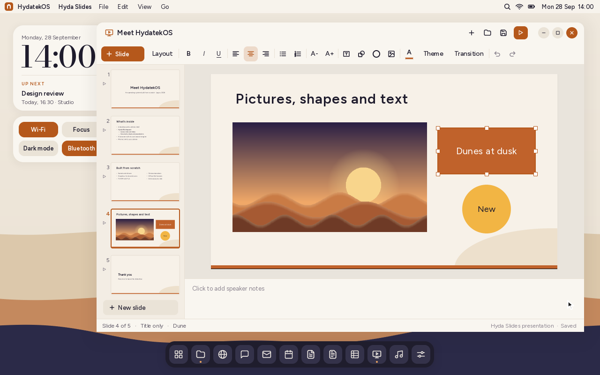 | 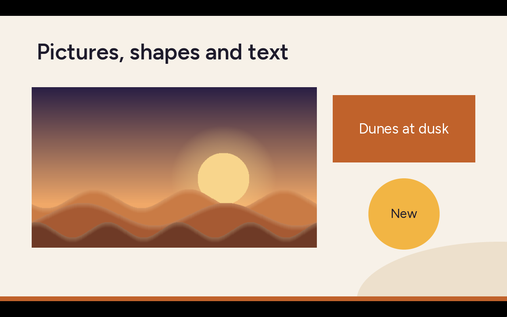 |

| Desktop | Phone Link with a phone | Mobile shell |
|---|---|---|
|  |  |  |

| Choosing an account | Settings › Accounts | A new account's first sign-in |
|---|---|---|
| 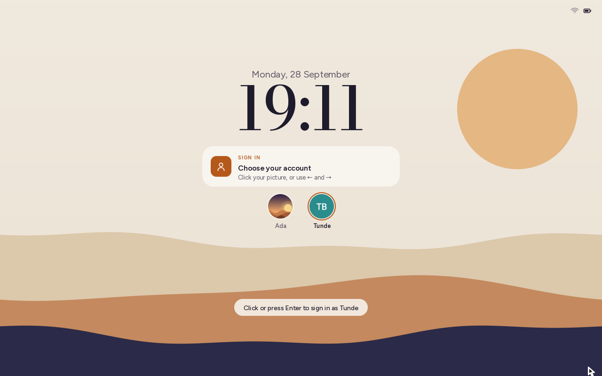 | 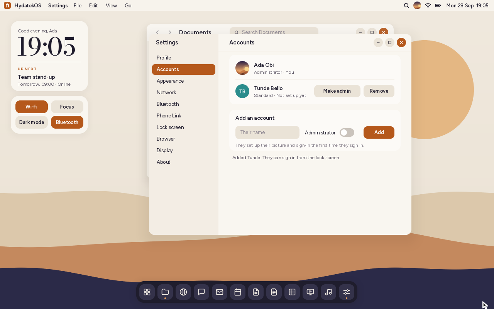 |  |

| Meeting Claude, the assistant | Asking Claude | Settings › Assistant |
|---|---|---|
| 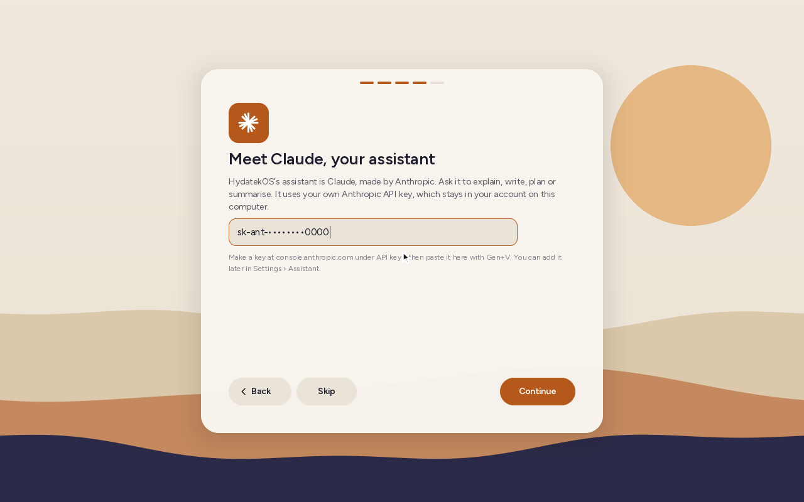 | 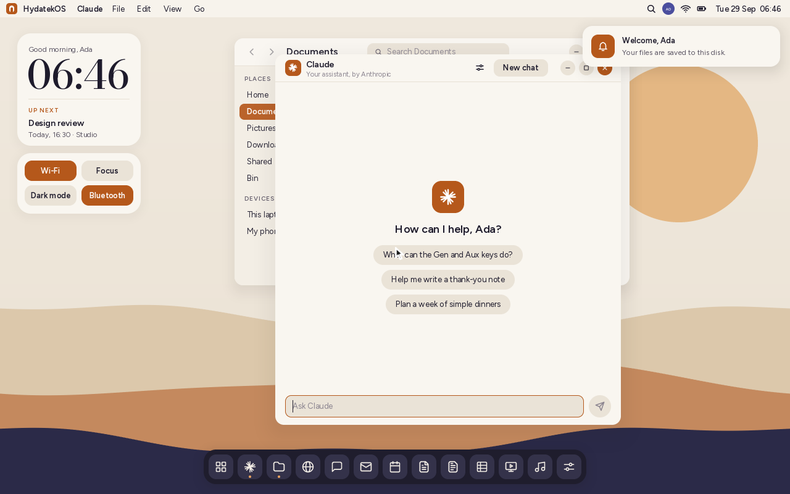 | 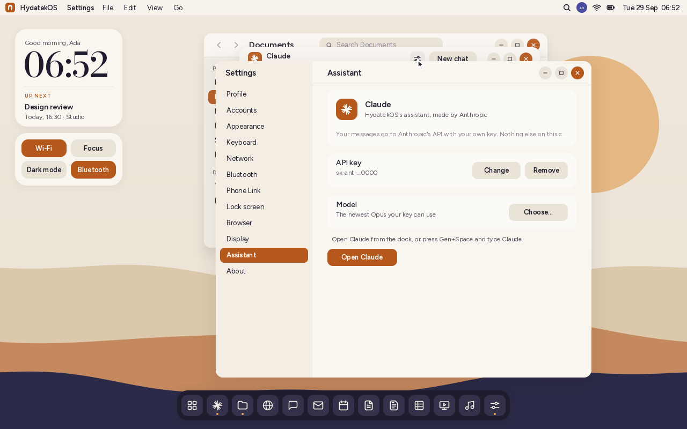 |

| Setup assistant | Choosing a profile picture | Settings › Profile |
|---|---|---|
| 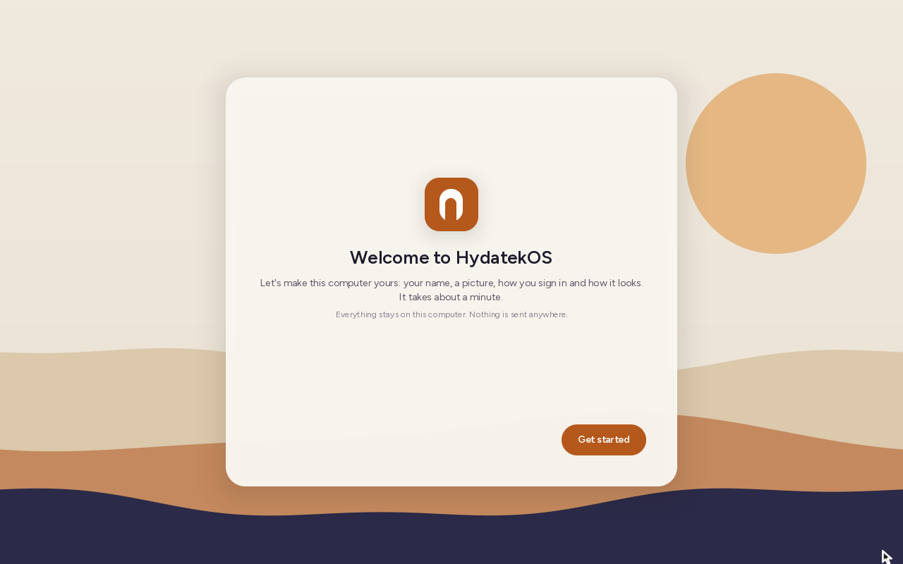 | 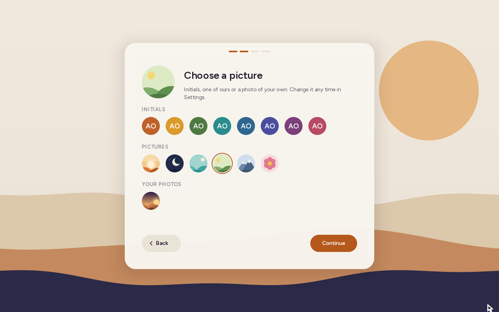 | 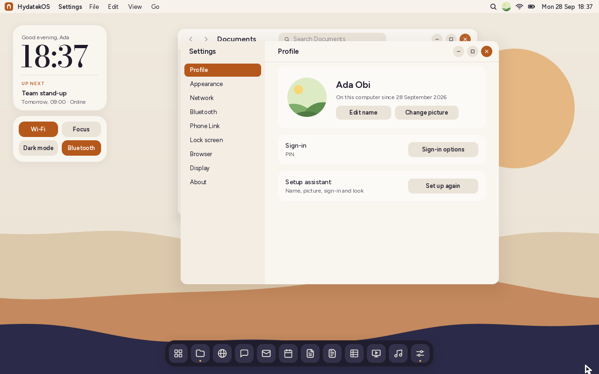 |

| Boot logo | Lock screen: PIN, password, fingerprint | Fingerprint via your phone |
|---|---|---|
|  |  |  |


| Pairing by QR code | Browser companion on the phone | Demo phone mirror |
|---|---|---|
|  |  |  |

## What works today (milestone 1, "Dune")

- **Boots on real x86-64 PCs and ARM64 laptops** (Qualcomm Snapdragon X and
  other ARM machines with UEFI) from one USB stick or the internal disk (Secure
  Boot off). Settings › About names the processor, its cores and features, and
  the graphics (Intel, AMD, NVIDIA, Qualcomm Adreno…). Details:
  [docs/HARDWARE.md](docs/HARDWARE.md).
- **Motion and haptics:** windows zoom open, fade away when closed, fly into
  the dock when minimised and glide when maximised or snapped; the start menu,
  menus and notifications animate in. Haptic feedback taps for keys and
  switches and buzzes for mistakes, played on a paired Android phone's motor;
  Settings › Sound & haptics shows each pattern. Details:
  [docs/MOTION_AND_HAPTICS.md](docs/MOTION_AND_HAPTICS.md).
- **Setup assistant and profile:** the first start asks for your name, a picture
  (initials, one of six drawn pictures, or a photo of your own), a PIN or password
  and light or dark. Your picture and name then show on the lock screen and in the
  menu bar, the desktop greets you, and documents you make carry your name as
  their author (in Word, Excel, PowerPoint and PDF files too). Change it all in
  Settings › Profile. Details: [docs/PROFILE.md](docs/PROFILE.md).
- **Claude, the assistant:** HydatekOS's assistant is Claude, made by Anthropic.
  The setup assistant introduces it and takes your Anthropic API key, or you can
  add the key later in Settings › Assistant. Then ask Claude anything from its app,
  first in the dock. Requests go straight to Anthropic's API over HydatekOS's own
  TLS, carrying only what you type. It uses the newest Opus model your key can
  use. Details: [docs/ASSISTANT.md](docs/ASSISTANT.md).
- **Accounts:** several people can share the computer, each with their own home
  folder, Bin, settings, sign-in, calendar and search. A Shared folder is common
  to all. Administrators add, remove and promote accounts in Settings › Accounts,
  and new people set up their own picture and PIN the first time they sign in.
  The lock screen shows everyone's picture to choose from, and inside HydatekOS
  nobody can reach anyone else's files. Details: [docs/ACCOUNTS.md](docs/ACCOUNTS.md).
- **Gen, Aux and the Hydatek key:** HydatekOS's own keys. **Gen** is the shortcut
  key (the Ctrl key, or ⌘ on a Mac): Gen+S saves, Gen+Space opens an app, Gen+/ shows
  every shortcut, and menus show each one. **Aux** (Alt, or ⌥ Option) types
  special characters (Aux+N ₦, Aux+E €, Aux+- –) and switches windows with
  Aux+Tab. The **Hydatek key** (where Windows keyboards print ⊞) is the system
  key: tap it for the start menu, or hold it for Hydatek+E (Files), +L (lock),
  +D (desktop), +← / +→ (snap a window) and more. The volume, brightness and sleep keys work, F11 maximises a window,
  password boxes warn when Caps Lock is on, and every text box shares one line
  editor (word moves, Gen+Backspace, paste). Settings › Keyboard has a **key
  tester** that shows what each key sends. Details: [docs/KEYBOARD.md](docs/KEYBOARD.md).
- **Boot logo and lock screen:** after the PC maker's logo the screen goes black
  and the **Hydatek Systems** wordmark fades in, in white, with a thin progress bar
  while drivers, files and the network come up, then a fade into the lock screen (clock,
  date, Up next, phone notifications). Sign in with a **PIN** (keypad), a **password**,
  or **your phone's fingerprint**: Phone Link asks the paired Android phone, which
  shows its own fingerprint prompt. The password has an **on-screen keyboard**
  (letters, numbers, all symbols, shift and caps lock, and a **₦€£** page of special
  characters: ₦ € £ ¥ ¢ ₹ ₵ § ¶ © ® ™ ° ± × ÷ ¿ ¡ « » • … µ ¬ ¦ ¤): it opens by itself on
  portrait touch screens, and from the keyboard button in the field on desktops. Switch between them under the keypad; set them up
  in Settings › Lock screen. The screen also locks after idle time, from the logo
  menu, or with **F12**.
- **Desktop shell:** menu bar with working menus, clock and "Up next" widget, quick
  toggles, a dock with running-app indicators and tooltips, an app launcher with search,
  and notifications.
- **Window manager:** overlapping windows with drag, resize, maximise (double-click the
  header), minimise, close, focus and soft shadows.
- **Mobile shell:** the phone home screen from the design (clock, Up next card, app grid,
  dock) with full-screen apps and a home indicator. It's used automatically on portrait
  screens and can be switched on from **View › Mobile Shell** or Settings.
- **Networking:** HydatekOS's own TCP/IP stack (ARP, IPv4, ICMP, UDP, DHCP, TCP,
  mDNS) over HydatekOS's own Intel Ethernet driver (e1000, e1000e, chipset LAN
  up to the I219) or the firmware's driver for other cards. See Settings › Network.
- **Phone Link with real phones** (like Windows "Link to Windows"). Scan a QR code
  to pair. Any phone's browser can exchange photos, files and text with the PC.
  The **HydatekOS Link Android app** adds texts (read and reply), notifications,
  the call log and placing calls. Everything is end-to-end encrypted
  (ChaCha20-Poly1305). A demo phone with a live screen mirror lets you try it
  without a device. Details: [docs/PHONE_LINK.md](docs/PHONE_LINK.md).
- **Hyda Workspace, the office suite:** **Hyda Scripts** is its word processor,
  written from scratch. It lays out A4 pages and has paragraph styles,
  bold/italic/underline/strikethrough, alignment, lists, undo and copy/paste.
  Documents are saved in its own **`.hyds`** format. Word, text and Markdown files
  open for viewing and editing (saving makes a `.hyds`), and File › Export makes
  `.docx`, `.txt` or `.md` copies for sharing. **Hyda Grids** is its spreadsheet:
  formulas with 25 functions, ₦ currency and other number formats, copy/paste that
  moves references, AutoSum and resizable columns. Sheets are saved as **`.hydg`**;
  Excel (`.xlsx`) and CSV files open for viewing and editing and are export formats.
  **Hyda Slides** makes presentations: layouts, six themes, bullets, text boxes,
  sixteen shapes, lines and arrows, tables, charts, gradients, rotation,
  pictures, entrance animations, footers and slide numbers, speaker notes, a
  full-screen slideshow with transitions and a presenter view. Presentations
  are saved as **`.hydp`**; PowerPoint (`.pptx`) files open for viewing and
  editing and are an export format, as is PDF (slides or notes pages).
  Details: [docs/HYDA_WORKSPACE.md](docs/HYDA_WORKSPACE.md).
- **Browser and Hyda Search:** HydatekOS's own web browser (HTML, CSS, layout,
  pictures with its own JPEG / PNG / WebP / GIF decoders and SVG renderer,
  animations, external stylesheets with media queries and CSS variables,
  flexbox and grid layout,
  CSS backgrounds, links, forms, cookies,
  redirects, gzip) and search engine. Hyda Search indexes
  the pages you visit, sites you add (with a polite crawler) and your files, and
  ranks results with BM25, privately on your computer. Secure sites work too,
  with HydatekOS's own TLS 1.3 / 1.2 and certificate checks against Mozilla's
  list of authorities. The address bar can also search with DuckDuckGo, Mojeek,
  Bing, Brave Search, Google or Wikipedia (Settings › Browser, or `!d`, `!g`...
  shortcuts). Details: [docs/BROWSER.md](docs/BROWSER.md).
- **Apps:** Files, Notes, Hyda Scripts, Hyda Grids, Hyda Slides, Settings, Calendar, Terminal (`hsh`), Phone Link,
  Messages, Mail, Browser, Music, plus Phone and Camera on mobile.
- **Persistent storage:** your files, settings and calendar live in `\HYDATEK\` on the
  boot disk and survive reboots.
- **Wallpaper and personalisation:** a dynamic theme. The accent, windows,
  sidebars, lines, menu bar and dock all take their colours from the
  wallpaper, and ease to new ones when it changes. There are ten photographs. There are also seven scenes drawn at your screen's own size
  (Dune, Lagoon, Aurora, Hills, Mesa, Bloom, Harmattan) whose skies can follow the
  time of day, plus solid colours, gradients and your own pictures (fill, fit,
  stretch, centre, tile). The lock screen can have its own wallpaper. There are
  light "Dune" and dark "Dusk" themes, an automatic theme that turns dark at
  night, and four fixed accent colours for when you'd rather not follow the wallpaper. Details:
  [docs/PERSONALISATION.md](docs/PERSONALISATION.md).

### What isn't there yet

An operating system is a long project. Here's what's still missing; the plan is in
[docs/ROADMAP.md](docs/ROADMAP.md).

- **Wired Ethernet only.** Intel chips have HydatekOS's own driver; others go
  through the firmware's. There are no Wi-Fi or
  Bluetooth drivers yet. The browser runs no JavaScript, doesn't float or
  position boxes and can't show AVIF pictures, so many of today's sites look
  simpler than in other browsers. Mail
  holds local messages.
- **Phone Link can't mirror a real phone's screen yet.** The demo phone shows how
  it will look. The Android app has been built and statically checked, and its
  protocol code is tested against HydatekOS, but it hasn't run on a real phone yet
  ([details](companion/android/README.md)).
- **No sound, camera or fingerprint-reader drivers yet.** Fingerprint sign-in
  works through a paired Android phone's sensor instead. The on-screen keyboard is
  on the lock screen and in the setup assistant so far; other text fields still
  need a physical keyboard.
- **Accounts keep people apart inside HydatekOS only:** files aren't encrypted
  yet, and one person is signed in at a time.
- **Wi-Fi chips have no drivers yet**, and Bluetooth finds devices but doesn't pair.
  HydatekOS has its own ACPI interpreter, xHCI, NVMe, SATA, HD Audio and I²C
  touchpad drivers ([docs/DRIVERS.md](docs/DRIVERS.md)); the GPU draws through
  the firmware's framebuffer, on every core ([docs/GRAPHICS.md](docs/GRAPHICS.md)). USB touchpads, mice, touch screens and controllers
  work on x86 and ARM64 alike ([docs/DRIVERS.md](docs/DRIVERS.md)); haptic
  touchpads and controllers' rumble motors play HydatekOS's haptic patterns. Haptic
  touchpads and controllers have only been tested against simulated and virtual
  devices, not real ones.
- Milestone 1 still uses the firmware for the USB host controller, disk access and the
  framebuffer (it never calls `ExitBootServices`). Milestone 2 replaces these with
  HydatekOS drivers.

## Try it in a virtual machine

Prerequisites: Rust (stable) with the UEFI target, `mtools`, `python3`, QEMU and OVMF.

```sh
rustup target add x86_64-unknown-uefi
sudo apt install qemu-system-x86 ovmf mtools     # macOS: brew install qemu mtools
tools/run-qemu.sh
```

Click inside the QEMU window to capture the mouse (Ctrl+Alt+G releases it). The VM
gets a network through QEMU, and Phone Link's port 7743 is forwarded, so a phone
on the same network as your computer can pair using your computer's IP address.

A whole session, from power on to shut down: setup, a document, the terminal,
locking and unlocking, **Shut Down** from the HydatekOS menu, then powering on
again (the document is still there) and shutting down with `shutdown` in the
terminal.

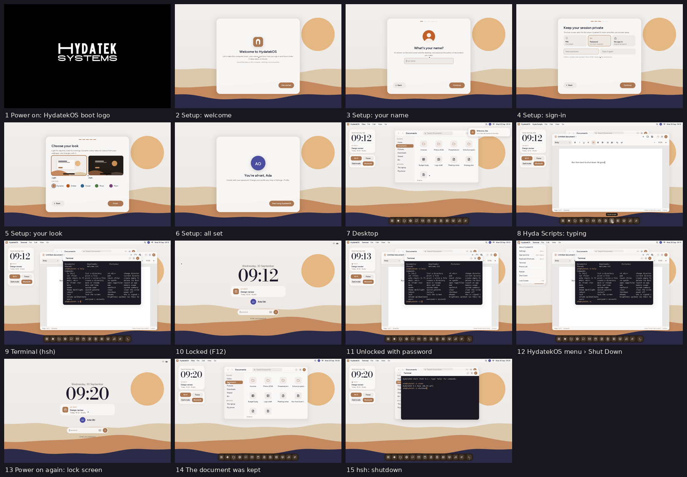

Automated tests (kernel crypto/QR/protocol, web and Android companion code):
`tools/test.sh`.

## Install on a PC

See **[docs/INSTALL.md](docs/INSTALL.md)**. In short:

```sh
tools/mkimage.sh        # -> build/hydatekos.img
```

Then write `build/hydatekos.img` to a USB stick with balenaEtcher, Rufus (DD mode) or
`dd`, and boot from it. Your files are saved on the stick. To put HydatekOS on the
computer's own **empty** disk, open **Settings › Install**. It copies HydatekOS and your
files across, checks everything, and adds HydatekOS to the computer's start-up menu.
The install guide also covers putting HydatekOS next to another OS by hand.

## Using HydatekOS

| Action | How |
|---|---|
| Open any app | Tap the **Hydatek key**, the grid button in the dock, the search icon in the menu bar, **Gen+Space** or **F1** |
| Ask Claude | The ✳ button first in the dock, or **Gen+Space** and type *Claude* |
| Move / maximise a window | Drag the header / double-click it |
| Resize a window | Drag the bottom-right corner |
| Close the front window | **Gen+W** or the orange button |
| Switch windows | **Gen+Tab** or **Aux+Tab** |
| See every shortcut | **Gen+/** |
| Type ₦ € £ – … | **Aux+N**, **Aux+E**, **Aux+3**, **Aux+-**, **Aux+;** |
| Save a note or document | **Gen+S** |
| Bold / italic / underline in Hyda Scripts | **Gen+B** / **Gen+I** / **Gen+U** |
| Rename / delete a file | **F2** / **Delete** (File menu has the same actions) |
| Maximise a window | **F11**, **Hydatek+↑**, or double-click its header |
| Snap a window to half the screen | **Hydatek+←** / **Hydatek+→** |
| Show the desktop | **Hydatek+D** (again brings the windows back) |
| Volume / brightness | Their keys, or `volume up` / `brightness down` in Terminal |
| Lock the screen | **F12**, **Hydatek+L**, the Sleep key, the logo menu, or `lock` in Terminal |
| Switch account / sign out | Lock the screen and choose another picture / profile menu › **Sign Out** |
| Shell commands | Open Terminal and type `help` |
| Restart / shut down | HydatekOS logo menu, or Settings › About |

## Repository layout

```
kernel/            the HydatekOS kernel + shell (Rust, no_std, UEFI x86-64 and ARM64)
  src/main.rs      boot, heap, display, main loop, cursor
  src/efi.rs       hand-written UEFI bindings
  src/heap.rs      kernel memory allocator
  src/gfx.rs       software rasteriser (AA shapes, shadows, scaling)
  src/font.rs      text rendering from the prebuilt font pack
  src/icons.rs     vector icon set
  src/ps2.rs       PS/2 mouse driver
  src/usb.rs       USB HID driver (pointers, touchpads, touch screens, media keys,
                   game controllers, haptic touchpads, rumble motors)
  src/hid.rs       HID report descriptors; touchpad.rs gestures; gamepad.rs controllers
  src/i2c.rs       DesignWare I2C controller and HID over I2C
  src/input.rs     keyboard + pointer input
  src/fs.rs        virtual file system persisted to the boot disk
  src/shell/       desktop shell, window manager, mobile shell, lock screen, setup assistant
  src/profile.rs   your profile (name, picture); avatar.rs draws profile pictures
  src/accounts.rs  accounts: the list, where each one's files are, what a session may reach
  src/apps/        built-in applications
  assets/fonts.bin prebuilt glyph atlases (regenerate with tools/fontgen.py)
  assets/boot-logo.png  the boot wordmark (made by tools/bootlogo.py from
                   assets/branding/hydatek-systems.jpg)
  src/net/         network stack: firmware NIC, ARP/IPv4/DHCP/TCP/mDNS
  src/crypto.rs    SHA-256, HKDF, ChaCha20-Poly1305; rng.rs; qr.rs
  src/hlp.rs       Hydatek Link Protocol; linksrv.rs its HTTP/WebSocket server
  src/doc.rs       Hyda Scripts documents: editing, .hyds, .docx/.txt/.md; zip.rs zip, deflate, inflate
  src/grid.rs      Hyda Grids formulas and formats; gridio.rs .hydg, .xlsx, .csv
  src/deck.rs      Hyda Slides slides, themes, text layout; deckio.rs .hydp, .pptx, PNG writer
  src/web/         browser engine: URL, DNS, HTTP, HTML, CSS/layout, Hyda Search
  src/image/       JPEG, PNG, WebP, GIF and BMP decoders; SVG renderer
  src/tls/         TLS 1.3/1.2, AES-GCM, X25519, P-256/384, RSA, X.509, CA list
companion/web/     browser companion for phones (served by HydatekOS)
companion/android/ HydatekOS Link for Android (built without the Android SDK)
tests-host/        host-side tests of kernel modules
assets/branding/   the Hydatek Systems wordmark (source of the boot logo)
assets/fonts/      source fonts (Figtree, Bodoni Moda, DejaVu Sans and Sans Mono) + licences
tools/             image builder, QEMU runner, GPT writer, font generator, boot logo maker
docs/              architecture, install guide, Phone Link, Hyda Workspace, profile, accounts, keyboard, roadmap
```

More detail: [docs/ARCHITECTURE.md](docs/ARCHITECTURE.md).

## Licences

The fonts are distributed under their own licences in `assets/fonts/` (SIL OFL 1.1 for
Figtree and Bodoni Moda, the Bitstream Vera/DejaVu licence for DejaVu Sans and DejaVu Sans Mono).
