# HydatekOS

A calm desktop **and** mobile operating system, written from scratch.

HydatekOS boots straight from a PC's UEFI firmware. The kernel, memory allocator,
graphics compositor, window manager, font and icon renderers, file system layer,
PS/2 mouse driver, TCP/IP network stack, cryptography and every app are
HydatekOS code: Rust, `no_std`, zero third-party crates. It isn't a skin on
Windows, macOS or Linux.

| Browser | Hyda Search |
|---|---|
| 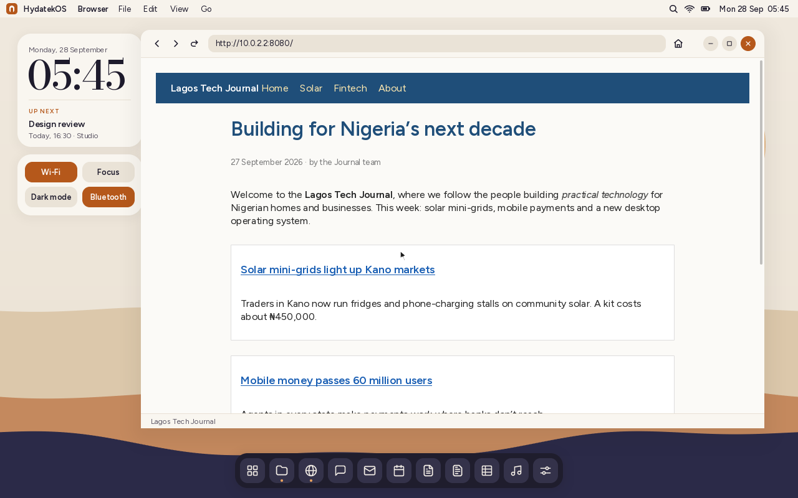 | 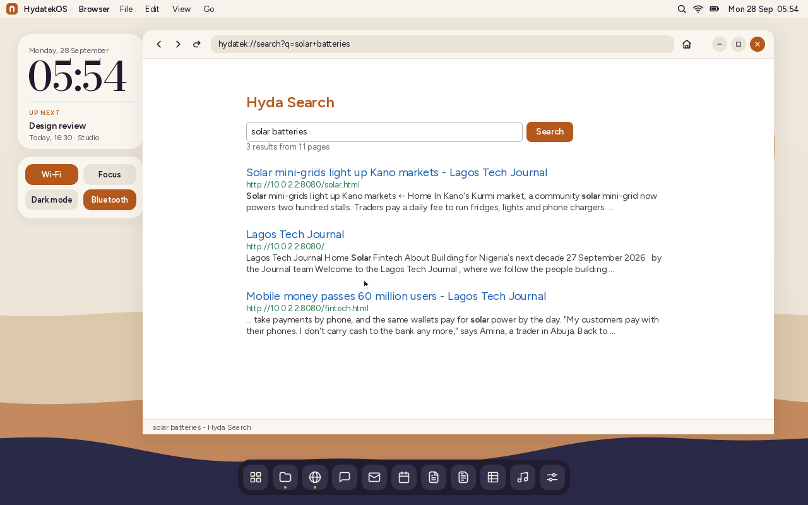 |

| Hyda Scripts (Hyda Workspace) | Hyda Grids (Hyda Workspace) |
|---|---|
| 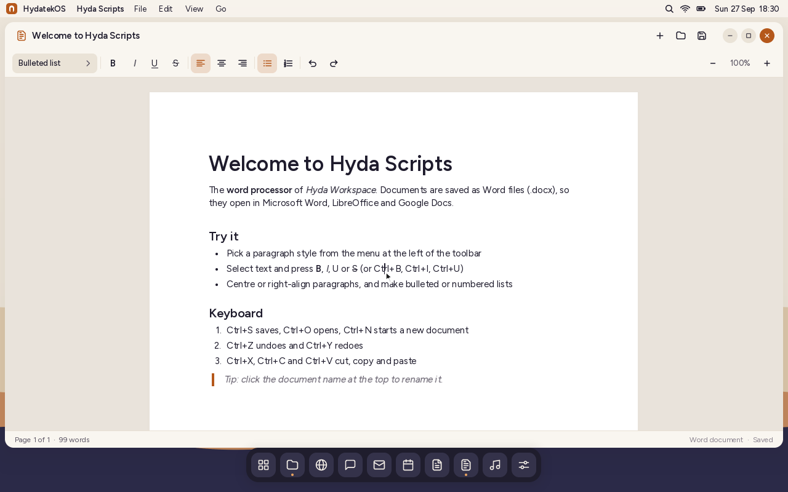 | 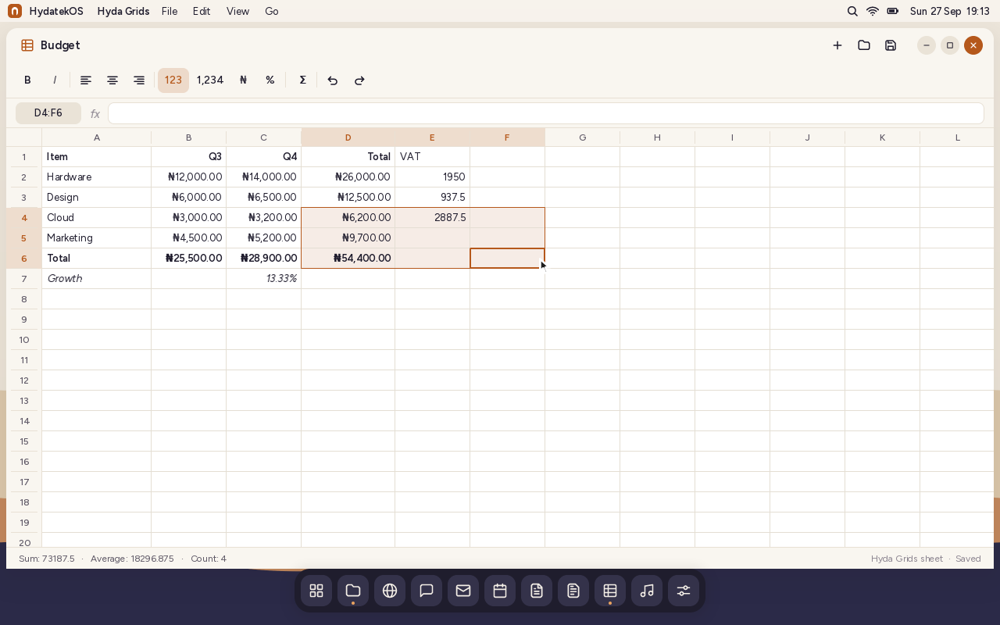 |

| Desktop | Phone Link with a phone | Mobile shell |
|---|---|---|
| 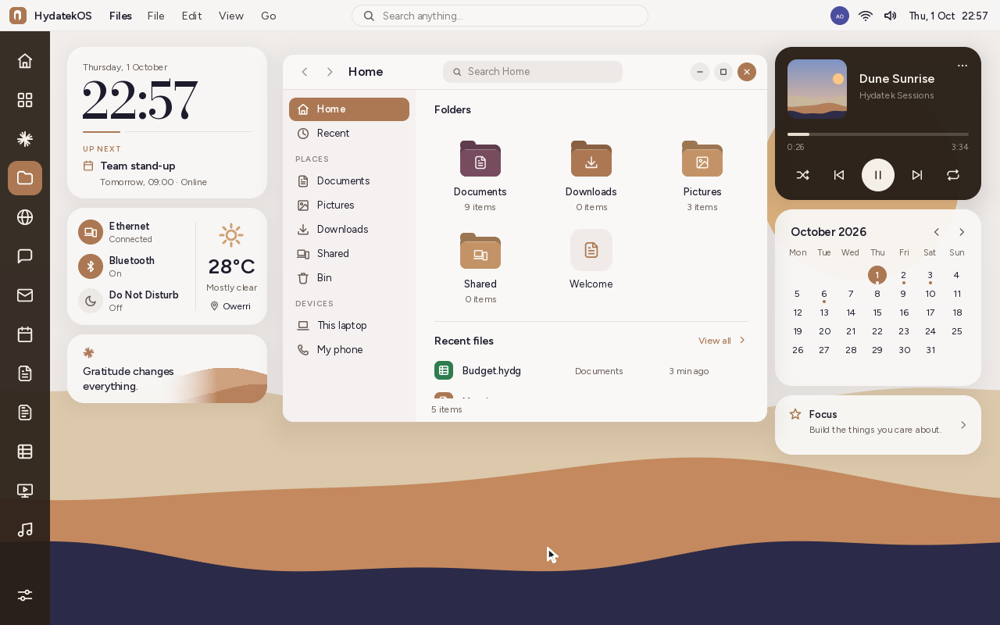 | 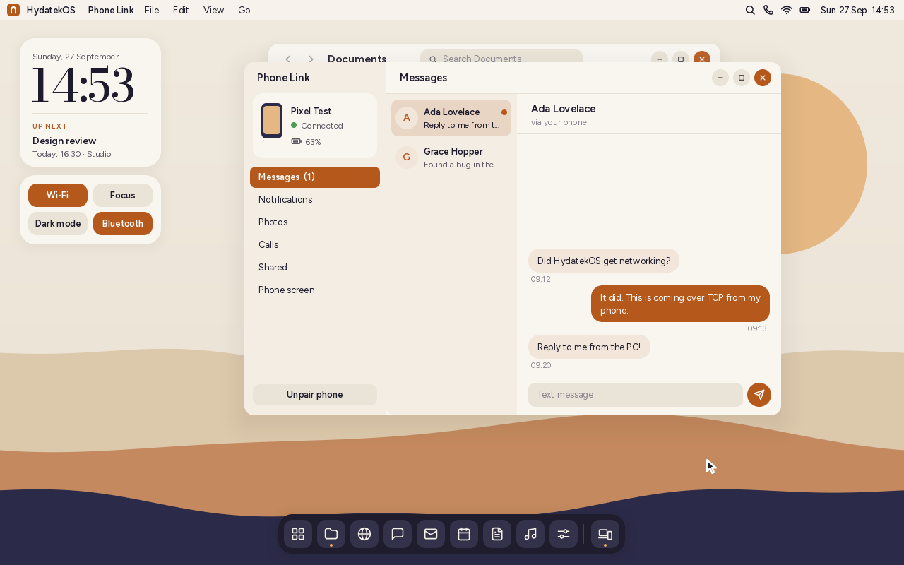 | 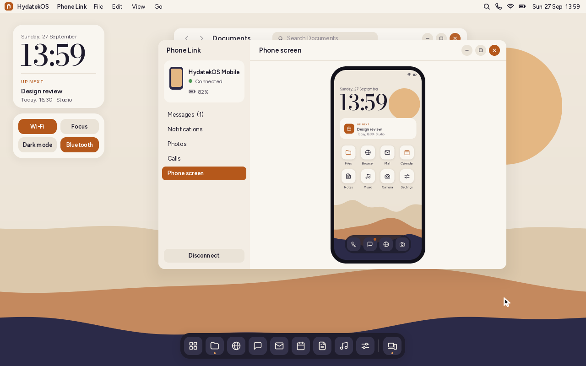 |

| Boot splash | Lock screen: PIN, password, fingerprint | Fingerprint via your phone |
|---|---|---|
| 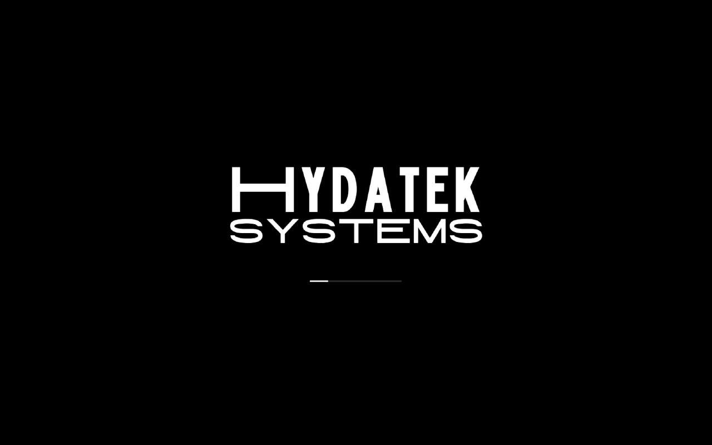 | 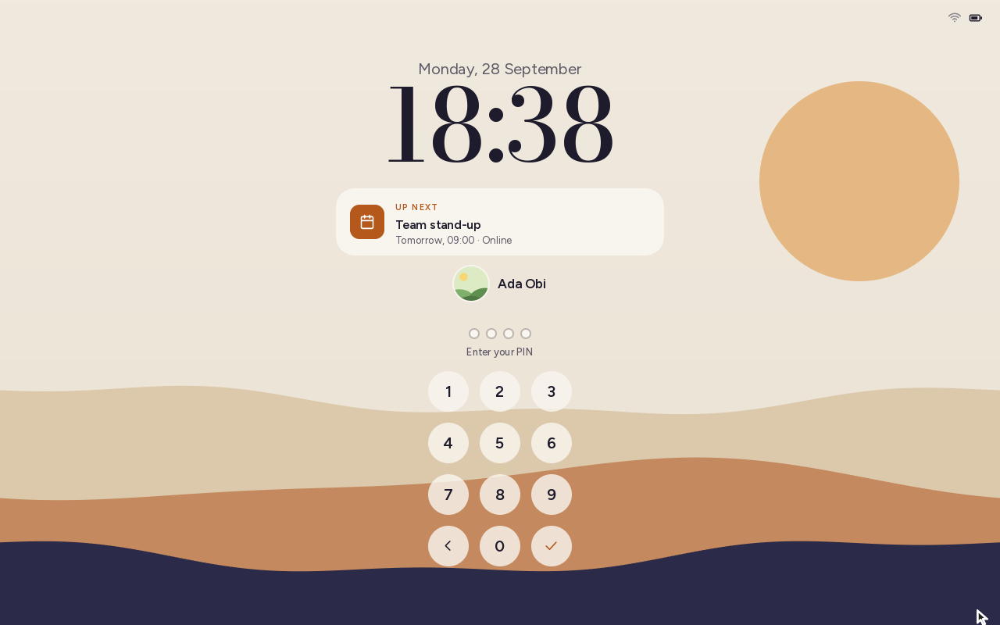 | 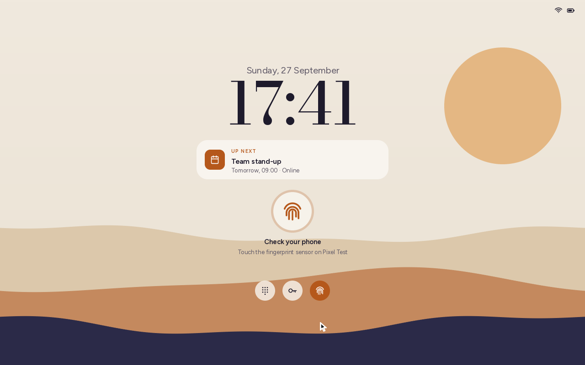 |

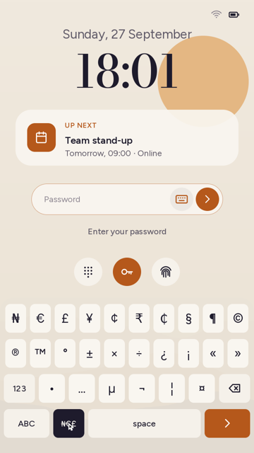

| Pairing by QR code | Browser companion on the phone | Demo phone mirror |
|---|---|---|
| 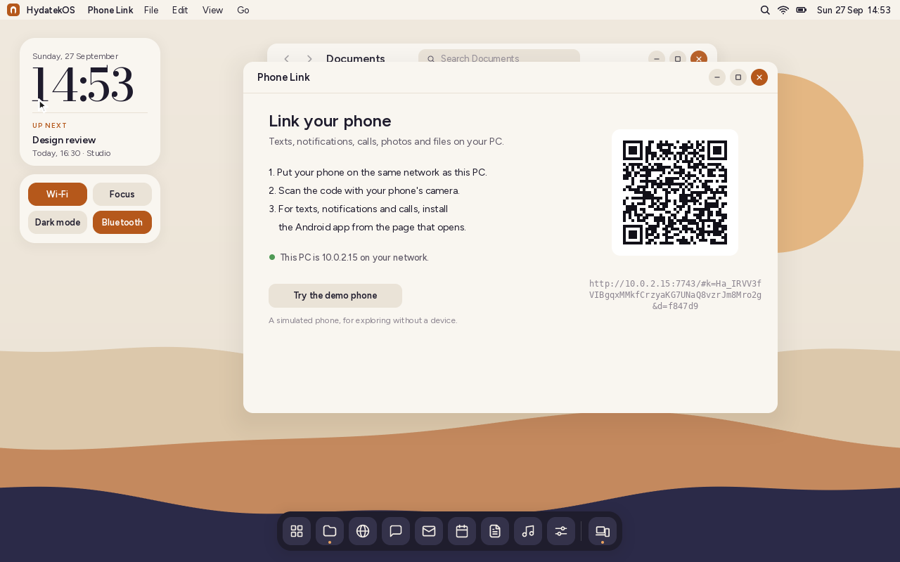 | 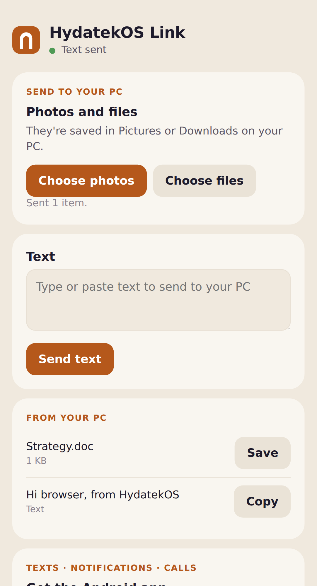 |  |

## What works today (milestone 1, "Dune")

- **Boots on real x86-64 PCs** from a USB stick or the internal disk (UEFI, Secure Boot off).
- **Boot splash and lock screen:** a HydatekOS splash with a progress bar while
  drivers, files and the network come up, then a fade into the lock screen (clock,
  date, Up next, phone notifications). Sign in with a **PIN** (keypad), a **password**,
  or **your phone's fingerprint**: Phone Link asks the paired Android phone, which
  shows its own fingerprint prompt. The password has an **on-screen keyboard**
  (letters, numbers, all symbols, shift and caps lock, and a **₦€£** page of special
  characters: ₦ € £ ¥ ¢ ₹ ₵ § ¶ © ® ™ ° ± × ÷ ¿ ¡ « » • … µ ¬ ¦ ¤): it opens by itself on
  portrait touch screens, and from the keyboard button in the field on desktops. Switch between them under the keypad; set them up
  in Settings › Lock screen. The screen also locks after idle time, from the logo
  menu, or with **F12**.
- **Desktop shell:** menu bar with working menus, clock and "Up next" widget, quick
  toggles, a dock with running-app indicators and tooltips, an app launcher with search,
  and notifications.
- **Window manager:** overlapping windows with drag, resize, maximise (double-click the
  header), minimise, close, focus and soft shadows.
- **Mobile shell:** the phone home screen from the design (clock, Up next card, app grid,
  dock) with full-screen apps and a home indicator. It's used automatically on portrait
  screens and can be switched on from **View › Mobile Shell** or Settings.
- **Networking:** HydatekOS's own TCP/IP stack (ARP, IPv4, ICMP, UDP, DHCP, TCP,
  mDNS) over the firmware's Ethernet driver. See Settings › Network.
- **Phone Link with real phones** (like Windows "Link to Windows"). Scan a QR code
  to pair. Any phone's browser can exchange photos, files and text with the PC.
  The **HydatekOS Link Android app** adds texts (read and reply), notifications,
  the call log and placing calls. Everything is end-to-end encrypted
  (ChaCha20-Poly1305). A demo phone with a live screen mirror lets you try it
  without a device. Details: [docs/PHONE_LINK.md](docs/PHONE_LINK.md).
- **Hyda Workspace, the office suite:** **Hyda Scripts** is its word processor,
  written from scratch. It lays out A4 pages and has paragraph styles,
  bold/italic/underline/strikethrough, alignment, lists, undo and copy/paste.
  Documents are saved in its own **`.hyds`** format. Word, text and Markdown files
  open for viewing and editing (saving makes a `.hyds`), and File › Export makes
  `.docx`, `.txt` or `.md` copies for sharing. **Hyda Grids** is its spreadsheet:
  formulas with 25 functions, ₦ currency and other number formats, copy/paste that
  moves references, AutoSum and resizable columns. Sheets are saved as **`.hydg`**;
  Excel (`.xlsx`) and CSV files open for viewing and editing and are export formats.
  Details: [docs/HYDA_WORKSPACE.md](docs/HYDA_WORKSPACE.md).
- **Browser and Hyda Search:** HydatekOS's own web browser (HTML, CSS, layout,
  links, forms, cookies, redirects, gzip) and search engine. Hyda Search indexes
  the pages you visit, sites you add (with a polite crawler) and your files, and
  ranks results with BM25, privately on your computer. Secure sites work too,
  with HydatekOS's own TLS 1.3 / 1.2 and certificate checks against Mozilla's
  list of authorities. Details: [docs/BROWSER.md](docs/BROWSER.md).
- **Apps:** Files, Notes, Hyda Scripts, Hyda Grids, Settings, Calendar, Terminal (`hsh`), Phone Link,
  Messages, Mail, Browser, Music, plus Phone and Camera on mobile.
- **Persistent storage:** your files, settings and calendar live in `\HYDATEK\` on the
  boot disk and survive reboots.
- **Light "Dune" and dark "Dusk" themes** with four accent colours.

### What isn't there yet

An operating system is a long project. Here's what's still missing; the plan is in
[docs/ROADMAP.md](docs/ROADMAP.md).

- **Wired Ethernet only, through the firmware's driver.** There are no Wi-Fi or
  Bluetooth drivers yet. The browser shows no images, runs no JavaScript and
  doesn't load external stylesheets, so most of today's sites look plain. Mail
  holds local messages.
- **Phone Link can't mirror a real phone's screen yet.** The demo phone shows how
  it will look. The Android app has been built and statically checked, and its
  protocol code is tested against HydatekOS, but it hasn't run on a real phone yet
  ([details](companion/android/README.md)).
- **No sound, camera or fingerprint-reader drivers yet.** Fingerprint sign-in
  works through a paired Android phone's sensor instead. The on-screen keyboard is
  only on the lock screen so far; other text fields still need a physical keyboard.
- Milestone 1 still uses the firmware for USB input, disk access and the framebuffer
  (it never calls `ExitBootServices`). Milestone 2 replaces these with HydatekOS drivers.

## Try it in a virtual machine

Prerequisites: Rust (stable) with the UEFI target, `mtools`, `python3`, QEMU and OVMF.

```sh
rustup target add x86_64-unknown-uefi
sudo apt install qemu-system-x86 ovmf mtools     # macOS: brew install qemu mtools
tools/run-qemu.sh
```

Click inside the QEMU window to capture the mouse (Ctrl+Alt+G releases it). The VM
gets a network through QEMU, and Phone Link's port 7743 is forwarded, so a phone
on the same network as your computer can pair using your computer's IP address.

Automated tests (kernel crypto/QR/protocol, web and Android companion code):
`tools/test.sh`.

## Install on a PC

See **[docs/INSTALL.md](docs/INSTALL.md)**. In short:

```sh
tools/mkimage.sh        # -> build/hydatekos.img
```

Then write `build/hydatekos.img` to a USB stick with balenaEtcher, Rufus (DD mode) or
`dd`, and boot from it. Your files are saved on the stick. The install guide also
covers putting HydatekOS on the internal disk next to another OS.

## Using HydatekOS

| Action | How |
|---|---|
| Open any app | Grid button in the dock, the search icon in the menu bar, or **F1** |
| Move / maximise a window | Drag the header / double-click it |
| Resize a window | Drag the bottom-right corner |
| Close the front window | **Ctrl+W** or the orange button |
| Save a note or document | **Ctrl+S** |
| Bold / italic / underline in Hyda Scripts | **Ctrl+B** / **Ctrl+I** / **Ctrl+U** |
| Rename / delete a file | **F2** / **Delete** (File menu has the same actions) |
| Lock the screen | **F12**, the logo menu, or `lock` in Terminal |
| Shell commands | Open Terminal and type `help` |
| Restart / shut down | HydatekOS logo menu, or Settings › About |

## Repository layout

```
kernel/            the HydatekOS kernel + shell (Rust, no_std, UEFI x86-64)
  src/main.rs      boot, heap, display, main loop, cursor
  src/efi.rs       hand-written UEFI bindings
  src/heap.rs      kernel memory allocator
  src/gfx.rs       software rasteriser (AA shapes, shadows, scaling)
  src/font.rs      text rendering from the prebuilt font pack
  src/icons.rs     vector icon set
  src/ps2.rs       PS/2 mouse driver
  src/input.rs     keyboard + pointer input
  src/fs.rs        virtual file system persisted to the boot disk
  src/shell/       desktop shell, window manager, mobile shell, wallpaper
  src/apps/        built-in applications
  assets/fonts.bin prebuilt glyph atlases (regenerate with tools/fontgen.py)
  src/net/         network stack: firmware NIC, ARP/IPv4/DHCP/TCP/mDNS
  src/crypto.rs    SHA-256, HKDF, ChaCha20-Poly1305; rng.rs; qr.rs
  src/hlp.rs       Hydatek Link Protocol; linksrv.rs its HTTP/WebSocket server
  src/doc.rs       Hyda Scripts documents: editing, .hyds, .docx/.txt/.md; zip.rs zip + inflate
  src/grid.rs      Hyda Grids formulas and formats; gridio.rs .hydg, .xlsx, .csv
  src/web/         browser engine: URL, DNS, HTTP, HTML, CSS/layout, Hyda Search
  src/tls/         TLS 1.3/1.2, AES-GCM, X25519, P-256/384, RSA, X.509, CA list
companion/web/     browser companion for phones (served by HydatekOS)
companion/android/ HydatekOS Link for Android (built without the Android SDK)
tests-host/        host-side tests of kernel modules
assets/fonts/      source fonts (Figtree, Bodoni Moda, DejaVu Sans and Sans Mono) + licences
tools/             image builder, QEMU runner, GPT writer, font generator
docs/              architecture, install guide, Phone Link protocol, Hyda Workspace, roadmap
```

More detail: [docs/ARCHITECTURE.md](docs/ARCHITECTURE.md).

## Licences

The fonts are distributed under their own licences in `assets/fonts/` (SIL OFL 1.1 for
Figtree and Bodoni Moda, the Bitstream Vera/DejaVu licence for DejaVu Sans and DejaVu Sans Mono).
