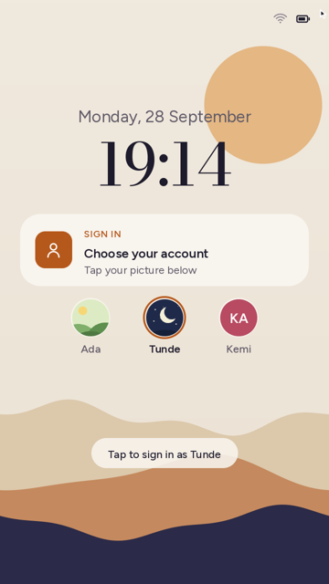
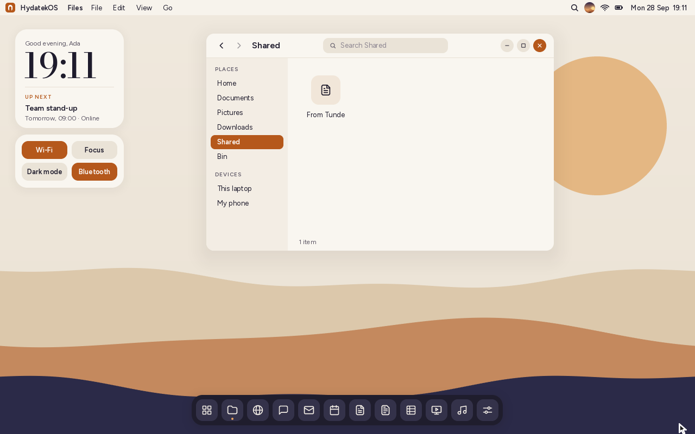
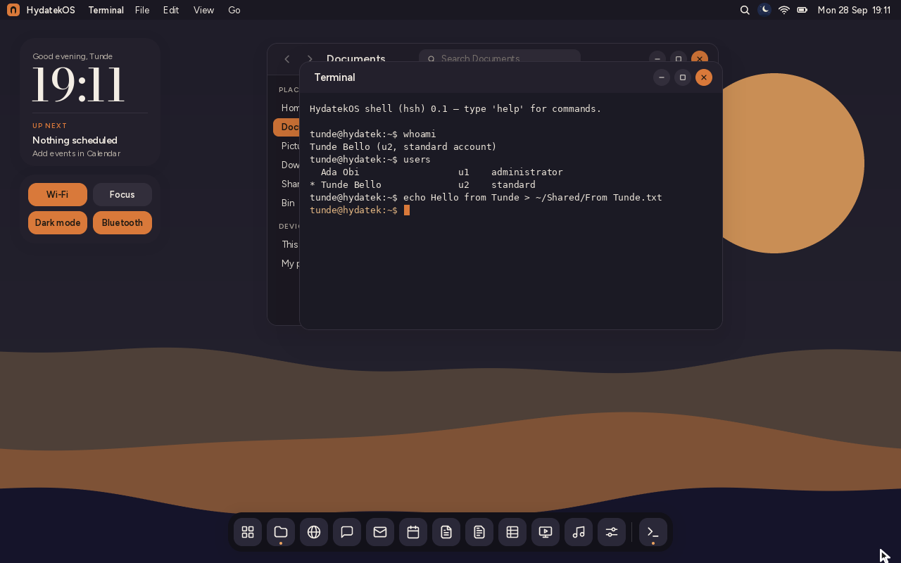
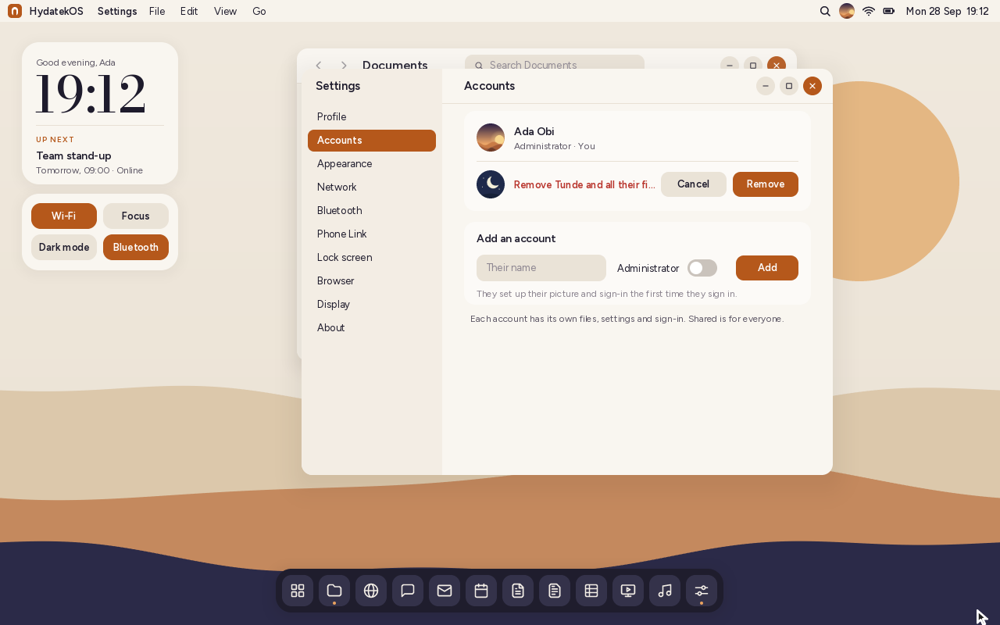

# Accounts

Several people can use one HydatekOS computer, each with their own account:

- their own **home folder** (Documents, Pictures, Downloads) and **Bin**;
- their own **settings**: light or dark, accent, pointer speed, search engine,
  lock-screen options;
- their own **sign-in** (PIN, password, phone fingerprint);
- their own **profile** (name, picture), **calendar** and **Hyda Search index**.

A **Shared** folder in every home is the same folder for everyone: put things
there to pass them between accounts.

| The lock screen with several accounts | Settings › Accounts |
|---|---|
|  |  |

## Adding someone

The first account, made by the setup assistant, is an **administrator**. In
**Settings › Accounts** an administrator types the new person's name, chooses
whether they're an administrator too, and clicks **Add**. The account appears
as "Not set up yet".

The new person chooses their picture on the lock screen and signs in. There's
no PIN yet, so they just click or press Enter. The setup assistant then welcomes
them by name and asks for their name, picture, sign-in and look, as on a new
computer:


## Signing in and switching

With more than one account, HydatekOS starts at the lock screen, and the lock
screen shows everyone's picture. Click a picture, or use **←** and **→**, then
type that person's PIN or password. The person who signed in last is chosen at
first.

- While someone other than the signed-in person is chosen, the lock screen hides
  the signed-in person's calendar and phone notifications. It shows "Choose your
  account" instead.
- **Lock Screen** (**F12**, or the profile menu in the menu bar) keeps your apps
  open. If you come back, everything is as you left it.
- If **someone else** signs in, your apps are closed first (each saves your work,
  as when you close its window), and their session starts.
- **Sign Out** (profile menu) closes your apps and returns to the lock screen.

One person is signed in at a time.



## What each account can reach

Inside HydatekOS, an account sees only its own files and the Shared folder. This
holds in Files, in the open and save dialogs, and in the Terminal. The folders
where other accounts keep their files, and the system folder (sign-in hashes,
profiles, settings), aren't there for it: `ls /` shows `apps`, `home` and
`trash`, and `/system` and `/users` answer "no such directory".
Administrators can't open other people's files either. They manage accounts,
not their contents.

| Shared between accounts | The Terminal knows who you are |
|---|---|
|  |  |

In the Terminal, the prompt shows your name (`tunde@hydatek:~$`), `whoami` says
who is signed in, and `users` lists the accounts.

## Administrators and standard accounts

| | Administrator | Standard |
|---|---|---|
| Use the computer, change their own profile, settings and sign-in | ✓ | ✓ |
| Add accounts | ✓ | |
| Make someone an administrator or a standard account | ✓ | |
| Remove accounts | ✓ | |

- **Removing** an account asks first ("Remove Tunde and their files?"). It deletes
  that person's files, Bin, settings, calendar and sign-in. Anything they put in
  Shared stays.
- There is always at least one administrator: the last one can't be removed or
  made standard.
- The **first account** can't be removed, because it holds the computer's
  original folders.
- Nobody can remove the account they're signed in to.
- A computer holds up to **8 accounts**.



## How it's stored

```
/system/users.txt                 the accounts
/home, /trash, /system/*          the first account (the places HydatekOS always used)
/users/<id>/home, /users/<id>/trash       each other account's files and Bin
/system/users/<id>/                       its profile, photo, lock.txt, settings,
                                          calendar and search index
/home/Shared                      shared by everyone
/system/link.txt, /system/certs   Phone Link pairing and trusted certificates:
                                  the computer's, not an account's
```

```
user u1 admin
user u2 standard new      "new": its owner hasn't been through setup yet
last u1                   who signed in last (chosen first on the lock screen)
```

A computer set up before accounts existed carries on as account `u1`, the first
account and an administrator, with its files where they were. The list is
written on the next start, with nothing moved or asked. Bad lines in
`users.txt` are skipped. An id may only have lower-case letters and digits, since
it names folders. If nobody is an administrator, the first account becomes one.

## Limits

- **The separation is inside HydatekOS.** Files aren't encrypted, so anyone who
  takes the disk to another computer can read every account's files. Disk
  encryption is planned for milestone 5 ([ROADMAP.md](ROADMAP.md)).
- **One person at a time.** Switching accounts closes the other person's apps,
  saving their work. Several people can't stay signed in side by side.
- **Phone Link belongs to the computer.** The paired phone's messages and
  notifications show in whichever account is signed in, as they would for
  anyone at the desk. They're hidden on the lock screen while another account
  is chosen.
- The first account can't be removed. It holds the computer's original folders
  (moving them is future work).
- No per-file permissions or sharing with just one person yet: a file is
  private, or it's in Shared.

## How it's built

| Part | Where |
|---|---|
| The account list, ids, who may be removed, where each account's things are, the path rules | `kernel/src/accounts.rs` |
| The session's view of files: `/home` and `/trash` mapped, `/system` and `/users` refused | `kernel/src/fs.rs` (`Vfs::scope`, the `*_raw` methods are the system's own) |
| Per-account settings, profile, sign-in, calendar and search; switching; adding and removing | `kernel/src/sys.rs` |
| Choosing an account on the lock screen | `kernel/src/shell/lock.rs` |
| Signing in, out and switching; the setup assistant for new accounts | `kernel/src/shell/mod.rs`, `shell/setup.rs` |
| Settings › Accounts | `kernel/src/apps/settings.rs` |

`tools/test.sh` runs `tests-host/src/accounts_tests.rs`:
- the list's round trip and damaged lists (path tricks in ids, repeats, too
  many accounts, nobody an administrator);
- new ids, and who may be removed or made standard;
- where each account's things are kept;
- the path rules: your home and Bin, Shared for everyone, and `/system`, `/users`
  and `..` refused for every account, the first one included.

Checked in QEMU:
- adding an account, and its owner's first sign-in with the setup assistant;
- a private home and Shared from both sides;
- the Terminal's view of the file system;
- switching with PINs, starting again at the chooser, and removing an account;
- the phone-sized chooser;
- a disk from before accounts carrying on as the first account.
