# Browser and Hyda Search

HydatekOS has its own web browser and its own search engine, **Hyda Search**.
Both are written from scratch for HydatekOS: the TCP connections and DNS
resolver, the HTTP client, the HTML parser, CSS and page layout, and the search
index and crawler. None of it comes from another browser or search engine.

## The browser

- **Address bar:** type an address (`example.com`, `http://10.0.2.2:8080/`) or
  words to search. Ctrl+L selects the address.
- **Back, forward, reload / stop, home** (Hyda Search), a loading bar, and the
  link under the pointer in the status bar. Backspace goes back; Space and Page
  Up/Down scroll.
- **Pages:** headings, paragraphs, bold / italic / underline / strikethrough,
  links (including `#section` links), bulleted and numbered lists, block quotes,
  preformatted text, simple tables, horizontal rules, and colours, backgrounds,
  borders, sizes, alignment, margins, padding and widths from CSS.
- **CSS:** external stylesheets, `<style>` blocks and `style=""` attributes;
  see [Stylesheets](#stylesheets) below.
- **Forms:** text fields, password fields, checkboxes, buttons and drop-downs
  (their selected value); GET and POST.
- **HTTP and HTTPS:** redirects, cookies, chunked transfer, gzip / deflate, and
  a 30-second timeout. Files that aren't web pages are saved to Downloads.
- **Secure sites:** a padlock in the address bar; click it for how the
  connection is secured. Plain `http://` pages get an ⓘ that says they aren't.

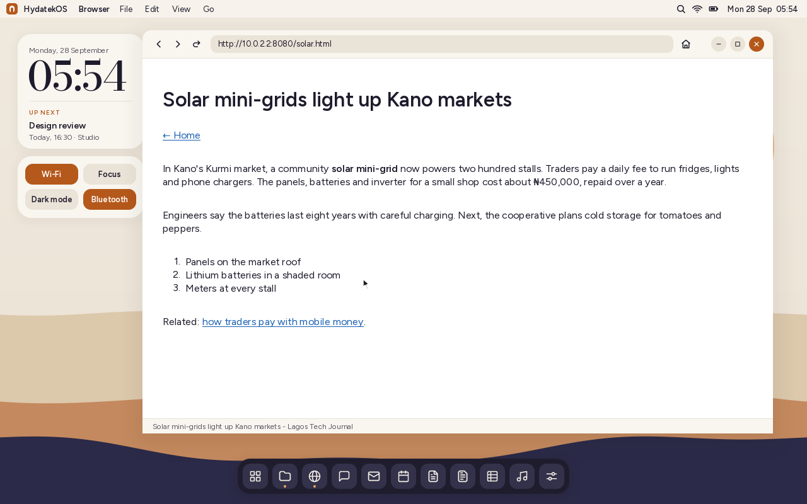

## Stylesheets

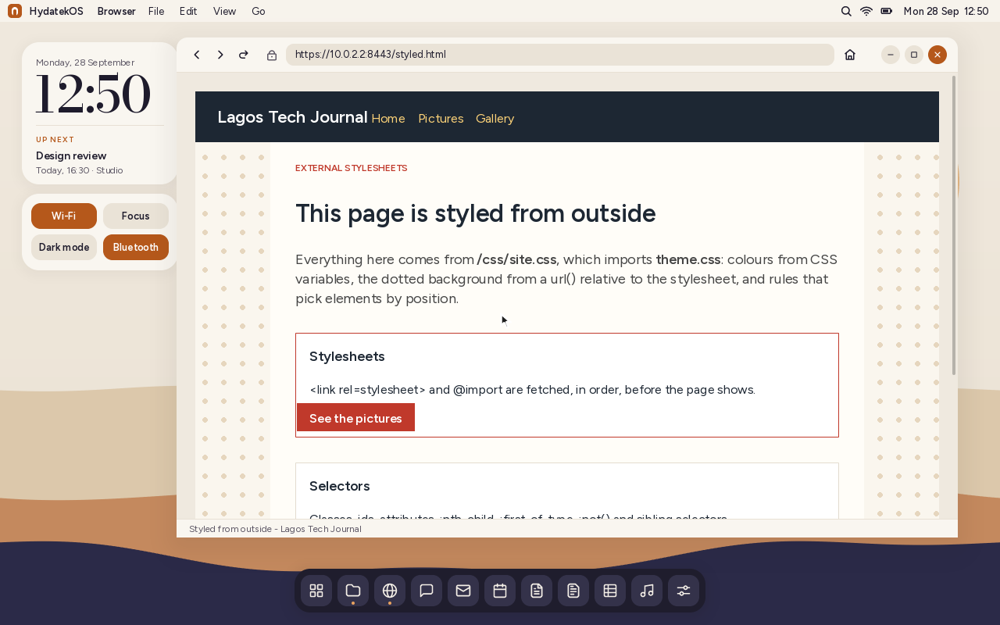

Pages get their look from **external stylesheets**, as on the real web:

- `<link rel="stylesheet" href="...">` (with its `media`) and `@import`
  (nested too, with media conditions) are fetched, and the page waits up to
  10 seconds for them before it shows, so it doesn't flash unstyled. Stop
  shows it at once. Stylesheets are kept for the next pages of the site.
- Addresses in a stylesheet (`url(...)` backgrounds, `@import`) are read
  relative to the stylesheet, not the page.
- **Selectors:** type, class, id, attributes (`[href^="https"]`,
  `[type=email i]` ...), `:first-child`, `:last-child`, `:nth-child(2n+1)`,
  `:nth-of-type`, `:not()`, `:is()`, `:where()`, `:root`, `:empty`, and
  descendant, child (`>`), next (`+`) and later (`~`) sibling combinators.
  Rules for `:hover`, `::before` and the like never match a still page.
- **The cascade:** specificity, source order, `!important`, `style=""`, and
  HTML's own presentational attributes underneath.
- **`@media`** queries are decided by the window: `min-width`/`max-width`,
  ranges like `(width >= 600px)`, `and`, `,`, `not`, `print` (no), orientation,
  `prefers-color-scheme: light`. `@supports` and `@layer` blocks apply.
- **Custom properties** (`--brand: #0a7`) and `var(--brand, fallback)`;
  **`calc()`**, `min()`, `max()`, `clamp()` with px, em, rem, %, vw and vh.
- **Hidden stays hidden:** skip links and screen-reader text (clipped to
  nothing), closed menus (`max-height: 0`), things moved off-screen, and
  `text-indent` image replacement.
- Links and spans with a background or border (buttons, badges) get their
  box; form buttons take the page's colours; `text-transform` works.

It's fast enough for frameworks: Bootstrap 5.3's stylesheet (2,300 rules)
reads in about 7 ms on a PC and a page of 1,600 elements lays out in about
40 ms, helped by indexing rules by id, class and tag.

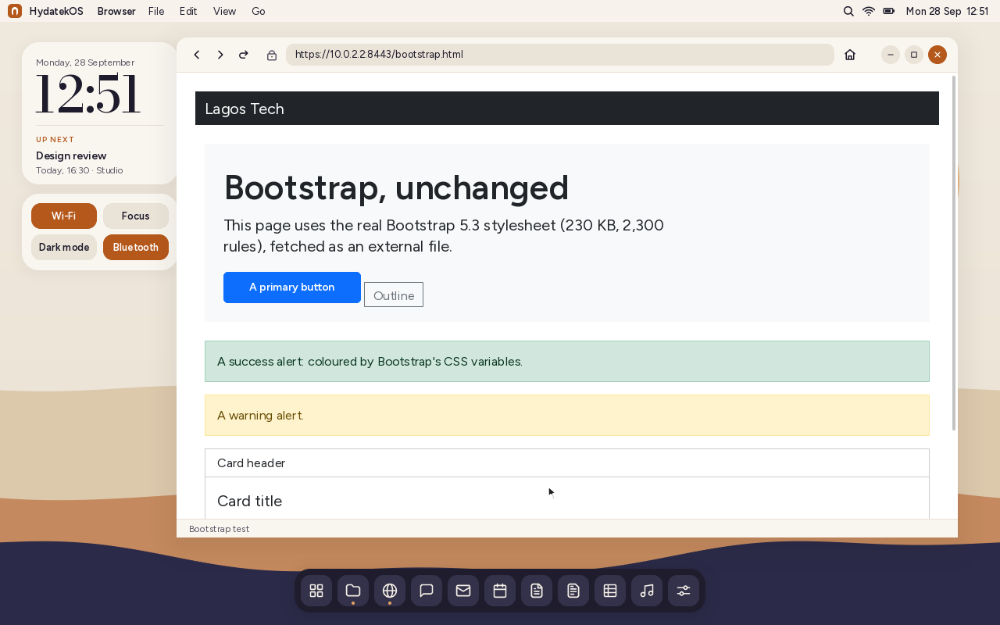

## Flexbox and grid

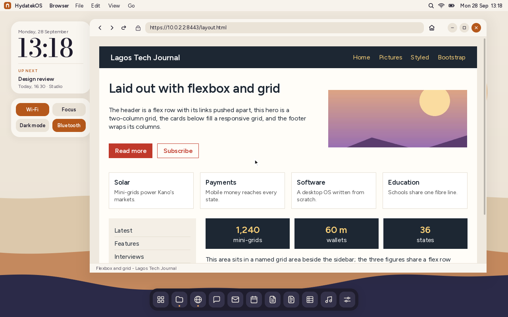

Pages lay out with **flexbox** and **CSS grid**, so navigation bars sit in a
row, columns sit side by side, and card galleries fill the width.

- **Flexbox:** `display: flex`, rows and columns (and `-reverse`), `flex-wrap`,
  `flex-grow` / `flex-shrink` / `flex-basis` and the `flex` shorthand, items
  sized to their content (min- and max-content), `justify-content` (start,
  end, center, space-between / around / evenly), `align-items` and
  `align-self` (stretch, start, end, center), `gap`, `order`, `margin: auto`
  to push items apart, and `min-height` / `height` on the container.
- **Grid:** `display: grid`, `grid-template-columns` / `-rows` with px, %,
  `fr`, `auto`, `min-content`, `max-content`, `minmax()` and `repeat()`
  (including `auto-fill` and `auto-fit`), `grid-template-areas` with
  `grid-area` names, line numbers (negative too) and `span` in
  `grid-column` / `grid-row`, auto-placement row by row, `grid-auto-rows`,
  `gap`, and `align-items` / `align-self` (grid items fill their cells' width).
- Frameworks' grids work: Bootstrap's `.row` / `.col-md-4`, `d-flex`,
  `justify-content-between`, `ms-auto` and the like.

The layouts are checked against Chromium: 33 test pages (wrapping, shrinking,
nested flex, spans, named areas, `auto-fill` ...) are laid out by both, and
every box lands within a pixel of Chromium's. Ten levels of nested flex boxes
lay out in about a millisecond.

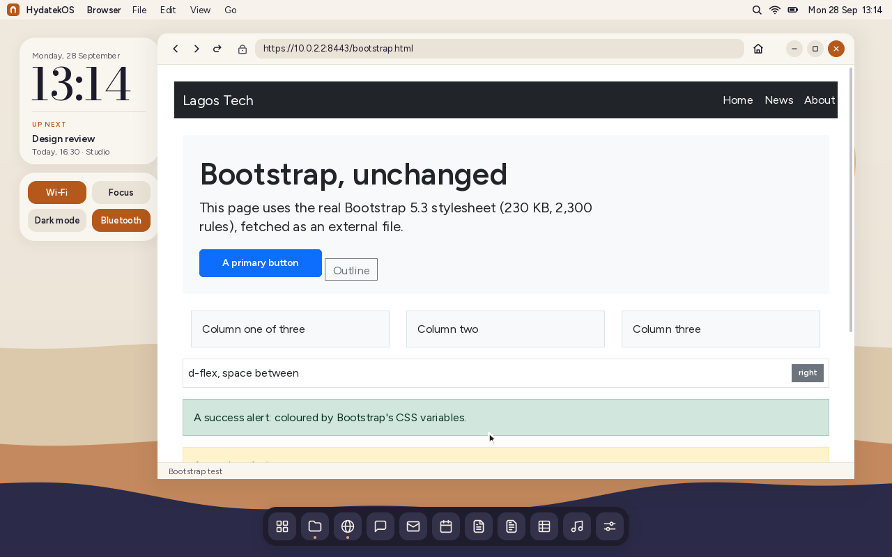

## Pictures

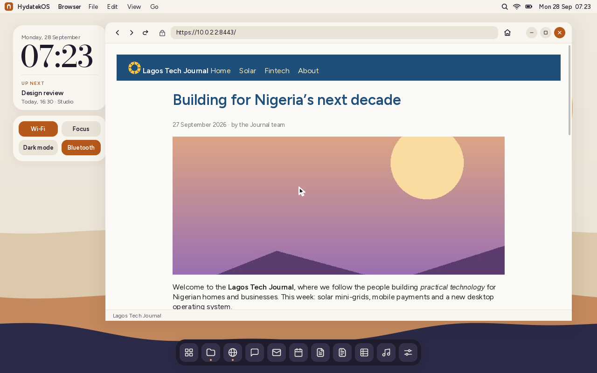

HydatekOS decodes pictures itself, with its own decoders (`kernel/src/image/`):

- **JPEG**, baseline and progressive, any chroma subsampling, restart
  markers, greyscale, CMYK, and phone photos' EXIF rotation.
- **PNG**, every colour type and bit depth, transparency and interlacing.
- **WebP**: lossy (VP8), lossless (VP8L), transparency and animation.
- **GIF**, animated, with transparency, and **BMP**.
- **SVG**, drawn by HydatekOS's own vector renderer, sharp at any size:
  shapes, paths (curves and arcs), fills (non-zero and even-odd), strokes
  (joins, caps, dashes), linear and radial gradients, transforms, groups
  with opacity, `<use>` and `<symbol>`, `<style>` sheets, nested `<svg>`.

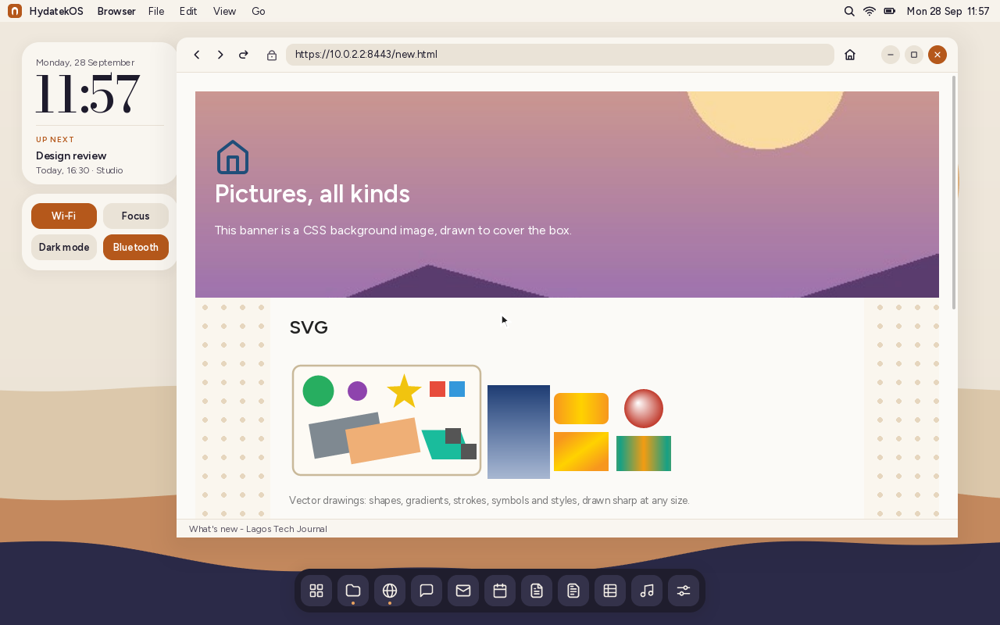

**Animations** (GIF and WebP) play with each frame's own timing.
**CSS background images** work too: `background` and `background-image`
with `url()`, `background-size` (`cover`, `contain`, lengths),
`background-position` and `background-repeat`, tiled or not. A CSS gradient
background shows its first colour for now.

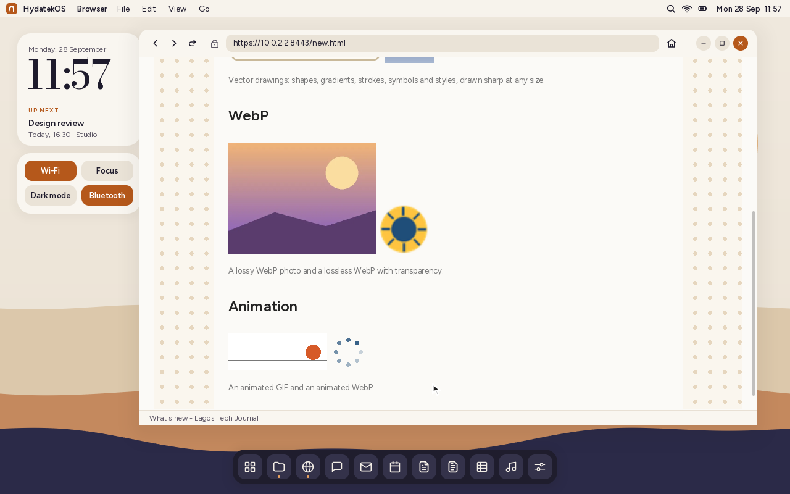

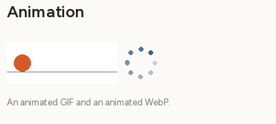

On a page, pictures take the size the page gives them (`width` / `height`
attributes or CSS), or their own, and are never wider than the text column:
large ones shrink to fit, keeping their shape. They sit in lines of text like
words, can be links, and keep their transparency. Pictures load six at a
time after the text, and the page makes room as they arrive; lazily loaded
pictures (`data-src`), `srcset` and `data:` addresses work. A picture that
can't be shown shows its description (`alt` text) instead.

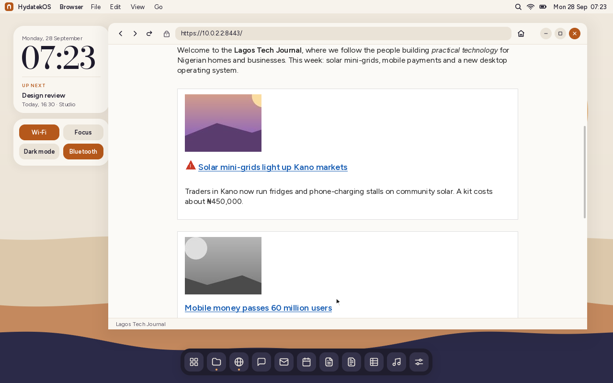

Opening a picture's address shows it on its own, with its size in the status
bar, and pictures in **Files** open the same way:

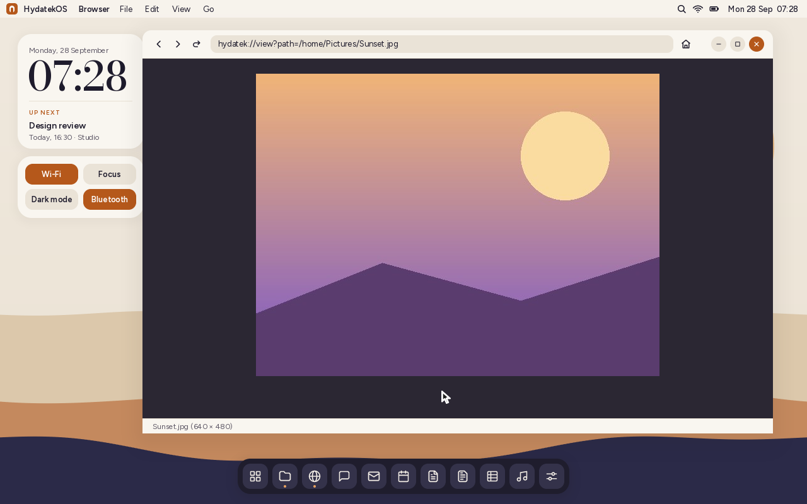

The decoders are compared with Pillow (libjpeg, libpng, libwebp) pixel by
pixel: PNG, GIF, BMP and WebP (lossy and lossless) match exactly, animations
frame by frame; JPEG is within a few levels (a slightly different inverse
DCT). SVG is compared with Chromium's drawing of the same files: on average
under one level apart, differing only along anti-aliased edges. With Go installed, they're also checked against Go's
image test files: the PNG suite and a photo in every JPEG subsampling,
progressive and restart variant. Thousands of randomly damaged files
(and SVGs full of nonsense and extreme numbers) check that a bad picture
never crashes anything.

## Hyda Search

Hyda Search is the browser's home page. It searches:

- **the pages you visit** (each page you open is added to the index),
- **sites you add:** type a site into "Add a site" and the crawler reads it,
- **your files:** documents, sheets, notes and text files in your home folder.

Results are ranked with **BM25** (the ranking function used by most search
engines), with words in a page's title counting extra and pages that contain all
your words first. Each result shows a snippet with your words in bold. Plural
and singular forms match each other.

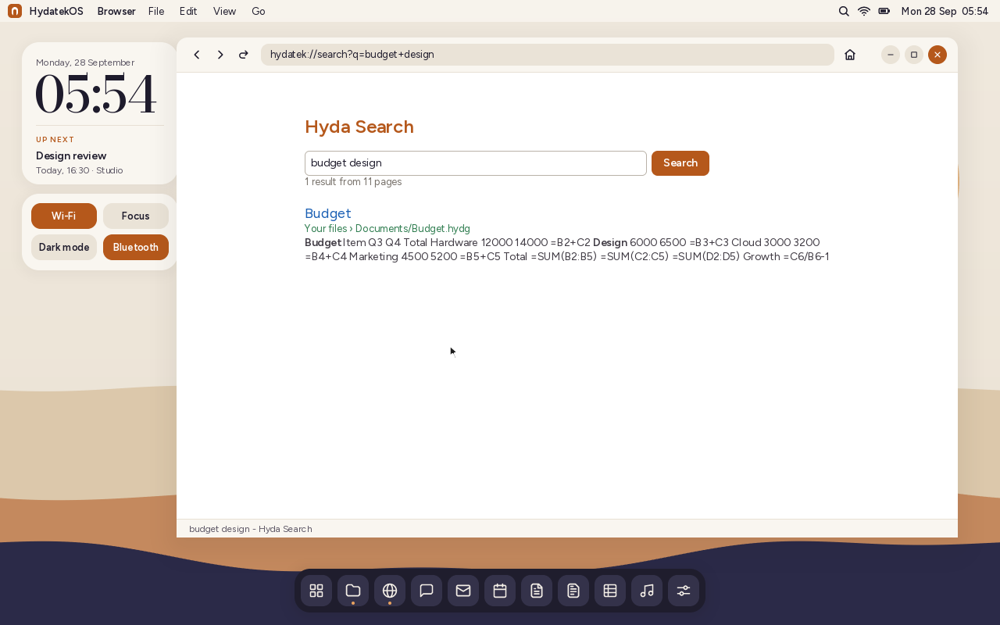

**The crawler is polite:** it reads a site's `robots.txt` first and follows its
rules, fetches one page per second, stays on the site you added, follows links
up to three levels deep, reads at most 60 pages per site, and skips pages marked
`noindex`. **Manage your index** lists the sites in it and removes any of them.

**Private:** the index is stored on this computer (`/system/search.hydx`), and
searches never leave it. There is no account and no tracking.

## Other search engines

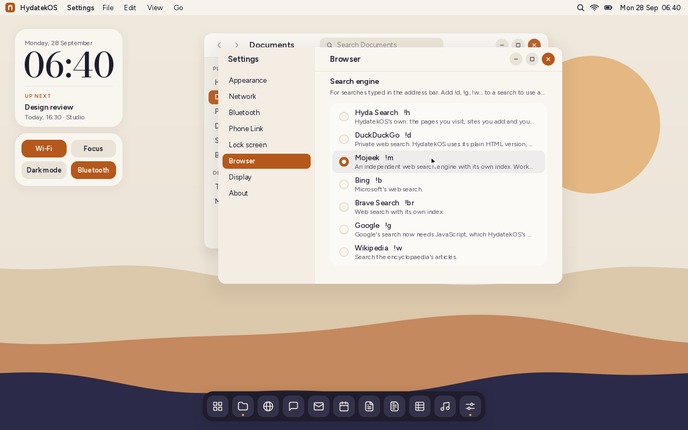

What you type in the address bar that isn't an address goes to your search
engine: Hyda Search to start with, or one of these, picked in
**Settings › Browser** or on the `hydatek://engines` page:

| Engine | Shortcut | Notes |
|---|---|---|
| Hyda Search | `!h` | On this computer; nothing is sent anywhere |
| DuckDuckGo | `!d` | Its plain HTML version, which works without JavaScript |
| Mojeek | `!m` | Independent index; works without JavaScript |
| Bing | `!b` | |
| Brave Search | `!br` | |
| Google | `!g` | Google's results now need JavaScript, which the browser doesn't run yet, so they may not show |
| Wikipedia | `!w` | Searches the encyclopaedia's articles |

A shortcut uses another engine just once: `!d jollof rice` or
`lagos weather !w`. A shortcut on its own opens that engine. Hyda Search's
results page also links the same search to each web engine:

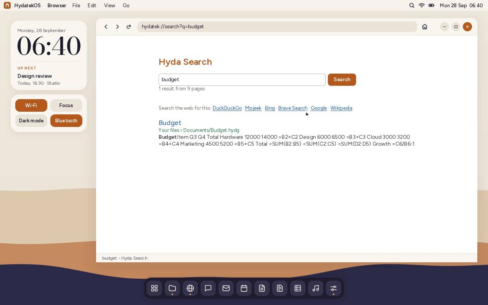

The web engines are other companies' services: what you search is sent to
them over HTTPS. HydatekOS only sends the search; it doesn't install their
code or share anything else.

**What it isn't:** a search engine for the whole web. Companies that index the
web run warehouses of computers crawling billions of pages; Hyda Search knows
the pages you visit, the sites you add and your files.

## Secure connections (HTTPS)

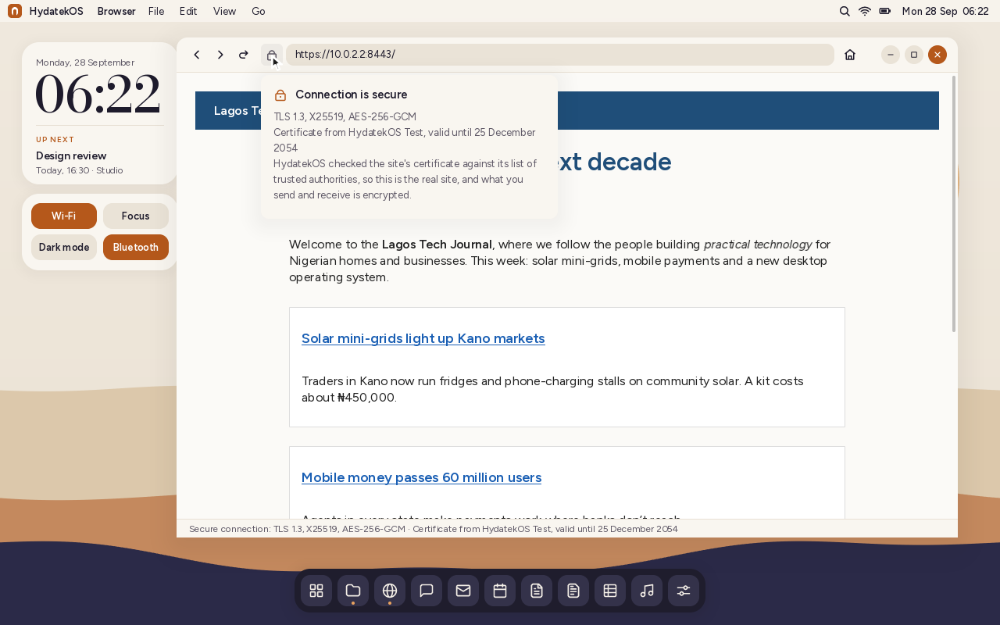

HydatekOS has its own TLS, written from scratch like the rest:

- **TLS 1.3** (RFC 8446) and **TLS 1.2** with ECDHE (RFC 5246, with extended
  master secret), no older versions. A TLS 1.2 answer from a server that could
  do 1.3 is caught (the downgrade sentinel).
- **Key exchange:** X25519, or P-256 / P-384 when the server asks for them
  (TLS 1.3's HelloRetryRequest).
- **Ciphers:** AES-128-GCM, AES-256-GCM and ChaCha20-Poly1305.
- **Signatures:** RSA (PSS and PKCS #1 v1.5, 2048 bits and up) and ECDSA on
  P-256 and P-384, with SHA-256, SHA-384 and SHA-512.
- **Certificates:** the browser follows the site's certificate chain up to one
  of **146 trusted authorities** (Mozilla's CA list, the one Firefox and most
  Linux systems use, stored in `kernel/src/tls/roots.bin`; `tools/rootgen.py`
  rebuilds it). It checks every signature, the dates, that authorities are
  marked as authorities, and that the certificate names the site (including
  `*.example.com` names and IP addresses).

When something is wrong, the page doesn't open:

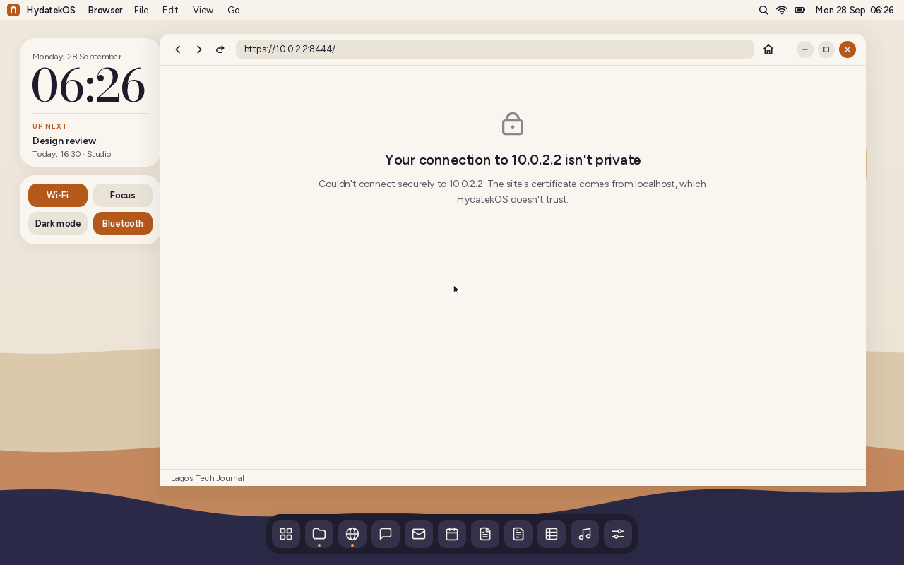

**Adding an authority:** organisations with their own certificate authority
(or a network that inspects traffic) can put its certificate, as `.pem`,
`.crt` or `.der`, in `/system/certs`; HydatekOS trusts it from the next start.

**Checked against:** OpenSSL's server in 27 handshakes (both TLS versions,
every cipher, RSA, P-256 and P-384 certificates, chains with an intermediate,
retry requests, a server asking for a client certificate, a 200 KB download),
and a production TLS 1.3 server on the internet (below: pypi.org, reached
through the test machine's security gateway, whose authority was added as
above; without it HydatekOS refused the connection, as it should). The
crypto is checked against published test vectors and 118 of Mozilla's root
certificates, whose own signatures HydatekOS verifies.

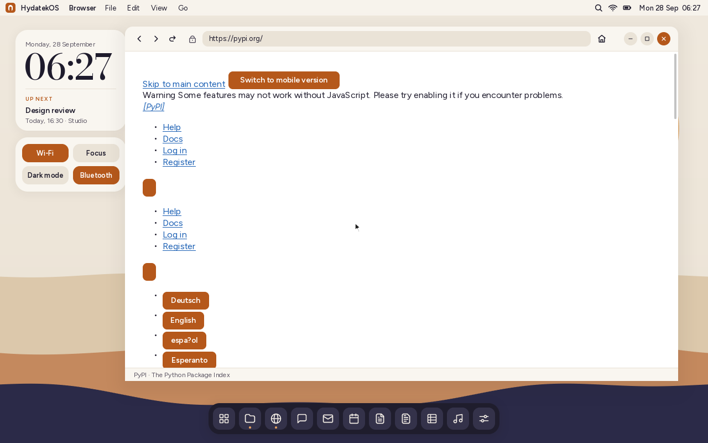

**Limits:** no certificate revocation checks (OCSP, CRLs) or Certificate
Transparency, no session resumption (every page is a full handshake), no
name constraints, and ECDSA/RSA code that isn't constant-time (it only
handles public data, except the P-256/P-384 key exchange, which is used when
a server refuses X25519).

## Not yet

- **AVIF pictures** (they show their description): AVIF is built on the AV1
  video codec, a much larger decoder.
- **In SVG:** text, filters, masks, clip paths and patterns.
- **JavaScript and web fonts.**
- **In CSS:** rounded corners, shadows, `::before`/`::after` content,
  positioning (absolute elements are laid out in the flow unless they're a
  hiding trick), and gradients (their first colour shows).
- **Tabs, bookmarks, find in page, downloads list, and text selection on pages.**
- **Layout:** floats are laid out as ordinary blocks; `inline-flex` and
  `inline-grid` flow as inline text; there's no `align-content`, baseline
  alignment or subgrid, and borders take no room in the layout.

## How it's built

| Part | Where |
|---|---|
| TCP connections (active open), UDP for DNS | `kernel/src/net/` |
| URLs, DNS messages, HTTP messages | `kernel/src/web/url.rs`, `dns.rs`, `http.rs` |
| Requests from apps, run by the main loop | `kernel/src/web/mod.rs`, `fetch.rs` |
| HTML parser | `kernel/src/web/html.rs` |
| CSS parsing, selectors, media queries, the cascade | `kernel/src/web/css.rs` |
| Style and layout, flexbox and grid | `kernel/src/web/render.rs` |
| Hyda Search: index, ranking, crawler | `kernel/src/web/search.rs` |
| Picture decoders: JPEG, PNG, WebP, GIF, BMP; the SVG renderer | `kernel/src/image/` |
| TLS: hashes, AES-GCM, X25519, P-256/P-384, RSA, X.509, the handshake | `kernel/src/tls/` |
| The browser app and its built-in pages | `kernel/src/apps/browser.rs` |

`tools/test.sh` tests URLs, DNS messages, HTTP parsing (byte by byte, chunked,
gzip), HTML parsing, CSS and layout, search ranking and storage, and TLS
(crypto vectors, certificates, and handshakes with `openssl s_server`) on the
host. `HYDATEK_LIVE=example.com cargo test --release live -- --ignored` in
`tests-host` connects to a real site.
In QEMU, the browser was checked against a local test site over HTTP and
HTTPS: pages, links, tables, forms (a gzip + chunked reply), crawling and
searching it, and refusing an untrusted certificate.
