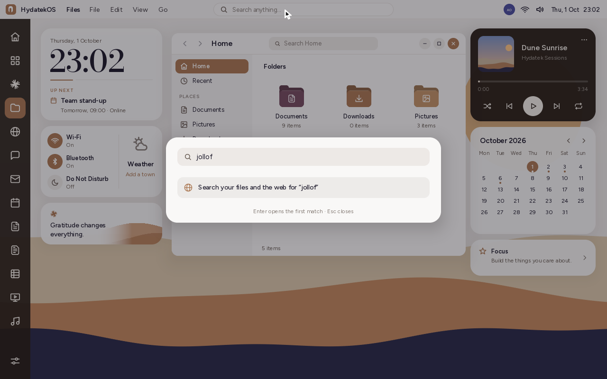
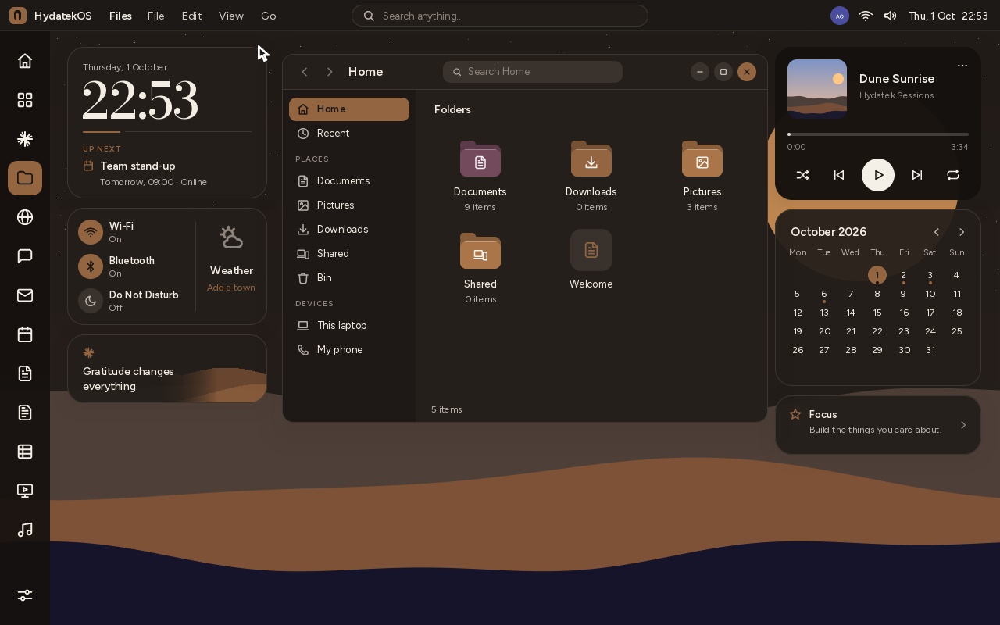
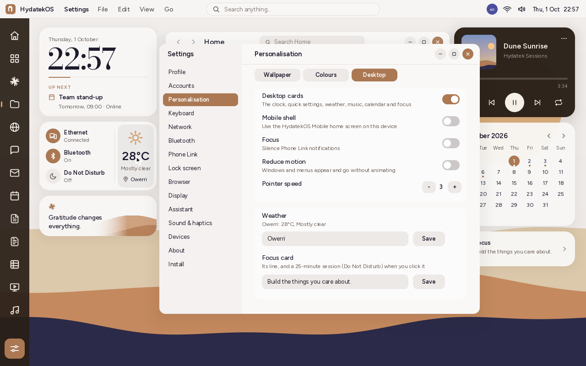

# The desktop


The desktop has four parts:
- the **top bar** across the top;
- the **app rail** down the left side;
- **cards** on either side;
- your windows in the space between the cards.

All of them take their colours from the wallpaper ([dynamic colour](PERSONALISATION.md#dynamic-colour)).

## The top bar

- **On the left:** the HydatekOS logo, which opens the system menu (About,
  Settings, Restart, Shut Down, Lock Screen). Next to it are the name of the app
  in front and that app's menus: File, Edit, View and Go.
- **In the middle:** **Search anything…**, which searches apps, files and the
  web. Type, and the matching apps show. **Enter** opens the first match. If no
  app matches, or you choose **Search your files and the web for "…"**, Hyda
  Search opens with results from your files, the pages you've visited and the
  sites you've added, plus links to web search engines. On a narrow screen, the
  search box shrinks to a magnifying glass.
- **On the right:** your picture (the profile menu), the phone when one is
  paired, the network, the volume, the battery on a laptop, and the date and time.



## The app rail

The rail holds your apps, top to bottom:

| Button | What it does |
|---|---|
| **Home** | Shows the desktop: windows get out of the way. Click again to bring them back (or press **Hydatek+D**). It's lit when no window is in front. |
| **All apps** | The launcher, with every app. |
| Claude, Files, Browser, Messages, Mail, Calendar, Notes, Scripts, Grids, Slides, Music | The pinned apps. **Hydatek+1 … 9** opens the first nine. |
| Apps you opened that aren't pinned | Appear under the pinned ones while they're open. |
| **Settings** | Sits at the foot of the rail. |

- The app in front is lit in your accent colour.
- A small mark at the left edge shows that an app is open.
- Clicking the app in front minimises it into its button, and clicking again
  brings it back.
- Hovering over a button shows its name.

On a short screen, the buttons move closer together so they all fit.

## The window buttons

Windows have HydatekOS's own round buttons on the right: minimise, maximise and
close. Close is filled with the accent colour. Double-click a window's header to
maximise it. Windows open in the space between the cards, when it's wide enough.

## The cards

On a screen at least 900 points wide (and 560 tall), cards sit on the left:

| Card | What it shows | Click it to |
|---|---|---|
| **Clock** | The date, the time and the next event from Calendar | Open Calendar |
| **Quick settings** | Ethernet when a cable is connected (or Wi-Fi, otherwise), Bluetooth, Do Not Disturb | Turn each on or off; Ethernet opens Settings › Network |
| **Weather** | The temperature, the sky and your town | Set your town (Settings › Personalisation › Desktop) |
| **A line for the day** | One of seven lines, a different one each day, over a small dune | — |

At least 1180 points wide, there are cards on the right too:

| Card | What it shows | Click it to |
|---|---|---|
| **Music** | What's playing, how far through it is, and the controls: shuffle, previous, play or pause, next, repeat | Steer playback; **⋯** opens Music |
| **Calendar** | The month, with today circled and dots on days with events | Move between months with the arrows (click the month's name to come back to today); click a day to open Calendar |
| **Focus** | Your line, *Build the things you care about.* by default | Start a 25-minute focus session: Do Not Disturb turns on, and the card counts down. Click again to stop early. |

The music card and the Music app control the same player, so pausing in one
pauses the other. The tracks are samples with no sound files yet, so playback
only shows on screen.



To turn the cards off, or to set your town and Focus line, go to
**Settings › Personalisation › Desktop**:



## The weather

The weather comes from [Open-Meteo](https://open-meteo.com), which is free and
needs no account or key.
- Type your town in Settings and press **Save**. HydatekOS looks it up once and
  remembers where it is. After that it asks for the current weather every half
  hour while the computer is online.
- The card shows the temperature in °C, the sky (clear, cloudy, fog, rain, snow
  or storm, by day and by night) and the town.
- Before there's an answer, it says why: *Waiting for a network*, *Looking
  outside…*, *Offline for now* (it tries again after five minutes) or *Town not
  found*.
- Only the town's name and coordinates go to Open-Meteo.
- Open-Meteo is open source, so you can run your own server. Point HydatekOS at
  it with a `weatherapi=` line in your settings file, for example
  `weatherapi=http://192.168.1.20:8080`.

## Files


- **Home** opens first. It shows your folders as coloured folders, each with how
  many items it holds. Under them is **Recent files**: the files you opened
  lately, with the folder each is in and when you opened it (*Just now*, *3 min
  ago*, *2h ago*, *Yesterday*, *3 Oct*).
- **View all** and **Recent** in the sidebar list up to 30 recent files.
- The sidebar has an icon for each place: Home, Recent, Documents, Pictures,
  Downloads, Shared, Bin, This laptop and My phone.
- Each folder's colour and picture come from its name, so it looks the same
  everywhere: Documents is plum with a page, Downloads is warm with an arrow,
  Pictures has a photo.
- Recent is kept for each account, in `recent.txt` in that account's system
  folder.

## How it works

| File | What it holds |
|---|---|
| `kernel/src/shell/mod.rs` | The top bar (`draw_bar`), the app rail (`rail`, `draw_rail`), the launcher's search, and where windows open |
| `kernel/src/shell/widgets.rs` | The cards and what clicking them does (`Q_*`) |
| `kernel/src/web/weather.rs` | Open-Meteo: the addresses, reading the answers, WMO weather codes, and when to ask. Host-tested in `tests-host/src/weather_tests.rs` |
| `kernel/src/apps/music.rs` | `Player`, which the card and the app share (in `Sys`) |
| `kernel/src/apps/files.rs` | Home, Recent, the coloured folders |
| `kernel/src/sys.rs` | The weather, Focus and Recent settings; `stamp` and `ago` for "when" |
| `kernel/src/icons.rs` | Icons added for this: star, moon, pin, shuffle, repeat, clock, download, video, archive, more, and six kinds of weather |

Settings file lines:

```
weather=Owerri
weatherat=5.4833,7.0304,Owerri     # where it was found (saves looking it up again)
weatherapi=                        # another Open-Meteo server, if you run one
intention=Build the things you care about.
```
