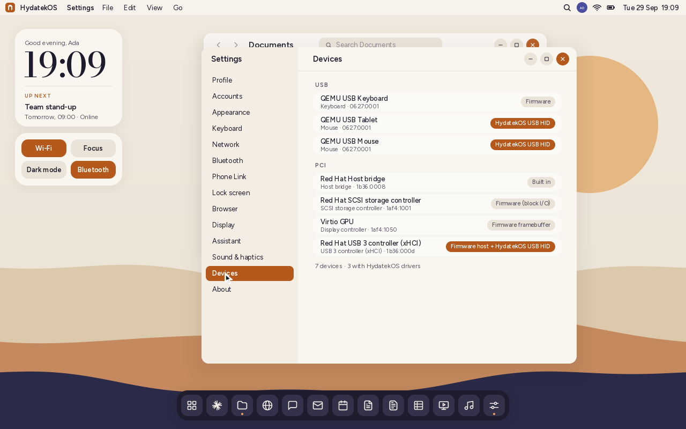
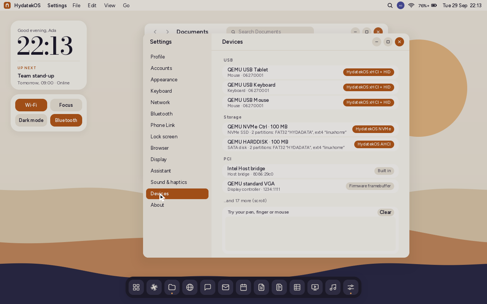

# Drivers

> Also: [GRAPHICS.md](GRAPHICS.md) (drawing on every core), and the sections below on ACPI, USB host, storage, audio, Bluetooth and Wi-Fi.

HydatekOS's own device drivers, and what each piece of hardware needs.
Milestone 1 keeps the firmware for the USB host controller, disks and the
framebuffer (HydatekOS never calls `ExitBootServices`). Everything a person
touches (mice, touchpads, touch screens, media keys, game controllers,
haptics) now goes through HydatekOS code on both x86-64 and ARM64.

## The pieces

| Driver | File | What it does |
|---|---|---|
| HID core | `kernel/src/hid.rs` | Reads HID report descriptors (globals, locals, push/pop, collections, arrays), finds what a device is, and decodes its reports: mice, tablets, Precision Touchpads, touch screens, gamepads, media keys and haptic controllers |
| Touchpad gestures | `kernel/src/touchpad.rs` | One finger moves; tap to click, two-finger tap for a right click, three for middle; two fingers scroll (natural direction); the pad's button, a right click with two fingers down; palms are ignored |
| USB HID | `kernel/src/usb.rs` | Takes every HID interface the firmware hasn't claimed, and Xbox controllers, through the firmware's USB I/O protocol. Asynchronous interrupt transfers fill a lock-free ring per device, and HydatekOS reads it every frame. New and unplugged devices are noticed within about 2 seconds |
| Game controllers | `kernel/src/gamepad.rs` | HID gamepads, Xbox 360 and Xbox One / Series protocols, navigation (D-pad or stick, A, B, Start, bumpers), rumble packets and motor timing |
| I²C and HID over I²C | `kernel/src/i2c.rs` | A polled DesignWare I²C controller driver (Intel and AMD laptops, many ARM SoCs) and Microsoft's HID over I²C protocol: HID descriptor, report descriptor, input reports, reset, power, get and set report, output reports |
| PS/2 mouse | `kernel/src/ps2.rs` | Older PCs and virtual machines without a USB mouse |
| Inventory | `kernel/src/hw.rs` | Every PCI device by class and vendor, and a count of the I²C devices ACPI lists; shown in Settings › Devices with who drives each |

## What works with what

| Hardware | x86-64 | ARM64 | How |
|---|---|---|---|
| USB mouse, trackball | ✅ | ✅ | HydatekOS USB HID (or the firmware's driver where it has one) |
| USB tablet, virtual machine pointer | ✅ | ✅ | positions scaled to the screen |
| USB Precision Touchpad | ✅ | ✅ | switched to multitouch mode (input mode 3), gestures |
| USB touch screen | ✅ | ✅ | points where it's touched; lifting the finger lets go |
| Media keys (mute, volume, brightness, sleep, eject) | ✅ | ✅ | the Consumer page, as the same keys as a keyboard's |
| USB haptic touchpad | ✅ | ✅ | reads its waveform list (GET_REPORT) and plays waveforms (SET_REPORT) |
| HID gamepad (DualShock 4, DualSense, generic) | ✅ | ✅ | D-pad and stick navigate, A Enter, B Escape, Start the start menu |
| Xbox 360 wired, Xbox One / Series (USB) | ✅ | ✅ | Microsoft's own protocols; the Xbox One is sent its "start" message |
| Rumble motors | ✅ | ✅ | Xbox 360, Xbox One, DualShock 4, DualSense |
| I²C touchpad, touch screen, pen | – | – | protocol ready; needs ACPI's AML to find the device |
| USB keyboard | ✅ | ✅ | the firmware's driver (HydatekOS reads it through the text input protocol) |
| USB storage | ✅ | ✅ | the firmware's driver |

## How a USB device is started

1. HydatekOS looks at every handle with the USB I/O protocol and skips those
   the firmware drives (they already have a keyboard or pointer protocol).
2. It reads the interface descriptor. HID interfaces (class 3) and Xbox pads
   (vendor class with Microsoft's subclasses 0x5D and 0x47) go on.
3. For HID it takes the report descriptor's length from the configuration
   descriptor's HID descriptor and reads it (GET_DESCRIPTOR 0x22). Then it
   switches boot devices to the report protocol (SET_PROTOCOL) and turns off
   idle repeats (SET_IDLE).
4. Touchpads are told to report fingers. Haptic touchpads are asked for their
   waveform list.
5. An asynchronous interrupt transfer starts on the interrupt IN endpoint.
   The firmware calls HydatekOS back with each report, into that device's ring.
6. The interrupt OUT endpoint, if there is one, carries rumble packets.
   Otherwise they go as SET_REPORT output reports.

The serial log says what happened. In QEMU's ARM machine that's
`usb: driving 0627:0001 interface 0 as Mouse`; an Xbox pad would log
`… as Xbox controller with rumble motors`.

## Tested

- **Host tests** (`cd tests-host && cargo test`):
  - descriptors from real devices: a boot mouse, QEMU's tablet, a two-finger
    Precision Touchpad, a haptic controller, media keys in both styles, a
    generic gamepad;
  - gesture sequences;
  - Xbox 360 and Xbox One reports;
  - navigation repeat timing;
  - every rumble packet, and motor timing;
  - malformed descriptors;
  - PCI class names;
  - finding I²C devices in AML;
  - the DesignWare driver and HID over I²C against a simulated controller, with a
    simulated haptic touchpad on its bus: descriptor, report descriptor, reset,
    power, waveform list, a haptic click, input mode, input reports, and report
    ids of 15 and up.
- **QEMU:**
  - ARM64 (virt, `qemu-xhci`, `usb-tablet`, `usb-mouse`): the pointer works,
    both absolute and relative, and clicks go through. This is the first time
    HydatekOS has a mouse on ARM.
  - x86-64 (q35): the USB tablet is driven by HydatekOS, alongside the PS/2 mouse.
- **Not yet on real hardware:** haptic touchpads, controllers and touch screens.

## What's next

- **ACPI AML interpreter.** It finds I²C touchpads: their controller, address
  and HID descriptor register (the PNP0C50 device's `_CRS` and `_DSM`), and the
  DesignWare controller's address and clock.
- **Qualcomm GENI I²C** for Snapdragon laptops' touchpads and touch screens.
  Then SPMI and the PMIC's haptics driver, for the vibration motor in
  Snapdragon tablets.
- **An xHCI host controller driver**, so USB no longer needs the firmware, and
  USB audio, video (UVC) and Bluetooth (HCI) can follow.
- **Wi-Fi, audio (HD Audio, SoundWire), NVMe/AHCI and GPU acceleration.** Each
  is a driver family of its own; see [ROADMAP.md](ROADMAP.md).

## Added since: the machine's own hardware

| Part | File | What it does | Tested |
|---|---|---|---|
| ACPI interpreter | `aml.rs`, `acpi.rs` | Loads the DSDT and SSDTs and runs their methods (_HID, _CID, _STA, _CRS, _DSM, _INI, _BIF/_BST, _ALI). _OSI answers like Windows. Reaches memory, I/O ports, PCI configuration space (ECAM) and the embedded controller | Host tests: an iasl-compiled laptop DSDT, QEMU's q35 and ARM `virt` DSDTs, fuzzed tables. QEMU: both DSDTs load with 0 errors; an injected SSDT's touchpad, battery and light sensor are found |
| I2C touchpads | `i2cdev.rs`, `i2c.rs` | Finds HID over I2C devices through ACPI and starts them on DesignWare controllers (Intel LPSS on PCI is taken out of reset and timed from FMCN). Polled, no GPIO interrupt yet | Simulated controller and touchpad; QEMU discovery (it has no I2C hardware) |
| Battery, light | `acpi.rs`, `ambient.rs` | Battery percentage in the top bar; brightness follows a light sensor (ACPI or HID). The brightness keys shift the curve | QEMU with an injected SSDT |
| Pen | `hid.rs`, `hidin.rs` | Pressure, eraser, barrel button, tilt; a pen pad in Settings › Devices (the mouse draws on it too) | Host test with a Windows-style pen descriptor; the pad in QEMU |
| USB host (xHCI) | `xhci.rs`, `pci.rs` | Takes controllers from the firmware (never the boot disk's, and the firmware always keeps a real keyboard), rings, contexts, port reset, hot-plug, HID devices including keyboards | QEMU x86-64 and ARM64: setup typed and clicked through it |
| NVMe, SATA | `nvme.rs`, `ahci.rs`, `storage.rs`, `disks.rs` | Identify, read, write; GPT/MBR; FAT, exFAT, NTFS, ext2-4, Btrfs, APFS, HFS+, ISO 9660. Writes only to disks carrying a test marker | Host tests on an mformat/mkfs disk; QEMU NVMe and AHCI, a sector written and read back |
| Audio | `hda.rs`, `sound.rs` | Intel HD Audio: codecs, output paths, a 48 kHz stream; synthesised system sounds; the volume keys work | QEMU recorded to WAV: the startup chord's notes, the notification, the volume tick |
| Bluetooth | `bt.rs`, `usb.rs` | USB adapters: HCI bring-up, classic inquiry and LE scanning, names, kinds, makers, signal | Host tests (QEMU 8.2 has no Bluetooth device) |
| Intel Ethernet | `net/e1000.rs`, `net/mod.rs` | Gigabit Ethernet on the 8254x ("e1000"), 82571–82574/82583 and the LAN in Intel chipsets since 2009: 82577LM/LC, 82578, 82579, I217, I218, I219 (the 82577LM is the one in an HP EliteBook 8440w). Takes the card from the firmware, legacy descriptors, 32-entry rings, polled. Chipset LAN is never reset, because the Management Engine (vPro) shares its PHY. Other cards still go through the firmware's driver | QEMU `e1000` (82540EM) and `e1000e` (82574L): link, DHCP, and 40 Phone Link page loads in a row. Not yet tried on a real chipset LAN |
| Wi-Fi | `wifi.rs`, `uefiwifi.rs` | Beacons (security, Wi-Fi 4-7, bands), WPA2: PBKDF2, PTK, the 4-way handshake, group key unwrap, CCMP. Scanning through the firmware's Wi-Fi driver where there is one | IEEE 802.11 Annex J vectors; the handshake frame for frame against an independent Python authenticator. No Wi-Fi hardware to try |

What's still missing:
- Wi-Fi chip drivers (Intel, Qualcomm, MediaTek, Realtek), and joining
  networks through the firmware. Intel's Wi-Fi chips run on a firmware file
  that the driver loads into them, and QEMU has no Wi-Fi card to test with.
- Bluetooth pairing and profiles.
- Qualcomm's I2C (GENI) and SPMI haptics.
- GPU engines (Intel, AMD, NVIDIA). NVIDIA publishes no programming manual
  for its older GPUs such as the Quadro FX 880M, so a driver means
  reverse-engineering on the scale of Linux's nouveau.
- Realtek and Broadcom Ethernet chips (these use the firmware's driver).
- An AML interpreter for Load/LoadTable (tables loaded at run time).
