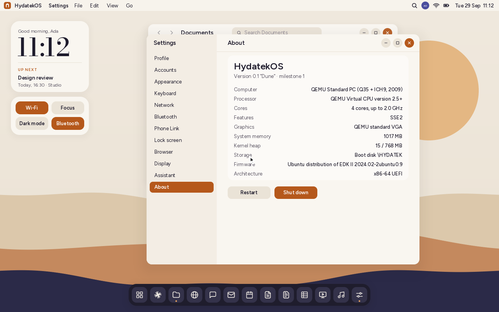
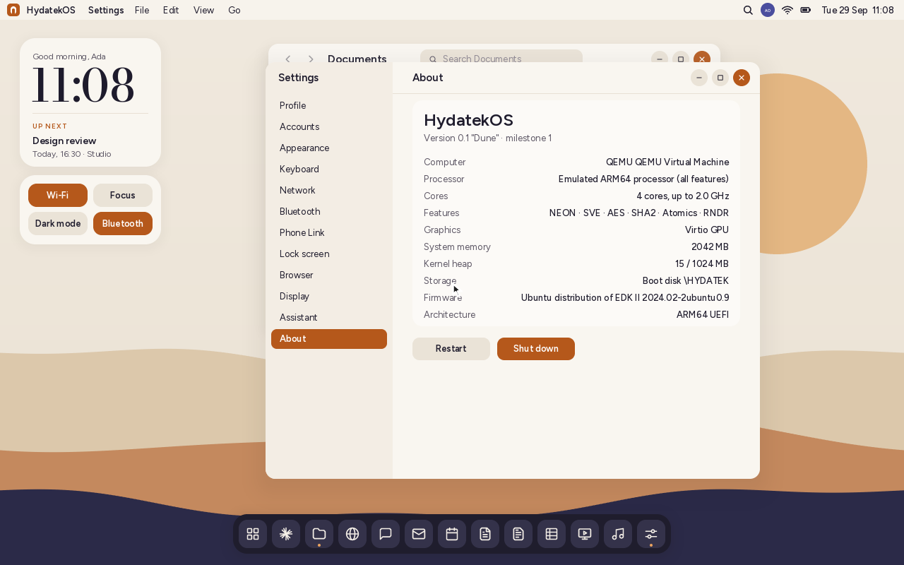
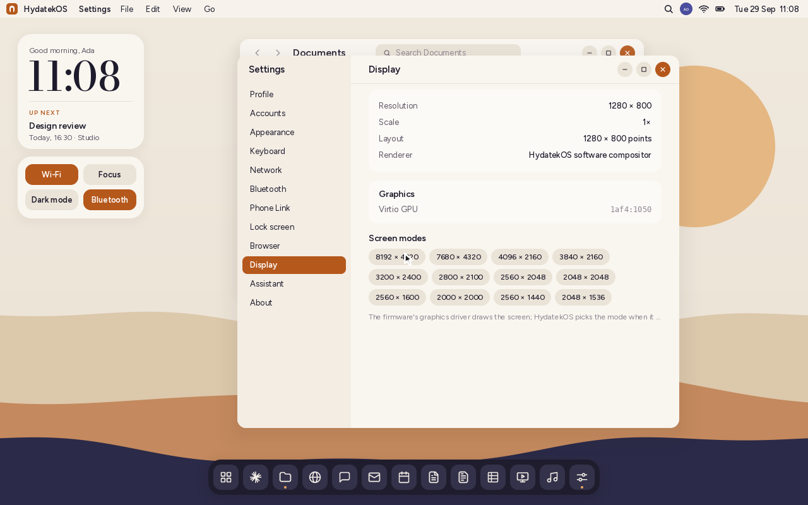

# Processors and graphics

HydatekOS runs on the two kinds of processor in today's laptops and desktops:

| | x86-64 | ARM64 |
|---|---|---|
| Processors | Intel Core / Xeon, AMD Ryzen / EPYC | Qualcomm Snapdragon X (Oryon), Arm Cortex / Neoverse designs |
| Boot file | `\EFI\BOOT\BOOTX64.EFI` | `\EFI\BOOT\BOOTAA64.EFI` |
| Random numbers | RDRAND + firmware RNG + TSC jitter | RNDR (Armv8.5) + firmware RNG + timer jitter |
| Debug log | COM1 | the firmware's serial port |
| Mouse without firmware support | HydatekOS PS/2 and USB HID drivers | HydatekOS USB HID driver |

`tools/mkimage.sh` puts both on the same stick when the `aarch64-unknown-uefi`
Rust target is installed, and the firmware picks the one for its processor.

| x86-64 (QEMU, 4 cores) | ARM64 (QEMU virt, 4 cores) |
|---|---|
|  |  |

## What HydatekOS finds out

Settings › About and Settings › Display show:

- **Computer:** the maker and model (SMBIOS), e.g. "Microsoft Corporation
  Surface Laptop 7".
- **Processor:**
  - On x86 it's the name the processor reports itself (CPUID): "AMD Ryzen 7 7840U
    w/ Radeon 780M Graphics".
  - On ARM it's the maker's product name from SMBIOS, e.g. "Snapdragon X Elite -
    X1E80100 - Qualcomm Oryon CPU".
  - Otherwise (virtual machines put the machine type in SMBIOS) it's the core design
    read from the processor's ID register: "Qualcomm Oryon", "Arm Cortex-A72".
- **Cores:** from the firmware's MP Services, with threads and the top speed from
  SMBIOS.
- **Features** HydatekOS knows:
  - x86: SSE2, SSE4.1, AVX, AVX2, AVX-512, AES-NI, SHA, RDRAND.
  - ARM: NEON, SVE, AES, SHA2, Atomics, RNDR.
- **Graphics:** every display controller on PCI, by vendor and device:
  - Intel, AMD Radeon, NVIDIA, Qualcomm Adreno;
  - QEMU, Virtio, VMware, VirtualBox and Hyper-V virtual GPUs.

  Snapdragon's Adreno isn't on PCI; it's shown as "Qualcomm Adreno (built into the
  Snapdragon)".
- **Screen modes:** every mode the firmware's graphics driver offers, with the one
  in use highlighted.
- **Devices** (Settings › Devices): every PCI and USB device, what it is, and
  what drives it: HydatekOS, the firmware, or nothing yet.

## How far the support goes

HydatekOS milestone 1 draws through the firmware's framebuffer (UEFI GOP) and
composites in software, so any GPU the firmware can show a picture on works.
There's no GPU acceleration yet: that needs drivers for each GPU family.

On ARM64 the keyboard, disk, network and screen all go through the firmware,
as on x86. Pointers don't have to: ARM firmware often has no mouse driver
(QEMU's doesn't), so HydatekOS drives USB mice, tablets, touchpads, touch
screens and controllers itself ([DRIVERS.md](DRIVERS.md)). In QEMU's ARM
machine the USB tablet and mouse both work.

A Snapdragon laptop's built-in touchpad sits on I²C, not USB. HydatekOS has
the HID over I²C protocol, but it can't find the touchpad until it can read
ACPI's AML, and Snapdragon's I²C controller (Qualcomm GENI) has no driver yet.
Settings › Devices counts the I²C devices ACPI lists. Until then, a USB mouse or
the keyboard works:
- the Hydatek key opens the start menu;
- Gen+Space opens the launcher;
- ↑/↓ move through Settings.

## How it's built

| Part | Where |
|---|---|
| Processor differences (cycle counter, RDRAND/RNDR, I/O ports, CPUID/MIDR) | `kernel/src/arch.rs` |
| SMBIOS, MP Services, PCI display controllers, GOP modes, name tables | `kernel/src/hw.rs` |
| Settings › About and Display | `kernel/src/apps/settings.rs` |
| Both boot files on one image | `tools/mkimage.sh` |

`tools/test.sh` checks the name tables and the SMBIOS parser against a
Snapdragon laptop's tables, including truncated ones
(`tests-host/src/hw_tests.rs`). Both builds were booted in QEMU:
- x86-64: q35 machine, OVMF firmware.
- ARM64: `virt` machine, AAVMF firmware, 4 cores, virtio-gpu, USB keyboard.

On ARM64 the whole system came up, from the setup assistant to the desktop and
Settings: random numbers from RNDR, 4 cores, NEON/SVE/AES/SHA2, the Virtio GPU
and 37 screen modes.
