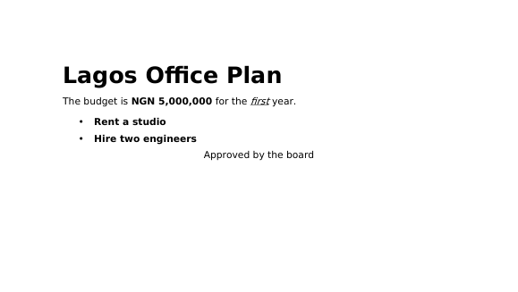

# Hyda Workspace

Hyda Workspace is HydatekOS's office suite. Its first app is **Hyda Scripts**,
the word processor. Like the rest of HydatekOS, it's written from scratch: the
document model, page layout, Word file reader and writer, zip and deflate code
are all HydatekOS code.

## Hyda Scripts

Open it from the dock, the app launcher (**F1**, type "scripts"), or by
double-clicking a `.docx` file in Files. On a phone-shaped screen it opens full
screen from Files, with the page fitted to the width.

### What it does

- **A4 pages** with 1-inch margins, laid out and paginated as you type. The status
  bar shows the page you're on, the page count and the word count.
- **Paragraph styles:** Body, Title, Heading 1, Heading 2, Quote, bulleted and
  numbered lists (numbering restarts after each list, as on screen).
- **Character formatting:** bold, italic, underline and strikethrough, on a
  selection or for what you type next.
- **Alignment:** left, centre and right.
- **Editing:** click to place the caret, drag or Shift+arrows to select,
  double-click to select a word, undo and redo (100 steps), cut, copy and paste
  (formatting survives copy and paste inside Hyda Scripts).
- **Zoom:** 50–200%, or fit to the window (click the percentage).
- **Files:** Word (`.docx`) by default; it also opens and saves plain text (`.txt`)
  and Markdown (`.md`), and exports either from a Word document.

### Keyboard

| Keys | Action |
|---|---|
| Ctrl+B / Ctrl+I / Ctrl+U | Bold / italic / underline |
| Ctrl+E / Ctrl+L / Ctrl+R | Centre / left / right align |
| Ctrl+1 / Ctrl+2 / Ctrl+0 | Heading 1 / Heading 2 / Body |
| Ctrl+Z / Ctrl+Y | Undo / redo |
| Ctrl+X / Ctrl+C / Ctrl+V | Cut / copy / paste |
| Ctrl+A | Select all |
| Ctrl+S / Ctrl+O / Ctrl+N | Save / open / new |
| Ctrl+= / Ctrl+- | Zoom in / out |
| Shift+arrows, Ctrl+arrows | Select; jump by word |
| Enter on an empty list item | End the list |

### Saving

- **Ctrl+S** saves. A new document is named after its first line and saved in
  Documents; click the name at the top to rename it.
- Closing the window saves your changes.
- **Opening someone else's Word file:** the first save goes to a copy,
  "*name* (edited).docx", and the original stays untouched. That's because Hyda
  Scripts doesn't show everything Word can store yet (see below), and saving over
  the original would lose it.

### Word compatibility

Documents are real Office Open XML (`.docx`) files: they open in Microsoft Word,
LibreOffice and Google Docs with their styles, lists, alignment and formatting.

*A document written in Hyda Scripts, as LibreOffice Writer renders it.*

When opening Word files, Hyda Scripts reads paragraphs, headings (by style name,
in any language), lists, alignment, bold, italic, underline, strikethrough and
tabs. **It doesn't show yet:** images, tables (their text appears as paragraphs),
fonts, font sizes and colours, headers and footers, footnotes, comments, tracked
changes and page setup.

### Other limits

- **Italic is a slanted version** of the regular font (the Figtree family ships no
  italics), so it looks slightly different from a designed italic.
- **One font, fixed sizes per style.** No font picker or size box yet.
- **No spelling check, find and replace, images, tables or printing yet.**
- **Phone Link paste:** text copied on a paired phone isn't pasted into Hyda
  Scripts yet.

## How it's built

| Part | Where |
|---|---|
| Document model, editing, `.docx`/`.txt`/`.md` conversion | `kernel/src/doc.rs` |
| Zip reading and writing, CRC-32, inflate (RFC 1951) | `kernel/src/zip.rs` |
| The app: layout, pagination, rendering, input | `kernel/src/apps/scripts.rs` |
| Italic faces (slanted at build time), ₦ and other symbols | `tools/fontgen.py` |

A document is a list of paragraphs; each has a style, an alignment, its
characters and a formatting byte per character (bold, italic, underline,
strikethrough). Layout measures each character with its face and size, wraps at
spaces, keeps headings with the line after them, and flows lines onto A4 pages.

### Tests

`tools/test.sh` runs these on the host (`tests-host/src/doc_tests.rs`):

- inflate against zlib's output (stored, fixed-Huffman and dynamic-Huffman blocks)
- zip round trip and CRC-32
- editing: typing, Enter, deleting across paragraphs, formatting, cut and paste
- `.docx` round trip and Markdown round trip
- reading a Hyda Scripts document **re-saved by LibreOffice Writer**
- reading a document made on **Microsoft Word's default template** (via python-docx)

Also checked by hand: documents written in HydatekOS (in QEMU) open in LibreOffice
Writer and python-docx with every style and format intact.
