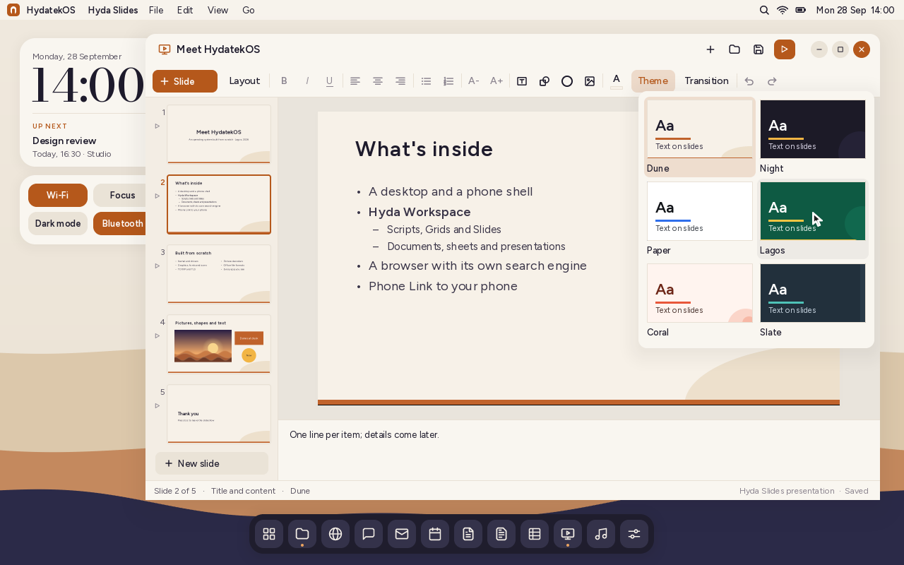
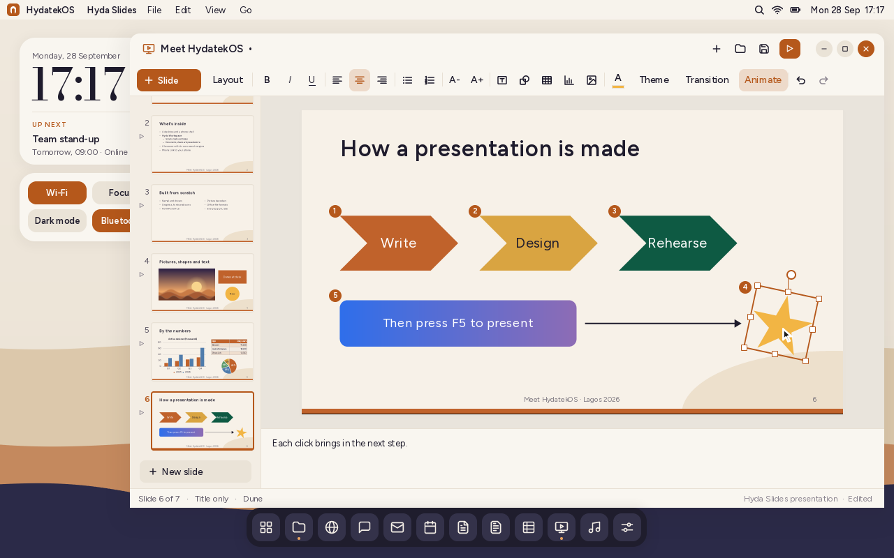
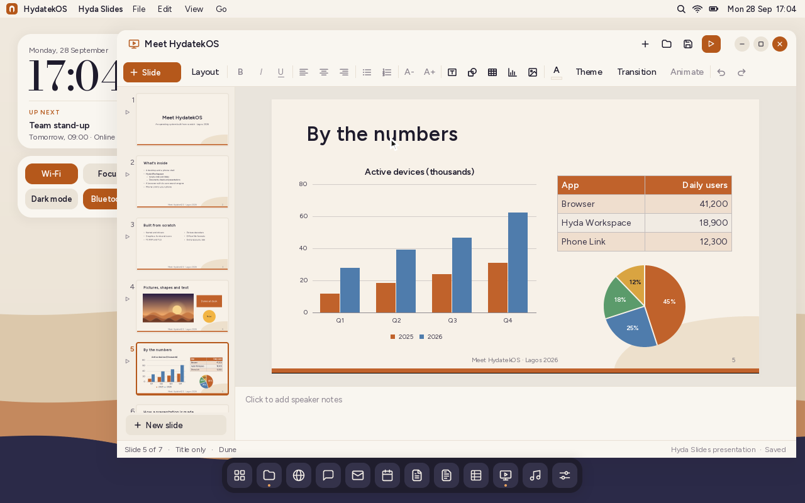
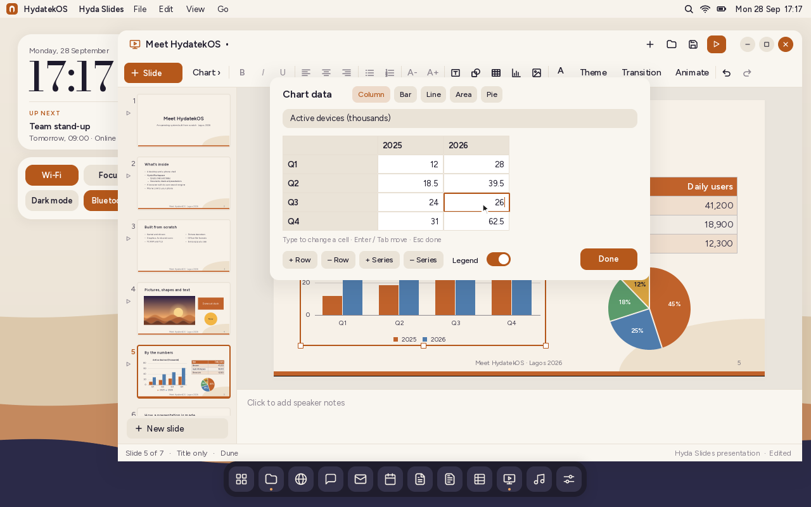
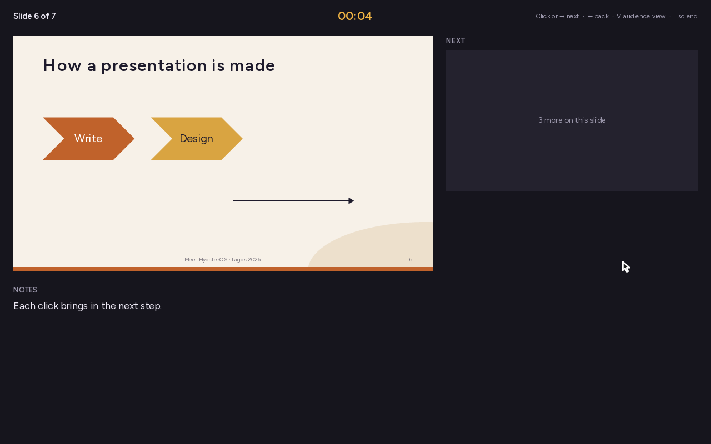
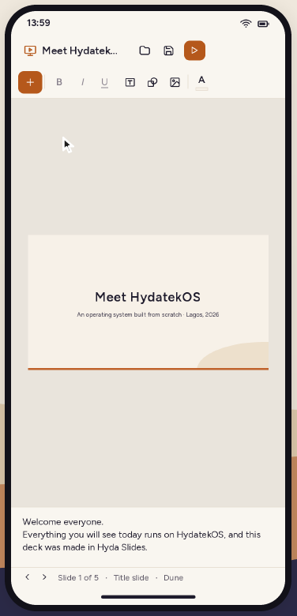
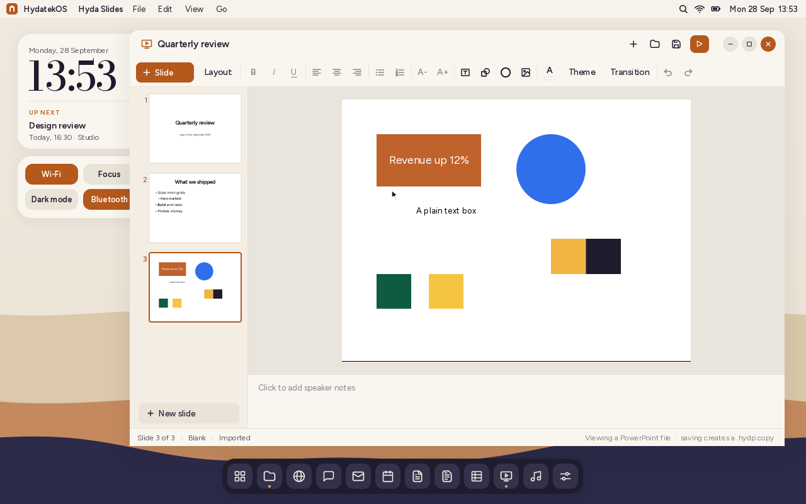

# Hyda Workspace

Hyda Workspace is HydatekOS's office suite: **Hyda Scripts**, the word
processor, **Hyda Grids**, the spreadsheet, and **Hyda Slides**, the
presentation program. Like the rest of HydatekOS, it's written from scratch and
built on no other word processor: the document model, its own file format
(`.hyds`, `.hydg`, `.hydp`), page and slide layout, and the importers and exporters for other formats are
all HydatekOS code, with no third-party libraries.

Shortcuts use **Gen**, HydatekOS's shortcut key: the ⊞ or ⌘ key, or Ctrl ([KEYBOARD.md](KEYBOARD.md)). Aux (Alt or ⌥) types special characters such as ₦, € and —.

Documents record who made them. When you first save or export one, your profile
name becomes its author, in HydatekOS's formats (`author` line) and in Word,
Excel, PowerPoint and PDF files, where other programs show it under the
document's properties. Files you open keep the author they came with
([PROFILE.md](PROFILE.md)).


## Hyda Scripts

Open it from the dock, the app launcher (**F1**, type "scripts"), or by
double-clicking a `.hyds` (or `.docx`) file in Files. On a phone-shaped screen it opens full
screen from Files, with the page fitted to the width.

### What it does

- **A4 pages** with 1-inch margins, laid out and paginated as you type. The status
  bar shows the page you're on, the page count and the word count.
- **Paragraph styles:** Body, Title, Heading 1, Heading 2, Quote, bulleted and
  numbered lists (numbering restarts after each list, as on screen).
- **Character formatting:** bold, italic, underline and strikethrough, on a
  selection or for what you type next.
- **Alignment:** left, centre and right.
- **Editing:** click to place the caret, drag or Shift+arrows to select,
  double-click to select a word, undo and redo (100 steps), cut, copy and paste
  (formatting survives copy and paste inside Hyda Scripts).
- **Zoom:** 50–200%, or fit to the window (click the percentage).
- **Files:** documents are saved as **`.hyds`**, Hyda Scripts' own format. Word,
  text and Markdown files can be opened and exported to (see below).

### Keyboard

| Keys | Action |
|---|---|
| Gen+B / Gen+I / Gen+U | Bold / italic / underline |
| Gen+E / Gen+L / Gen+R | Centre / left / right align |
| Gen+1 / Gen+2 / Gen+0 | Heading 1 / Heading 2 / Body |
| Gen+Z / Gen+Y | Undo / redo |
| Gen+X / Gen+C / Gen+V | Cut / copy / paste |
| Gen+A | Select all |
| Gen+S / Gen+O / Gen+N | Save / open / new |
| Gen+= / Gen+- | Zoom in / out |
| Shift+arrows; Gen+← / → or Aux+← / → | Select; jump by word |
| Enter on an empty list item | End the list |

### Saving, importing and exporting

| | Format | What Hyda Scripts does |
|---|---|---|
| **Save** | `.hyds` | The only format it saves to your storage. **Gen+S** saves; a new document is named after its first line and goes in Documents. Click the name at the top to rename it. Closing the window saves your changes. |
| **Import** | `.docx`, `.txt`, `.md` | Opens the file so you can read and edit it. The status bar says "Viewing a Word file". Saving writes a **new `.hyds` next to it** (e.g. `Budget.docx` → `Budget.hyds`); the original is never changed. |
| **Export** | `.docx`, `.txt`, `.md` | File › Export writes a copy for sharing, next to the document. It never replaces an existing file; the document you're editing stays `.hyds`. |

Exported Word files are standard Office Open XML, so the people you send them to
can open them in Word or any other word processor.

When importing Word files, Hyda Scripts reads paragraphs, headings (by style
name, in any language), lists, alignment, bold, italic, underline, strikethrough
and tabs. **It doesn't bring in yet:** images, tables (their text appears as
paragraphs), fonts, font sizes and colours, headers and footers, footnotes,
comments, tracked changes and page setup. Because the original file is never
overwritten, none of that is lost.

## The .hyds format

A `.hyds` file is UTF-8 text with one record per line. It's designed for
HydatekOS: easy to read, easy to recover, and checked for damage.

```
HYDS 1                          magic and format version
app Hyda Scripts                the program that wrote it
author Ada Obi                  who wrote it (optional)
paras 3                         number of paragraphs
p title left                    a paragraph: style, alignment
t Budget 2026                   its text
p body center
t Total: ₦1,200,000 approved.
f 7:10:b 17:10:i                formatting runs: start:length:flags
p bullet left
t Rent
end 44f68f84                    CRC-32 of every byte before this line
```

- **Styles:** `body`, `title`, `h1`, `h2`, `quote`, `bullet`, `number`.
  **Alignment:** `left`, `center`, `right`.
- **Text (`t`):** the paragraph's characters; `\\` is a backslash and `\t` a tab.
- **Formatting (`f`):** runs of characters, counted from 0, with flags `b` bold,
  `i` italic, `u` underline, `s` strikethrough. Unformatted text has no run.
- **Integrity:** `end` carries the CRC-32 (hex) of everything before it. A file
  with a wrong checksum, a missing `end` line or a wrong paragraph count is
  reported as damaged or incomplete instead of being opened half-read.
- **Versions:** `HYDS 1` is this version. Readers ignore record types they don't
  know, so later versions can add records (colours, images...) that older
  readers skip. A file with a newer major version is refused with a clear message.

### Other limits

- **Italic is a slanted version** of the regular font (the Figtree family ships no
  italics), so it looks slightly different from a designed italic.
- **One font, fixed sizes per style.** No font picker or size box yet.
- **No spelling check, find and replace, images, tables or printing yet.**
- **Phone Link paste:** text copied on a paired phone isn't pasted into Hyda
  Scripts yet.

## Hyda Grids


Hyda Grids is the spreadsheet. Open it from the dock, the app launcher (**F1**,
type "grids"), or by double-clicking a `.hydg` (or `.xlsx` / `.csv`) file in Files.
A starter sheet, *Budget*, is in Documents.

### What it does

- **A grid of 1,000 rows by 100 columns** (A to CV) with frozen row and column
  headers. The active cell and its row and column headers are highlighted.
- **Formulas** start with `=`: `=SUM(B2:B5)`, `=D2*7.5%`, `=IF(C4>100,"over","ok")`,
  `=A1&" "&B1`. Operators: `+ - * / ^ %`, `&` (join text), `= <> < > <= >=`.
  Absolute references use `$` (`$B$2`).
- **Functions:** SUM, AVERAGE, MIN, MAX, COUNT, COUNTA, PRODUCT, ROUND, INT, ABS,
  SQRT, POWER, MOD, IF, IFERROR, AND, OR, NOT, CONCAT, LEN, UPPER, LOWER, TRIM,
  SUMIF and COUNTIF.
- **Errors** show in the cell: `#DIV/0!`, `#VALUE!`, `#REF!`, `#NAME?`, `#NUM!`,
  and `#CIRC!` for a formula that depends on itself.
- **Number formats:** General, Number (1,234.50), Currency (₦1,234.50) and
  Percent. Typing `₦5,000`, `12%` or `1,250.5` picks the format for you; start
  with `'` to keep something as text (`'007`).
- **Formatting:** bold, italic, left / centre / right alignment. Numbers align
  right by themselves; long text runs on into empty cells to the right.
- **Editing:** type to replace a cell, **F2** or double-click to edit it, or edit
  in the formula bar. While typing a formula, clicking a cell inserts its
  reference.
- **Selecting:** click, drag, Shift+click, Shift+arrows, or click a row or column
  header. The status bar shows the **sum, average and count** of the selection.
- **Copy and paste** move formulas' relative references (`=D2*0.075` copied one
  row down becomes `=D3*0.075`). Text copied from elsewhere pastes into cells,
  split by tabs and lines.
- **AutoSum (Σ):** adds up the numbers above (or to the left of) the cell, in
  their number format; with a range selected, it totals each column underneath.
- **Columns:** drag a column header's edge to resize it; double-click the edge to
  reset it.
- **Undo and redo** (100 steps).

### Keyboard

| Keys | Action |
|---|---|
| Arrows, Tab, Enter (Shift for the other way) | Move |
| Shift+arrows | Select |
| F2 / Esc | Edit the cell / cancel editing |
| Delete / Backspace | Clear / clear and edit |
| Gen+B / Gen+I | Bold / italic |
| Gen+X / Gen+C / Gen+V | Cut / copy / paste |
| Gen+Z / Gen+Y | Undo / redo |
| Gen+A | Select everything |
| Gen+Home / Gen+End | First cell / last used cell |
| Gen+S / Gen+O / Gen+N | Save / open / new |

### Saving, importing and exporting

| | Format | What Hyda Grids does |
|---|---|---|
| **Save** | `.hydg` | The only format it saves to your storage. A new sheet goes to Documents; click the name at the top to rename it. Closing the window saves your changes. |
| **Import** | `.xlsx`, `.csv` | Opens the file to read and edit ("Viewing an Excel file"). Saving writes a **new `.hydg` next to it**; the original is never changed. |
| **Export** | `.xlsx`, `.csv` | File › Export writes a copy for sharing: an Excel workbook with formulas, their results, formats and column widths, or a CSV of the values. |

When importing Excel files, Hyda Grids reads the first sheet's values, formulas
(including shared formulas), bold and italic, alignment, currency / percent /
number formats and column widths. Dates are shown as text (`2026-09-27`).

### The .hydg format

Line-based UTF-8 text, like `.hyds`:

```
HYDG 1                          magic and format version
app Hyda Grids                  the program that wrote it
author Ada Obi                  who made it (optional)
sheet Budget                    sheet name
w 0 140                         column A is 140 px wide
c A1 b Item                     cell: reference, format, input
c B2 n=cur,sym=₦ 12000
c D2 n=cur,sym=₦ =B2+C2
c C7 i,n=pct =C6/B6-1
end f80f9715                    CRC-32 of every byte before this line
```

- **Format** is `-` or a comma list of `b` (bold), `i` (italic), `al=l|c|r`,
  `n=num|cur|pct` and `sym=` (the currency symbol).
- **Input** is exactly what was typed (a value, or a formula starting with `=`);
  `\\`, `\t` and `\n` escape a backslash, tab and newline.
- Checksum, versions and unknown records work as in `.hyds`.

### Limits

- **One sheet per file.** Importing an Excel workbook reads its first sheet.
- **Not yet:** inserting or deleting rows and columns, sorting and filtering,
  charts, cell colours and borders, freezing panes, find and replace, dates and
  times as values, and printing.
- Excel functions Hyda Grids doesn't have show `#NAME?` (the formula is kept).

## Hyda Slides


Hyda Slides makes presentations. Open it from the dock, the app launcher (**F1**,
type "slides"), or by double-clicking a `.hydp` (or `.pptx`) file in Files. A
sample presentation, *Meet HydatekOS*, is in Documents › Presentations.

### What it does

- **Slides** in 16:9 (1280 × 720 units; 4:3 and other shapes from imported
  files keep their shape). The strip on the left shows every slide; click one
  to go to it, drag it to reorder, double-click it to play from there.
- **Layouts:** title slide, title and content, section header, two columns,
  title only and blank. **+ Slide** picks one for a new slide; **Layout**
  changes the current slide's, carrying its text across. Empty placeholders
  say "Click to add title" / "Click to add text" (only while editing: they
  aren't shown in the slideshow or exports).
- **Six themes:** Dune, Night, Paper, Lagos, Coral and Slate. A theme sets the
  background, the title, text and accent colours and its decorations, for the
  whole presentation at once.

  

- **Text:** click a placeholder or text box and type. Bold, italic, underline;
  left / centre / right alignment; bulleted and numbered lists with five
  levels (**Tab** / **Shift+Tab**); **A−** / **A+** change the size. Text that
  doesn't fit shrinks until it does, as in other presentation programs.
  Double-click selects a word, drag or Shift+arrows select text.
- **Shapes and pictures:** text boxes, sixteen preset shapes (rectangle,
  rounded rectangle, ellipse, triangles, diamond, pentagon, hexagon, octagon,
  star, four arrows, chevron, parallelogram, trapezoid; all can hold text),
  lines and arrows, and pictures (PNG, JPEG, GIF, BMP or WebP, from Pictures, Documents,
  Downloads or Shared). Drag to move (it snaps to the slide's edges and
  centre), drag the handles to resize (pictures keep their shape unless you
  hold Shift), arrow keys nudge (Shift for one unit). **A** sets the fill of a
  shape, the colour of text, a picture's border, or with nothing selected the
  slide's background. The same menu sets a **gradient** (a second colour and
  an angle), the outline, the line width and arrowheads. Edit › Bring to
  Front / Send to Back.

  

- **Rotation and flips:** drag the round handle above a shape to rotate it
  (it catches at right angles; hold Shift for 15° steps), or Edit › Rotate
  Right / Left 90° and Flip Horizontal / Vertical. Rotated shapes still
  resize from their handles. A line has a handle at each end instead.
- **Tables:** the table button picks a size from a grid. Click a cell to type
  in it; **Tab** moves to the next cell and adds a row at the end. The
  **Table ›** menu inserts and deletes rows and columns and turns the header
  row and banded rows on or off. Dragging the bottom handle scales the rows.
- **Charts:** column, bar, line, area and pie, with a title, axis and legend.
  **Chart › Edit data…** opens a small sheet of categories and series: type
  numbers, add or remove rows and series, switch the chart type.

  
  

- **Animations:** **Animate** gives the selected shape an entrance: appear,
  fade or fly in. Numbered badges show the order; in the slideshow each click
  brings in the next one before moving to the next slide.
- **Header & footer** (View menu): a footer line and slide numbers on every
  slide except title slides.
- **Speaker notes** under each slide.
- **Slideshow:** the ▶ button or **F5** plays full screen, from the start (**F5**)
  or the current slide (**Shift+F5**, the ▶ button, or View › Play from This
  Slide). Next: click, →, ↓, Space, Enter or Page Down; back: ←, ↑ or Page Up;
  **B** blacks the screen; **Esc** leaves, on the slide you stopped at.
  Transitions: none, **fade** or **push** (Transition › Apply to all slides).

  

- **Presenter view** (View › Presenter View, or **V** during a slideshow): the
  current slide, the next one (or "N more on this slide" while animations
  remain), your notes and a timer. **V** switches back to the audience view.

  

- **PDF and printing:** File › Export as PDF writes one page per slide, with
  the text laid over the picture so it can be searched and copied. Export
  Notes Pages makes A4 pages with the slide above its speaker notes. Print…
  makes the PDF (HydatekOS has no printer drivers; print the PDF from another
  computer).

- **Undo and redo** (100 steps), cut, copy and paste of text or whole shapes
  (pictures included), duplicate (**Gen+D**).
- **On a phone** the slide strip folds away: ‹ › in the status bar move between
  slides, and the slideshow fills the phone's screen.

  

### Keyboard

| Keys | Action |
|---|---|
| F5 / Shift+F5 | Play from the start / from this slide |
| V (in the slideshow) | Presenter view / audience view |
| Home / End (in the slideshow) | First / last slide |
| Gen+M | New slide (like the current one) |
| Gen+D | Duplicate the shape, or the slide |
| Delete | Delete the shape (a placeholder empties), or with nothing selected the slide |
| Enter / F2 | Edit the selected shape's text; with nothing selected, a new slide |
| Esc | Stop editing text, then deselect |
| Tab / Shift+Tab | In a table: next / previous cell (Tab adds a row at the end). While editing a list: indent / outdent. Otherwise: select the next / previous shape |
| Arrows | Nudge the shape (Shift: finely); with nothing selected, go to the previous / next slide |
| Gen+↑ / Gen+↓ | Move the slide up / down |
| Gen+B / Gen+I / Gen+U | Bold / italic / underline |
| Gen+L / Gen+E / Gen+R | Left / centre / right align |
| Gen+[ / Gen+] | Smaller / bigger text |
| Gen+Z / Gen+Y | Undo / redo |
| Gen+X / Gen+C / Gen+V | Cut / copy / paste |
| Gen+S / Gen+O / Gen+N | Save / open / new |

### Saving, importing and exporting

| | Format | What Hyda Slides does |
|---|---|---|
| **Save** | `.hydp` | The only format it saves to your storage. A new presentation goes to Documents › Presentations, named after its first title; click the name at the top to rename it. Closing the window saves your changes. Pictures are kept inside the file. |
| **Import** | `.pptx` | Opens the file to read, edit and play ("Viewing a PowerPoint file"). Saving writes a **new `.hydp` next to it**; the original is never changed. |
| **Export** | `.pptx` | File › Export as PowerPoint writes a copy for sharing, next to the presentation. It never replaces an existing file. |
| **Export** | `.pdf` | File › Export as PDF (slides) or Export Notes Pages (slides with notes, A4), next to the presentation. |

Exported PowerPoint files are standard Office Open XML with the slides, their
shapes (preset geometries, rotation, flips, gradients), lines and arrows,
tables, charts (with their data in an embedded workbook, so PowerPoint's Edit
Data works), entrance animations, footers and slide numbers, text formatting,
bullets and levels, pictures, backgrounds, the theme (as the slide master),
transitions and speaker notes, so they open in
PowerPoint and other presentation programs. They name Figtree, HydatekOS's
font, which other computers may replace with one of theirs.

When importing PowerPoint files, Hyda Slides reads the slide size, the order of
slides (skipping hidden ones), titles, subtitles and content placeholders (with
the positions, sizes and alignment they inherit from the layout and master),
text boxes, shapes (the sixteen presets above, rotated and flipped; other
presets become rectangles), lines and connectors with arrowheads, tables,
charts (column, bar, line, area, pie), gradient fills, groups, pictures (PNG, JPEG, GIF, BMP, WebP), bold, italic, underline, strikethrough,
bullets, numbering and levels, font sizes and colours, fills and outlines
(theme colours too), backgrounds (gradients too), transitions, entrance
animations (appear, fade and fly in; others play as appear), footers, slide
numbers and speaker notes. The deck gets
an "Imported" theme with the file's background, text and accent colours.



### The .hydp format

Line-based UTF-8 text, like `.hyds` and `.hydg`:

```
HYDP 1                          magic and format version
app Hyda Slides                 the program that wrote it
name Meet HydatekOS
author Ada Obi                  who made it (optional)
size 1280 720                   slide size in units (1/96 inch)
theme dune                      a built-in theme, or
                                theme custom <bg> <title> <text> <accent> (hex)
slides 5                        number of slides
slide content                   a slide and its layout
bg 1C1A27                       its own background (optional)
trans fade                      transition: fade or push (optional)
notes One line\nand another     speaker notes
shape title 80 36 1120 116 size=40 anchor=m fill=- line=- color=-
p body left 0                   a paragraph: style, alignment, level
t What's inside                 its text
shape body 80 172 1120 480 size=24 anchor=t fill=- line=- color=-
p bullet left 0
t Hyda Workspace
f 0:14:b                        formatting runs, as in .hyds
shape picture 80 180 720 405 size=20 anchor=t fill=- line=- color=- pic=0
pic png iVBORw0KGgo…            picture 0 (base64)
end 1a2b3c4d                    CRC-32 of every byte before this line
```

- **Shapes:** `title`, `subtitle`, `body`, `text`, `rect`, `ellipse`,
  `picture`, `line`, `table` or `chart`, then x, y, width and height in slide units, the text size in
  points, the text's vertical anchor (`t`, `m`, `b`), and fill, outline and
  text colours (`-` for the theme's). Optional after those: `geom=` (a
  PowerPoint preset name such as `star5` or `chevron`), `rot=` (degrees),
  `flip=h`/`v`/`hv`, `grad=<colour>,<angle>`, `lw=` (line width), `arrows=`
  (`h` head, `t` tail, `-` none, e.g. `-t`), `anim=<appear|fade|fly>,<order>`.
- **Tables:** `table <rows> <cols> <header> <banded>`, `cols` and `rows`
  (sizes), then `cell <r> <c>` followed by that cell's `p`/`t`/`f` lines.
- **Charts:** `chart <column|bar|line|area|pie> <legend>`, `ctitle`, one `cat`
  line per category, and `series <name>` + `vals <numbers>` per series.
- **Deck and slide extras:** `footer <text>`, `numbers 1`, and per slide
  `bgrad <colour> <angle>` (a gradient background).
- **Paragraph styles:** `body`, `bullet`, `number`; levels 0–8.
- **Pictures** are PNG or JPEG, stored once and numbered from 0; other formats
  are converted to PNG when inserted.
- Checksum, versions and unknown records work as in `.hyds`.

### Limits

- **One text size per shape**, reduced for deeper list levels; imported text
  with mixed sizes takes the size most of it uses. Per-run text colours become
  one colour for the shape. Table cells share their table's text size.
- **One font** (Figtree); imported fonts are shown in Figtree.
- Only entrance animations (appear, fade, fly in from the bottom); emphasis,
  exit and motion paths are left out. Charts have one colour per series (no
  per-point colours or data labels except pie percentages); merged table
  cells are shown unmerged.
- SmartArt, video and audio are left out when importing; preset shapes
  beyond the sixteen show as rectangles.
- Text in a rotated shape is edited straight and shown rotated again when
  you stop editing.
- PDFs use Helvetica for the searchable text layer (the picture keeps
  Figtree), so selected text may not line up exactly.

## How it's built

| Part | Where |
|---|---|
| Document model, editing, the `.hyds` format, `.docx`/`.txt`/`.md` import and export | `kernel/src/doc.rs` |
| Zip reading and writing, CRC-32, deflate and inflate (RFC 1951) | `kernel/src/zip.rs` |
| The app: layout, pagination, rendering, input | `kernel/src/apps/scripts.rs` |
| Hyda Grids: cells, formula parser and evaluator, number formats | `kernel/src/grid.rs` |
| Hyda Grids files: `.hydg`, `.xlsx` import/export, CSV | `kernel/src/gridio.rs` |
| The Hyda Grids app | `kernel/src/apps/grids.rs` |
| Hyda Slides: slides, layouts, themes, shapes, tables, charts, text layout | `kernel/src/deck.rs` |
| Hyda Slides files: `.hydp`, `.pptx` import/export, the PNG writer | `kernel/src/deckio.rs` |
| Drawing slides: anti-aliased polygons, gradients, rotation, tables, charts | `kernel/src/apps/slidedraw.rs` |
| The Hyda Slides app: editor, thumbnails, slideshow, presenter view | `kernel/src/apps/slides.rs` |
| The PDF writer | `kernel/src/pdf.rs` |
| Italic faces (slanted at build time), ₦, Σ and other symbols | `tools/fontgen.py` |

A document is a list of paragraphs; each has a style, an alignment, its
characters and a formatting byte per character (bold, italic, underline,
strikethrough). Layout measures each character with its face and size, wraps at
spaces, keeps headings with the line after them, and flows lines onto A4 pages.

### Tests

`tools/test.sh` runs these on the host (`tests-host/src/doc_tests.rs`,
`grid_tests.rs` and `deck_tests.rs`). For Hyda Slides: `.hydp` round trip,
damage and version checks; text layout (wrapping, caret positions, bullets and
numbering, shrinking to fit); changing layouts; the PNG writer and deflate
(round trips through inflate); `.pptx` round trip; and importing PowerPoint
files written by two other programs (a 4:3 deck made with python-pptx on its
default template, and the same deck re-saved by LibreOffice Impress, built by
`tests-host/fixtures/slides/make.py`, which also adds a table, charts, a
connector, a rotated star and a gradient); tables, charts, rotation,
gradients, lines, animations and footers through `.hydp`, `.pptx` and
LibreOffice; chart axis ticks; and the PDF writer. Exported `.pptx` files were also
opened and rendered in LibreOffice Impress to check them. For Hyda Grids: references, operator precedence, every
function, circular references, number formats and typed values, moving
references, `.hydg` round trip and damage checks, CSV, `.xlsx` round trip, an
Excel file written by another program, and shared formulas. For Hyda Scripts:

- inflate against zlib's output (stored, fixed-Huffman and dynamic-Huffman blocks)
- zip round trip and CRC-32
- editing: typing, Enter, deleting across paragraphs, formatting, cut and paste
- `.hyds` round trip (including backslashes, tabs, leading spaces, ₦), and
  rejecting other files, newer versions, truncated and corrupted files;
  skipping unknown records
- `.docx` round trip and Markdown round trip
- importing Word files written by other programs (a file re-saved by another
  word processor, and one built on Word's default template)

Those sample files, and the other word processor used to check that exported
`.docx` files open correctly, are test tools on the build machine only; nothing
from them is part of HydatekOS.
