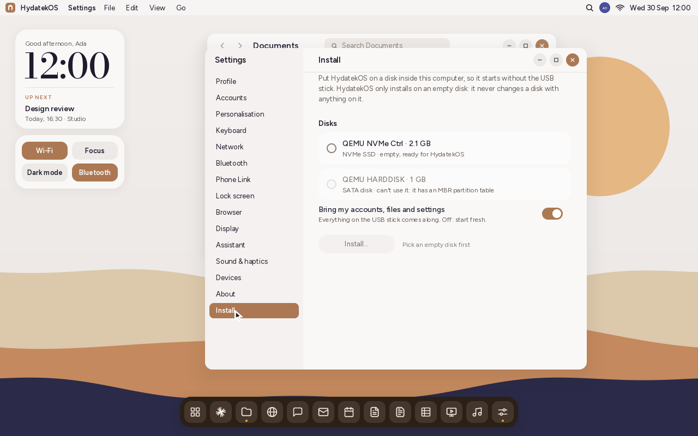
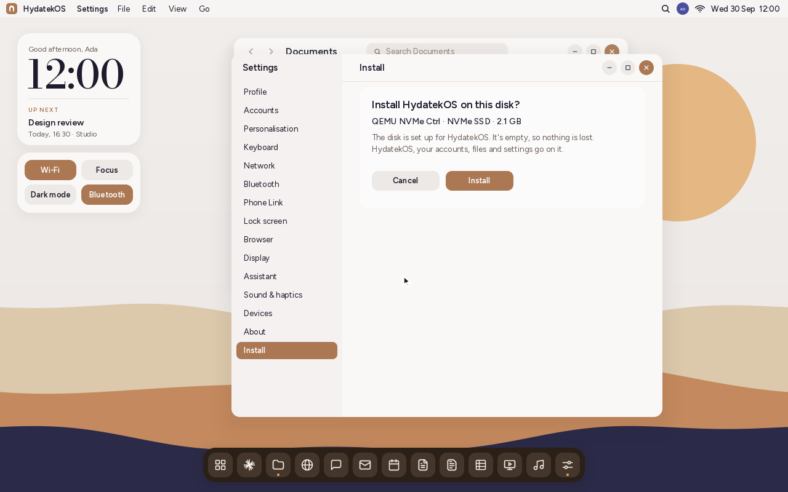
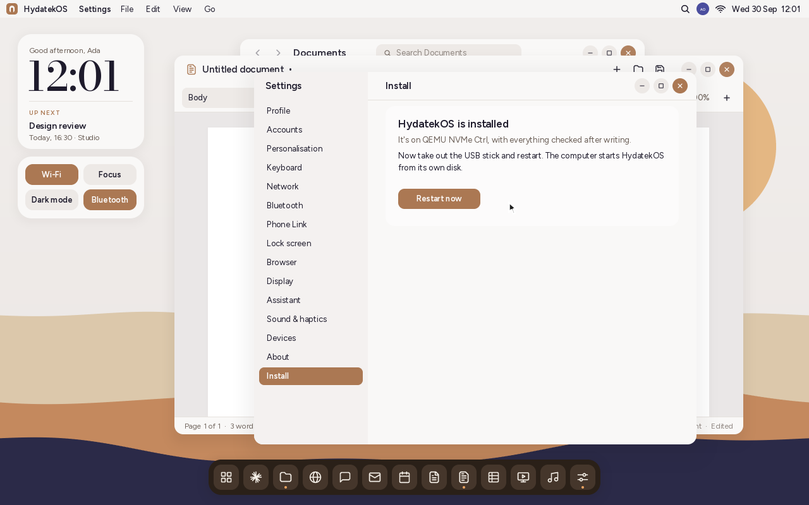

# Installing HydatekOS on a PC

> **Just want to try it?** `tools/mkdist.sh` makes `dist/HydatekOS-0.1-x86_64.zip`:
> a ready-built disk, the UEFI firmware and double-click launchers for Windows
> (`Start HydatekOS.bat`) and Mac/Linux (`start-hydatekos.command`). The person
> trying it only needs QEMU; the README inside walks through it.

HydatekOS 0.1 runs on computers with **UEFI firmware** (almost every PC made since
~2012). You need 512 MB of RAM or more. One stick carries both builds:

- **x86-64**: Intel and AMD PCs (`\EFI\BOOT\BOOTX64.EFI`);
- **ARM64**: Qualcomm Snapdragon X laptops and other ARM machines with UEFI
  (`\EFI\BOOT\BOOTAA64.EFI`). See [HARDWARE.md](HARDWARE.md) for what works on
  ARM so far.

## The easy way: copy files onto a flash drive

`tools/mkdist.sh` also makes `dist/HydatekOS-0.1-USB-files.zip`. It holds the folders
`EFI` and `HYDATEK` and a README. **Copy both folders to the top of any FAT32 flash
drive** and start the PC from it: UEFI firmware starts `\EFI\BOOT\BOOTX64.EFI` (or
`BOOTAA64.EFI`) from any FAT32 drive, so no imaging tool is needed. Files already on
the drive stay as they are; HydatekOS keeps yours in `\HYDATEK\` next to them.

Drives of 32 GB or less usually come formatted FAT32. Larger ones often come as exFAT,
which firmware can't start from. Format those FAT32 with Rufus, which erases them.

Tested in QEMU with a 4 GB drive formatted like Windows does (MBR, one FAT32
partition) that already held a photo. The PC started from it by itself, and HydatekOS
saved its files next to the photo. Settings › Install worked from it too, and the PC
then started from its own disk with the drive removed.

## 1. Build the disk image

```sh
rustup target add x86_64-unknown-uefi
rustup target add aarch64-unknown-uefi   # for ARM64 / Snapdragon (optional)
sudo apt install mtools            # macOS: brew install mtools
tools/mkimage.sh                   # -> build/hydatekos.img (128 MB, GPT + EFI System Partition)
```

`SIZE_MB=1024 tools/mkimage.sh` makes a larger image if you want more room for files.

## 2. Write it to a USB stick

**This erases the stick.**

- **Windows:** [balenaEtcher](https://etcher.balena.io/), or Rufus with "DD image" mode.
- **macOS:** balenaEtcher, or `sudo dd if=build/hydatekos.img of=/dev/rdiskN bs=4m`.
- **Linux:** `sudo dd if=build/hydatekos.img of=/dev/sdX bs=4M status=progress conv=fsync`.

## 3. Boot it

1. Plug the stick in and power on the PC while pressing its boot-menu key
   (often F12, F11, F10, Esc or F8).
2. Choose the USB stick (it may be listed as "UEFI: <stick name>").
3. If the PC refuses to boot the stick, open the firmware settings and **disable Secure
   Boot**. HydatekOS isn't signed yet.

HydatekOS boots into the desktop. Files, notes, settings and calendar events are saved in
`\HYDATEK\` on the stick, so it works as a portable install you can carry between PCs.

## 4. Install on the computer's own disk

HydatekOS has its own installer. It puts HydatekOS on an **empty** disk inside the
computer, so it starts without the USB stick.

1. Start HydatekOS from the USB stick (steps 1–3), and go through the setup assistant.
2. Open **Settings › Install**. It lists the computer's NVMe and SATA disks:

   

3. Pick the empty disk. Leave **Bring my accounts, files and settings** on to take
   everything on the stick along, or turn it off to start fresh. Save any open work
   first: files are copied as they are on the stick.
4. Click **Install…**, check the disk, and click **Install**.

   

5. When it says **HydatekOS is installed**, take out the USB stick and click
   **Restart now**. The computer starts HydatekOS from its own disk.

   

### What the installer does

- **Only empty disks.** A disk with a partition table (MBR or GPT, at either end) or a
  file system straight on it is listed, with the reason, but can't be picked. The disk
  is checked again just before the first write. HydatekOS never touches the disk it
  started from.
- **The layout.** One GPT partition, an EFI System Partition as big as the disk,
  formatted FAT32 (up to 2 TiB with 512-byte sectors, 16 TiB with 4 KiB ones). It
  holds `\EFI\BOOT\BOOTX64.EFI` and `BOOTAA64.EFI`, and `\HYDATEK\` for your
  files. Disks with 4 KiB sectors ("4K native", as many NVMe drives are) are laid out
  in 4 KiB sectors.
- **Safely.** The file system goes on first and the partition table last, so an
  install that's interrupted leaves a disk that still reads as empty, and it can
  simply be run again. Everything written is read back and compared before it says
  it's done.
- **The start-up menu.** It adds a "HydatekOS" entry to the firmware's start-up list
  (a `Boot####` variable) and puts it first. The entry names the partition by its
  unique ID, so it works wherever the disk is connected. If the firmware won't take
  the entry, the installer says so: most firmware starts `\EFI\BOOT\` from a disk
  anyway, or you pick the disk in the boot menu.

Tested in QEMU on an empty 512-byte NVMe disk, a 4 KiB-sector NVMe disk and a SATA
disk. Each started HydatekOS by itself afterwards, with the stick removed. A disk
with a partition was refused and left unchanged. The layout is host-tested against
`sgdisk`, `fsck.fat` and mtools (`tests-host/src/mkdisk_tests.rs`).

### Next to Windows or Linux (by hand)

The installer only uses empty disks. To add HydatekOS to a disk that already has
Windows or Linux, copy it onto the existing EFI System Partition by hand:

1. Copy `kernel/target/x86_64-unknown-uefi/release/hydatek.efi` to the ESP as
   `\EFI\HydatekOS\hydatek.efi`.
   - Windows (admin prompt): `mountvol S: /s`, then
     `mkdir S:\EFI\HydatekOS` and `copy hydatek.efi S:\EFI\HydatekOS\`.
   - Linux: the ESP is usually mounted at `/boot/efi`.
2. Add a boot entry:
   - Windows: `bcdedit /copy {bootmgr} /d "HydatekOS"`, then
     `bcdedit /set {NEW-ID} path \EFI\HydatekOS\hydatek.efi`.
   - Linux: `sudo efibootmgr -c -d /dev/nvme0n1 -p 1 -L HydatekOS -l '\EFI\HydatekOS\hydatek.efi'`.
3. Reboot and pick "HydatekOS" from the firmware boot menu.

HydatekOS then creates `\HYDATEK\` on the ESP for your files. It never touches other
partitions.

## Hardware notes for milestone 1

| Area | Status |
|---|---|
| Processor | x86-64 (Intel, AMD) and ARM64 (Qualcomm Snapdragon, Arm Cortex/Neoverse); Settings › About names it |
| Display | Uses the firmware framebuffer (GOP) at the panel's native resolution; 2x scaling at 2560x1440+; Settings › Display names the GPU |
| Keyboard | USB and PS/2, through the firmware |
| Mouse / touchpad | USB through the firmware, or the HydatekOS PS/2 mouse driver (with wheel). On ARM64, only if the firmware has a pointer driver |
| Storage | The boot disk's FAT partition |
| Ethernet | Through the firmware's network driver; DHCP, then Phone Link on port 7743 |
| Wi-Fi, Bluetooth, audio, camera | Not yet (see ROADMAP.md) |

**Networking:** plug in an Ethernet cable before booting. Many PCs only load
their network driver when **Network Stack**, **PXE** or **UEFI network** is
enabled in the firmware settings. Settings › Network shows the adapter and IP
address. Phone Link needs the phone on the same network (e.g. the router's
Wi-Fi) and TCP port 7743 reachable.

If the pointer doesn't move on your machine, your firmware has no mouse driver and the
touchpad isn't PS/2-compatible. The keyboard still works, and native USB/I2C-HID drivers
arrive in milestone 2.
