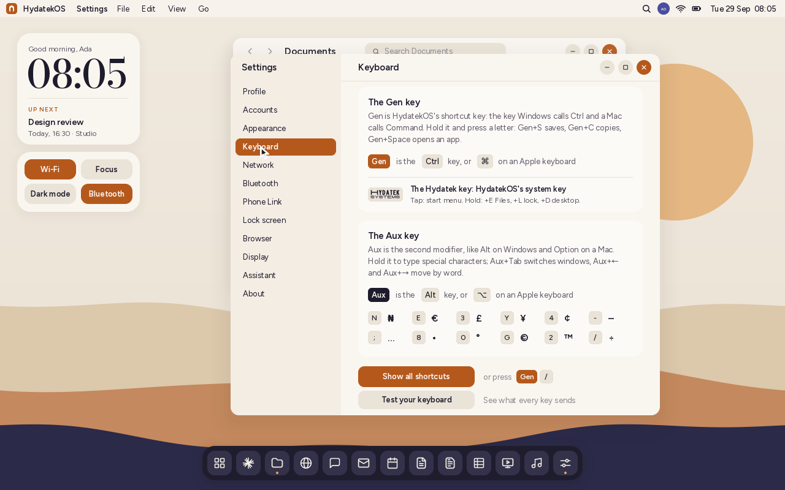
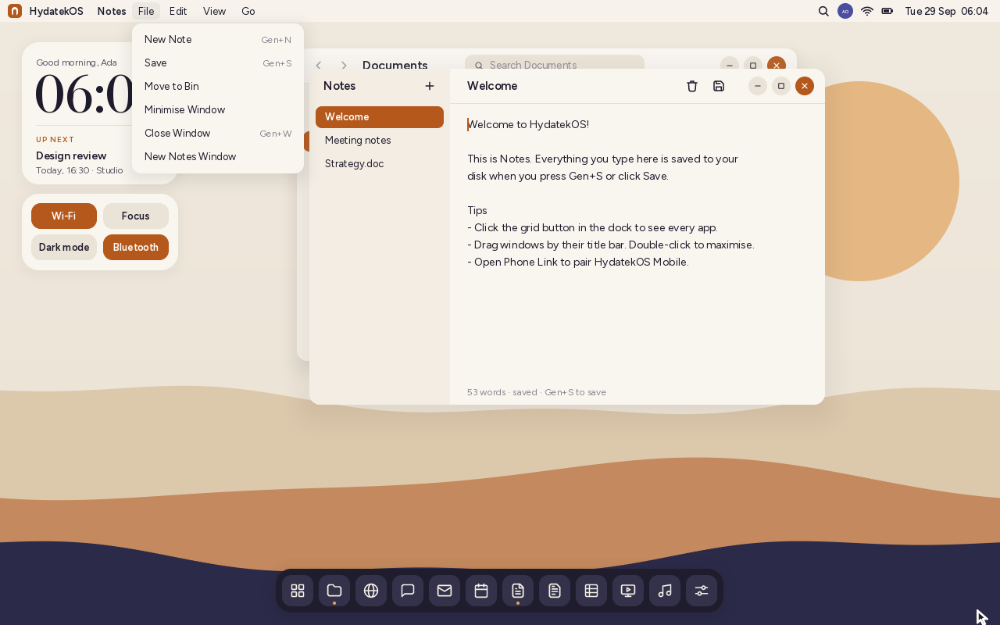
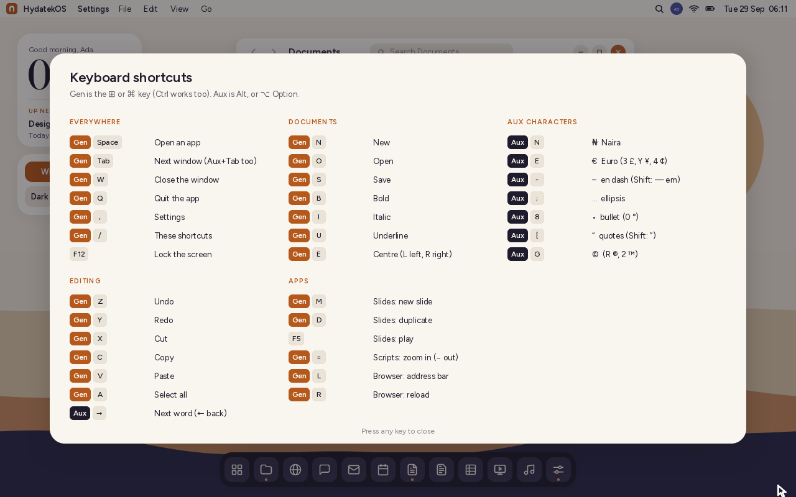
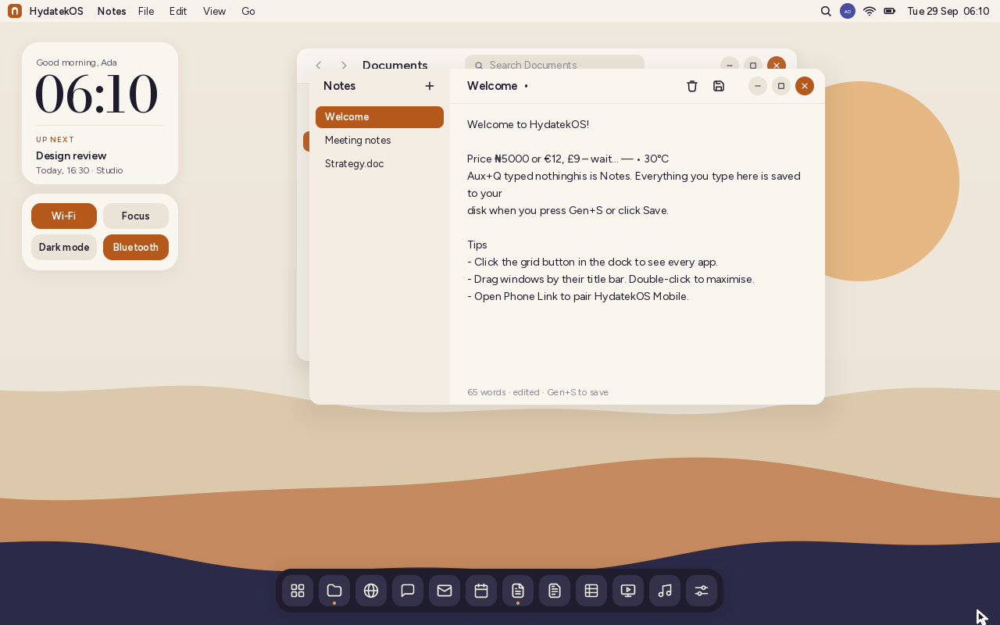
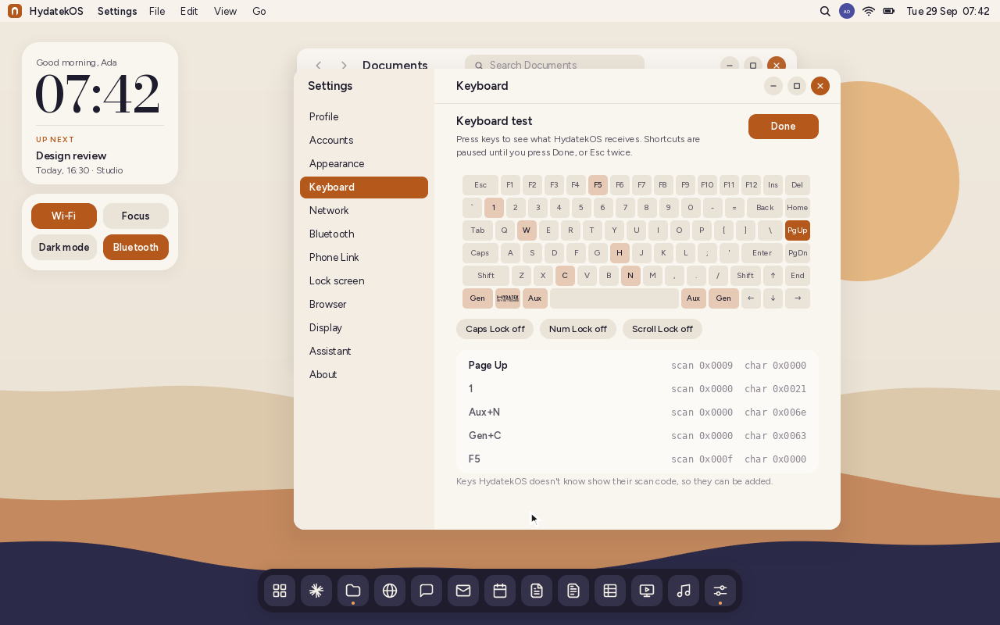

# The keyboard

HydatekOS names its modifier keys after what they do, not after another
system's keyboards:

| HydatekOS | What it does | On a PC keyboard | On an Apple keyboard | Windows / macOS call it |
|---|---|---|---|---|
| **Gen** (general) | Shortcuts: Gen+S saves, Gen+C copies | Ctrl | ⌘ Command | Ctrl / Command |
| **Aux** (auxiliary) | Special characters, switching windows, moving by word | Alt | ⌥ Option | Alt / Option |
| **Hydatek key** | The system: start menu, Files, lock, desktop, snapping windows | the logo key (⊞) | — | Windows key |

## Gen

Hold Gen and press a letter. Menus show each command's shortcut on the right,
and **Gen+/** shows all of them:

| Menus show shortcuts | Gen+/ |
|---|---|
|  |  |

**Gen is the Ctrl key**, always: the key Windows calls Ctrl and a Mac calls ⌘
Command is HydatekOS's Gen key, and the keyboard tester shows it as Gen. In the
Terminal, Gen does what Ctrl does in a Unix shell:
- **Gen+C** cancels the line and **Gen+L** clears the screen.
- **Gen+A** / **Gen+E** go to the line's start / end.
- **Gen+U** / **Gen+K** cut to the start / end.

### Everywhere

| Keys | Action |
|---|---|
| Gen+Space | Open an app (the launcher). F1 does too |
| Gen+Tab | Next window; with Shift, the one before. Aux+Tab does the same |
| Gen+W | Close the window |
| Gen+Q | Quit the app |
| Gen+, | Settings |
| Gen+/ | Keyboard shortcuts |
| F11 | Maximise the front window, or put it back |
| F12 | Lock the screen |

Aux+Tab and Hydatek+Tab switch windows too. Gen+Tab can't always: some
firmware reports Ctrl+I as Tab, and it has to stay Gen+I (italic) there.

### In apps

| Keys | Action |
|---|---|
| Gen+N / Gen+O / Gen+S | New / open / save |
| Gen+Z / Gen+Y | Undo / redo |
| Gen+X / Gen+C / Gen+V | Cut / copy / paste |
| Gen+A | Select all |
| Gen+B / Gen+I / Gen+U | Bold / italic / underline |
| Gen+L / Gen+E / Gen+R | Left / centre / right (Hyda Scripts and Slides) |
| Gen+M, Gen+D | New slide, duplicate (Hyda Slides) |
| Gen+L, Gen+R | Address bar, reload (Browser) |
| Gen+V | Paste into the command line (Terminal) |

Every app's own list is in [HYDA_WORKSPACE.md](HYDA_WORKSPACE.md) and
[BROWSER.md](BROWSER.md). Gen+Shift+letter counts as Gen+letter.

## The Hydatek key

The key beside Gen, where Windows keyboards print ⊞, is the **Hydatek key**.
HydatekOS shows it with the Hydatek Systems wordmark, on the keyboard tester's
picture, in Settings and on the shortcuts sheet. It's the system key, as the
Windows key is on Windows:

| Keys | Action |
|---|---|
| Hydatek (tap it) | The start menu: every app, and a search box. Tap again to close it. On the phone layout, home |
| Hydatek+Space, +R, +S | The start menu, ready to search |
| Hydatek+E | Files |
| Hydatek+I | Settings |
| Hydatek+C | Claude, the assistant |
| Hydatek+L | Lock the screen |
| Hydatek+D | Show the desktop; press again to bring the windows back |
| Hydatek+M | Minimise every window |
| Hydatek+↑ / ↓ | Maximise the front window / put it back (↓ again minimises it) |
| Hydatek+← / → | Snap the front window to the left / right half of the screen |
| Hydatek+Tab | Next window (with Shift, the one before) |
| Hydatek+X | The HydatekOS menu: profile, lock, sign out, restart, shut down |
| Hydatek+1 … 9 | The app rail's apps, in order (Hydatek+1 is Claude) |
| Hydatek+/ | Keyboard shortcuts |

A tap only counts when the key is let go without another key pressed with it,
so Hydatek+E never flashes the start menu. HydatekOS asks the firmware to report
modifier keys on their own (UEFI's "partial keys") and to say which are held
between strokes. Firmware that doesn't say when a key is let go gets the start
menu a third of a second after a lone press. Apps never see the Hydatek key:
its shortcuts are the system's.

## Aux

Hold Aux and press a key to type a special character. The layout follows the
Mac's Option key where it can (Aux+3 £, Aux+8 •, Aux+; …, Aux+- –), and
Aux+N types the Naira sign.

| Key | Aux | Aux+Shift | | Key | Aux | Aux+Shift |
|---|---|---|---|---|---|---|
| N | ₦ | ₦ | | - | – | — |
| E | € | € | | ; | … | |
| 3 | £ | | | [ | “ | ” |
| Y | ¥ | ¥ | | ] | ‘ | ’ |
| 4 | ¢ | | | \ | « | » |
| R | ® | ₹ | | 1 | ¡ | |
| C | | ₵ | | / | ÷ | ¿ |
| G | © | © | | = | ≠ | ± |
| 2 | ™ | | | , | ≤ | |
| 6 / 7 | § / ¶ | | | . | ≥ | |
| 8 | • | ° | | X | × | × |
| 0 | ° | | | W | Σ | Σ |
| M | µ | µ | | L | ¬ | ¬ |

Aux with a key that has no character types nothing. Aux also has two jobs
besides characters:
- **Aux+Tab** switches windows.
- **Aux+← and Aux+→** move by word in text, as Gen+← and Gen+→ do.

The same characters, and more, are on the on-screen keyboard's **₦€£** page on
touch screens.

## Every other key

| Keys | What they do |
|---|---|
| ← → Home End Backspace Delete | Edit any text box. With Gen (or Aux+← →) by word: Gen+Backspace deletes the word before the caret |
| Shift+Insert / Gen+Insert / Shift+Delete | Paste / copy / cut, as on older PCs |
| Page Up / Page Down | Scroll, or move by page (Files, Calendar, Claude, Terminal) |
| F2 | Rename (Files) / edit the cell (Hyda Grids) |
| F5 | Reload (Browser) / start the slideshow (Hyda Slides) |
| Esc | Close a menu, dialog or the launcher; clear a box |
| Volume up / down, Mute | Change the volume, shown near the bottom of the screen |
| Brightness up / down | Dim or brighten the screen (10% to 100%) |
| Sleep | Lock the screen (HydatekOS has no sleep states yet) |
| Caps Lock | Password boxes say "Caps Lock is on" when it is |

The volume is kept for when HydatekOS has sound drivers. Until then there's no
sound to change. Brightness dims the picture in software until there are
display drivers. Both are kept for each account. On a keyboard without these
keys, Terminal's `volume up|down|mute` and `brightness up|down` do the same.

Every single-line text box uses one line editor (`kernel/src/lineedit.rs`):
- the names of files, documents, slides and accounts;
- the address and search boxes;
- the Terminal's command line;
- the Calendar's event fields, Messages and the launcher.

So the same keys work in all of them.

## Testing your keyboard

**Settings › Keyboard › Test your keyboard** shows what HydatekOS receives from
each key, which is handy on a new laptop:
- a picture of the keyboard lights up the keys you've pressed;
- Caps Lock, Num Lock and Scroll Lock show whether they're on;
- the last five strokes are listed with their modifiers, the firmware's scan
  code and the character.

While the test is open, shortcuts are paused, so Gen+W or F12 show up in the
list instead of acting. Press **Done**, or **Esc** twice, to finish.

Keys HydatekOS doesn't know show as "Key 0x…" with their scan code, so they can
be added. Keyboards don't all send everything: in QEMU the firmware reports no
volume keys at all, and whether a laptop's F13–F24, volume and brightness keys
arrive depends on its firmware. The tester shows which ones do.

## How it's built

| Part | Where |
|---|---|
| Reading the modifiers from the firmware; Gen, Aux and the Hydatek key (taps and shortcuts) | `kernel/src/input.rs` (`gen_key`, `Ev::Hydatek`, `Ev::HydatekTap`) |
| What the Hydatek key does | `kernel/src/shell/mod.rs` (`hydatek`, `hydatek_tap`) |
| Scan codes (F13–F24, volume, brightness, power), lock keys, the tester's record of strokes | `kernel/src/input.rs` (`map_key`, `raw_since`) |
| Key names and the tester's keyboard picture | `kernel/src/keymap.rs` (`key_name`, `LAYOUT`) |
| The line editor behind every text box | `kernel/src/lineedit.rs` |
| Volume, brightness, F11 | `kernel/src/shell/mod.rs` (`media`) |
| What Aux types | `kernel/src/keymap.rs` |
| Global shortcuts, window switching, the shortcuts sheet, menu hints | `kernel/src/shell/mod.rs`, `shell/keys.rs` |
| Settings › Keyboard | `kernel/src/apps/settings.rs` |
| ⊞ ⌘ ⌥ ↑ ↓ − in the font | `tools/fontgen.py` |
| The Hydatek key's wordmark (shared with the boot screen) | `kernel/src/brand.rs`, `Ui::brand` |

Apps receive `key(k, gen, sys)`: `gen` is true while Gen (Ctrl) is held.
`Key::Aux` (Aux with no character) exists so that Aux never types a letter by
accident.

`tools/test.sh` checks:
- what Aux types (Shift, capitals, keys with nothing);
- that every character in the Aux table is in HydatekOS's font;
- key names, and that every key the tester can name is on its picture
  (`tests-host/src/keymap_tests.rs`);
- the line editor (`lineedit_tests.rs`). The firmware's reports were checked in
QEMU: Ctrl (Gen), the Hydatek key, Alt (Aux) and Shift each arrive as their own
flag with the key. So were the shortcuts, the sheet, the menu hints, window switching, typing
with Aux, and the Hydatek key: OVMF reports it tapped alone and says when it's
let go, so a tap opens the start menu and Hydatek+E, +C, +←, +→, +D and +X do
what the table says.
