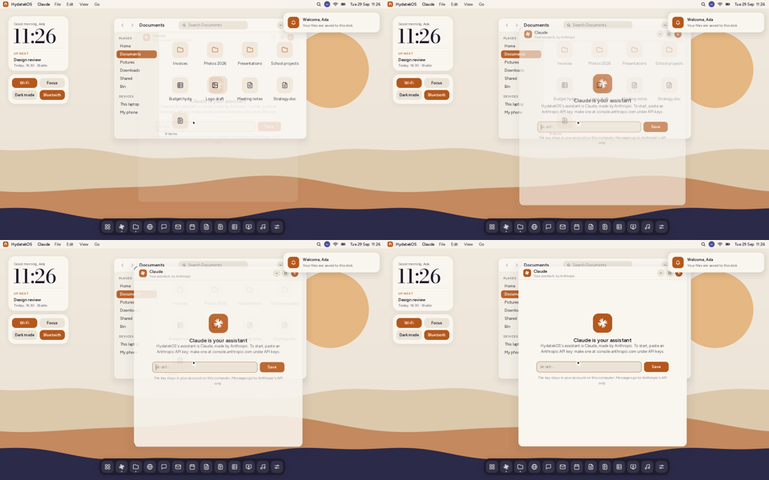
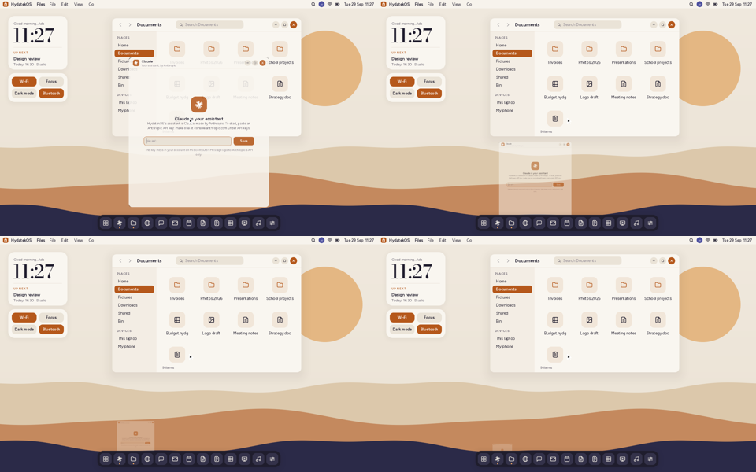
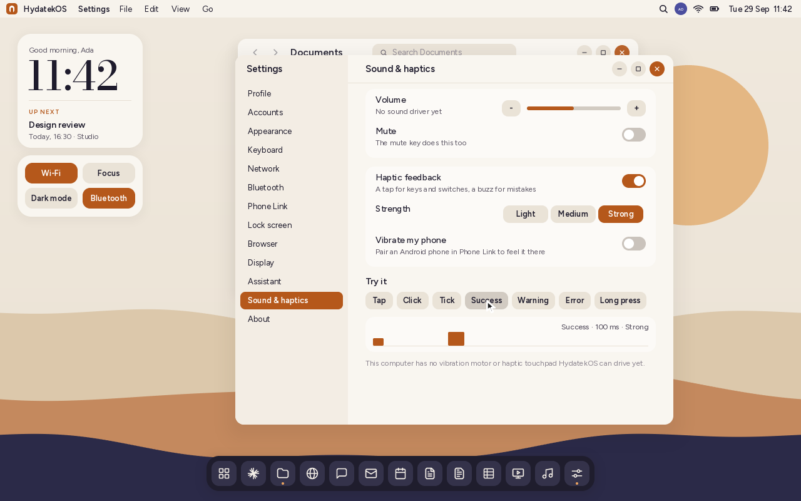

# Motion and haptic feedback

## Animations

| A window opening (Hydatek+C) | Minimising into the dock (Hydatek+↓) |
|---|---|
|  |  |

| What | How it moves | Time |
|---|---|---|
| A window opens | zooms up from 94% with a small spring, fading in | 220 ms |
| A window closes | shrinks a little and fades away | 160 ms |
| Minimise | flies into its dock icon | 260 ms |
| Back from the dock | grows out of its dock icon | 260 ms |
| Maximise, restore, snap (F11, Hydatek+arrows, double-click) | glides to the new place and size | 200 ms |
| The start menu, menus, the shortcuts sheet | fade in | 160 ms |
| Notifications | slide in from the right | 240 ms |
| Volume and brightness | the level rises into place | 160 ms |
| Unlocking | the lock screen slides away | 280 ms |

The animations run on real time: the processor's cycle counter, calibrated
at start-up (`arch::ms`). So they take the same time on a slow computer or in
an emulator, which just shows fewer frames. HydatekOS draws in software, so
windows that open or leave are drawn on their own and then scaled and faded
into the frame. Closed and minimised windows leave a snapshot that animates
out while the rest of the desktop carries on.

**Settings › Appearance › Reduce motion** turns them all off: everything
appears and goes at once.

The curves are in `kernel/src/anim.rs`:
- ease-out for things arriving;
- ease-in for things leaving;
- ease-in-out for moves;
- a gentle spring for opening.

## Haptic feedback

HydatekOS asks for a *kind* of feedback, and each kind has its own pattern:

| Feedback | When | Pattern |
|---|---|---|
| Tap | a key on the on-screen keyboard or PIN pad, a tap on the phone layout, a setup button | one 10 ms tick |
| Click | a switch in Settings | one firm 14 ms click |
| Tick | a window snapping or maximising | one light 6 ms tick |
| Success | unlocking | two rising taps |
| Warning | setup needs something fixed | two even pulses |
| Error | a wrong PIN or password | three quick strong buzzes |
| Long press | (for touch and hold) | one 60 ms swell |

Settings › Sound & haptics:
- turns feedback on or off;
- sets its strength: Light, Medium or Strong;
- chooses whether it plays on your phone.

**Try it** plays each pattern and draws it: the pulses, their strength, and a
playhead as it plays.

**Where it's felt:** HydatekOS plays each pattern directly on the hardware it
drives ([DRIVERS.md](DRIVERS.md)):
- **Haptic touchpads** (USB, and I²C once those are found) play the nearest HID
  waveform: Tap and Tick a click, Click a press, Success two clicks, Warning and
  Error buzzes, Long press a rumble, at the chosen strength.
- **Game controllers' rumble motors** (Xbox 360, Xbox One / Series, DualShock 4,
  DualSense) play the pulses themselves: light pulses on the small motor, strong
  ones on both, each stretched to at least 40 ms so the motor spins up.

Settings › Sound & haptics says which of them it's playing on. A paired
Android phone can play them too. With **Vibrate my phone** on, each pattern goes to
the phone over Phone Link as a `haptic` message (`"10:180:0"`: milliseconds on,
strength, milliseconds off), and HydatekOS Link plays it on the phone's motor.
The phone says it can with the `haptics` capability. A laptop's own vibration
motor, where it has one, sits behind the chipset's power management (Qualcomm
SPMI, for instance) and has no driver yet.

## How it's built

| Part | Where |
|---|---|
| Curves, tweens | `kernel/src/anim.rs` (host-tested) |
| Window, ghost, popup and notification animations | `kernel/src/shell/mod.rs` |
| Faded, scaled drawing | `kernel/src/gfx.rs` (`blit_scaled_alpha`, `fade_from`) |
| Real-time clock | `kernel/src/arch.rs` (`calibrate`, `ms`) |
| Patterns, strengths, the engine, the message format | `kernel/src/haptics.rs` (host-tested) |
| Waveforms for haptic touchpads | `kernel/src/haptics.rs` (`waveform`), `kernel/src/hid.rs` (`HapticController`) |
| Rumble motors | `kernel/src/gamepad.rs` (`Motor`, `rumble`), `kernel/src/usb.rs` |
| The phone playing them | `companion/android/src/org/hydatek/link/Haptic.java`, `LinkService.java` (JVM-tested parsing) |
