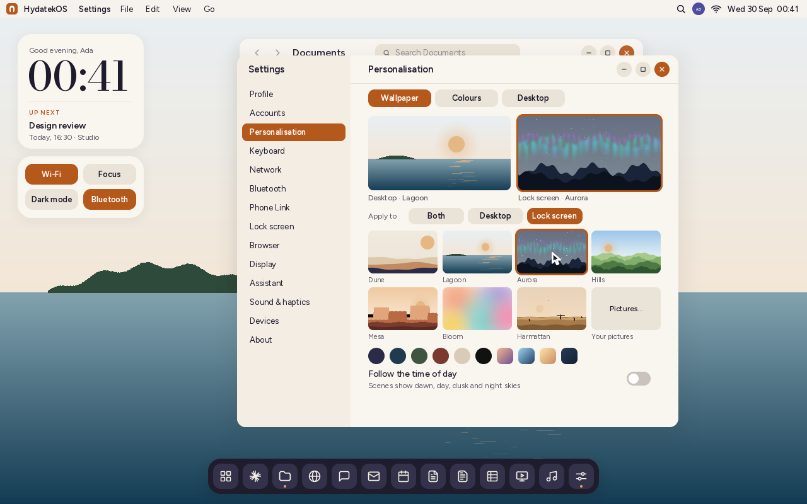
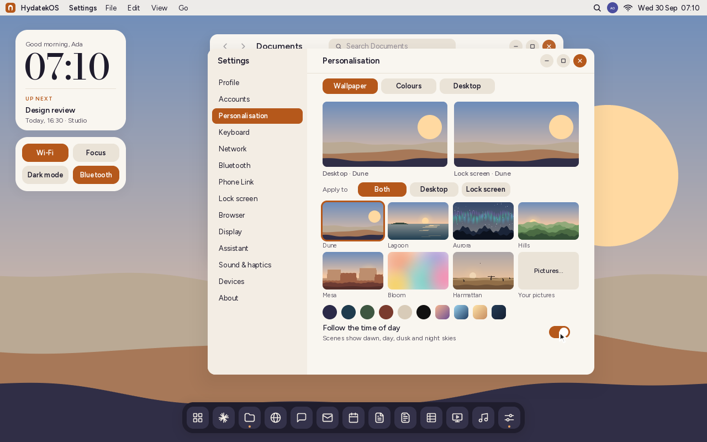
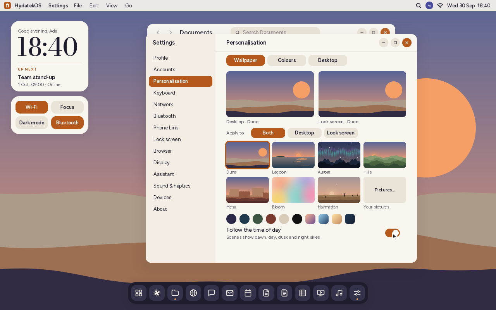
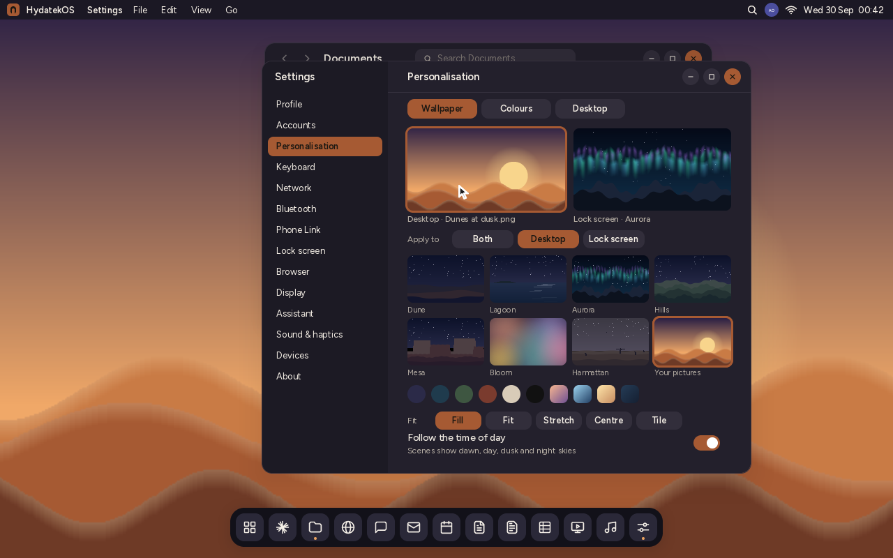
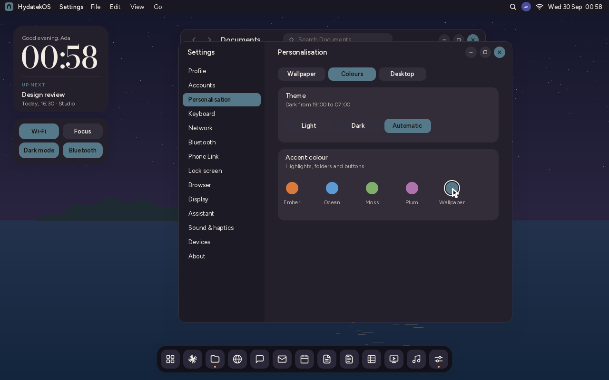
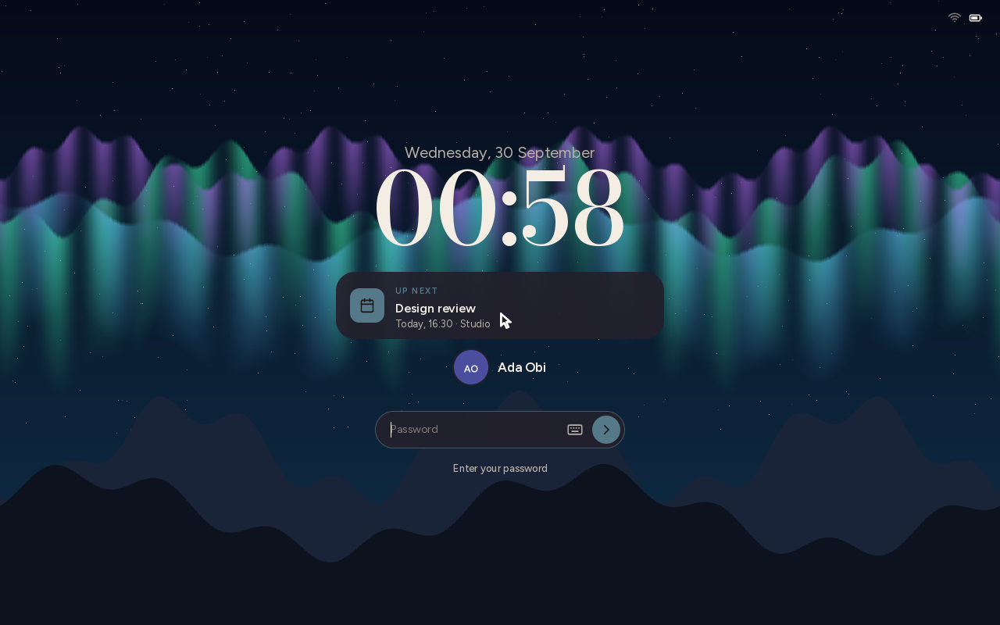
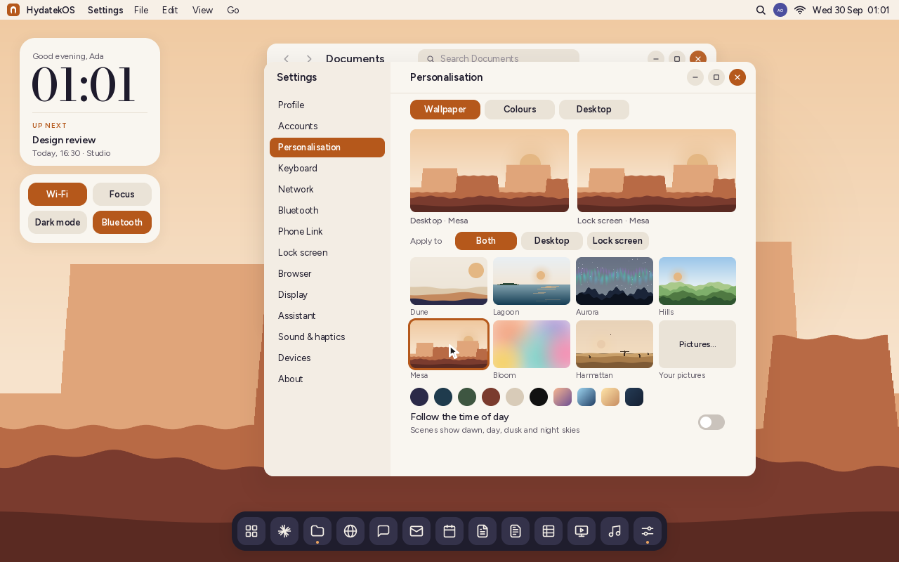

# Wallpaper and personalisation



**Settings › Personalisation** is where HydatekOS takes on your look. It has three
tabs: **Wallpaper**, **Colours** and **Desktop**. Each person on the computer has
their own choices ([accounts](ACCOUNTS.md)), and every choice takes effect at once
and survives reboots.

## Wallpaper

At the top are the desktop and the lock screen as they are now. **Apply to** says
where your next choice goes: **Both**, the **Desktop** only, or the **Lock
screen** only. You can also click either preview to pick it as the target. So the
desktop can be a quiet lagoon while the lock screen shows the northern lights.

### Scenes

HydatekOS draws seven scenes itself, at the exact size of your screen. Nothing is
stretched, and they're sharp on any display, from a phone held upright to a 4K
monitor.

| Scene | What it is |
|---|---|
| **Dune** | The HydatekOS scene: layered sand dunes under a low sun. |
| **Lagoon** | Still water with a wooded island and the sun's path on the water. |
| **Aurora** | Northern lights over a mountain ridge. Always a night sky. |
| **Hills** | Rolling green hills, one ridge behind another. |
| **Mesa** | Flat-topped red cliffs in a desert. |
| **Bloom** | Soft overlapping colour, with no horizon: a calm background for work. |
| **Harmattan** | The dusty West African dry season: a pale sky, a sun you can look at, and a lone acacia. |

There are also six **solid colours** and four **gradients**.

### Follow the time of day

Turn this on, and the sky in each scene follows the clock. It shows night, dawn
from 05:30, full morning at 07:00, a high sun around 13:00, the evening from
18:00, dusk at 19:30 and night again from 21:00. The colours blend smoothly
between those points, and the land takes on the light of the sky. The picture is
refreshed every ten minutes, so it costs nothing in between.

| 07:10 | 18:40 |
|---|---|
|  |  |

When the time of day is off, scenes follow the theme instead: a daytime sky in
the light theme, and a night sky in the dark theme.

### Your pictures

**Pictures…** shows the pictures in *Pictures*, *Downloads*, *Documents › Photos
2026* and *Shared*. It can open PNG, JPEG, GIF, BMP and WebP files. You can also
select a picture in **Files** and choose **File › Set as Wallpaper**.



A picture has five ways to fit the screen:

| Fit | What it does |
|---|---|
| **Fill** | Covers the screen and crops what's left over, keeping the middle. This is the default. |
| **Fit** | Shows the whole picture, framed by its own main colour, darkened. |
| **Stretch** | Fills the screen exactly, changing the picture's shape. |
| **Centre** | Shows it at its real size in the middle, framed like Fit. If it's larger than the screen, it's shown at the largest size that fits. |
| **Tile** | Repeats it at its real size. |

Pictures are decoded once and scaled with an area average when they are made
smaller (no shimmer) and bilinear filtering when they are made larger. A picture
larger than 3840 pixels on its longer side is reduced to that size first, to
save memory. If a picture is moved or deleted, the wallpaper falls back to Dune.

## Colours



- **Theme:** Light, Dark or **Automatic**. Automatic is dark from 19:00 to 07:00
  and switches on its own. Choosing dark from the quick settings, the keyboard
  shortcut or the terminal turns Automatic off.
- **Accent colour:** Ember, Ocean, Moss, Plum or **Wallpaper**. Wallpaper takes the
  accent from your desktop wallpaper (see below). That way a lagoon gives a
  teal accent and a picture of dunes at dusk gives an amber one.

## Desktop

**Desktop widgets** shows or hides the clock, *Up next* and the quick settings
cards on the desktop. The mobile shell, Focus, reduced motion and pointer speed
are here too.

## The lock screen



The lock screen shows its own wallpaper when you've chosen one, and the desktop's
otherwise. It uses your accent before you sign in, too.

## ARM64

The Personalisation page and every scene look the same on ARM64 (Snapdragon)
machines:



## How it works

- **`kernel/src/personal.rs`** holds the choices (`Look`: wallpaper, fit, lock
  wallpaper, time of day, theme mode, accent source, widgets) and the colour
  maths. It has no drawing code and is tested on the host
  (`tests-host/src/personal_tests.rs`).
- **`kernel/src/shell/wallpaper.rs`** draws the scenes, the colours and the
  pictures. Scenes are built from a few pieces:
  - sky gradients;
  - glows;
  - anti-aliased ridges, whose heights are in 1/256 of a pixel so their edges
    fall between pixels;
  - sine waves;
  - a fixed pseudo-random sequence for stars and grass, so the same scene looks
    the same every time.
- **Cache.** A finished wallpaper is kept in a small cache: the last three
  screens and the last three decoded pictures. It is drawn again only when
  something that shows changes: the wallpaper, the fit, light or dark, the
  accent, the screen size or the ten-minute time slot. Drawing the desktop is a
  copy.
- **Accent from the wallpaper.**
  - HydatekOS draws a small daytime copy of the wallpaper, 160 × 100, so the
    accent is the same in light and dark.
  - It builds a 4096-bucket colour histogram of the copy's colourful pixels,
    leaving out greys, near-blacks and near-whites, and weights each pixel by
    how saturated it is.
  - It averages the busiest bucket. `accent_pair` then darkens that colour
    until white text on it has at least 3:1 contrast (WCAG), and lightens it
    until it stands out 3:1 against the dark theme's surfaces.
  - A wallpaper with no colour in it gives a neutral grey.
- **Settings file.** The choices are saved as lines in your settings file:

  ```
  wall=lagoon                 # or colour:#2b2a48, gradient:#a,#b, picture:/home/Pictures/x.png
  wallfit=Fill
  lockwall=aurora             # or "same"
  timeofday=1
  thememode=Automatic         # Light, Dark, Automatic
  accentfrom=wallpaper        # or the preset's number
  widgets=1
  ```

  Settings files from before this release have no `thememode` line. They keep
  their light or dark choice.
