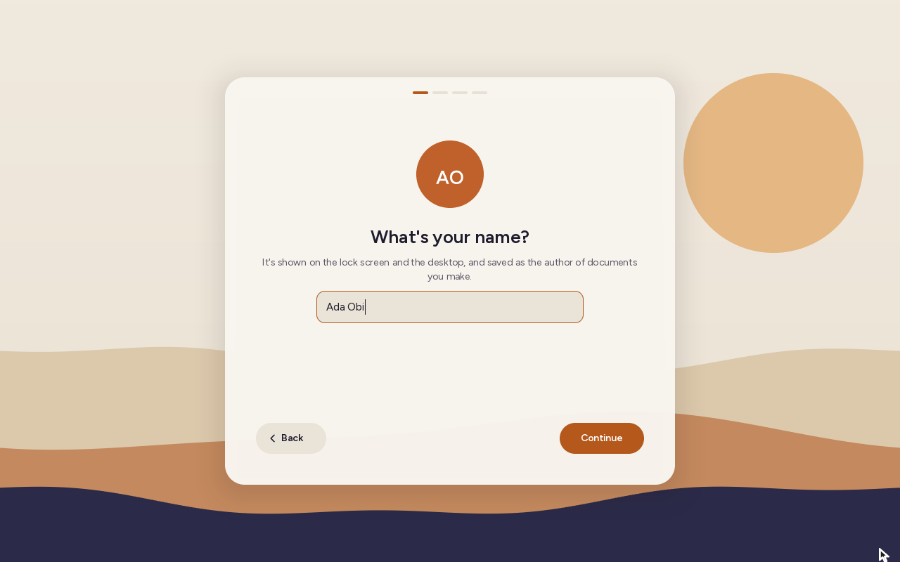
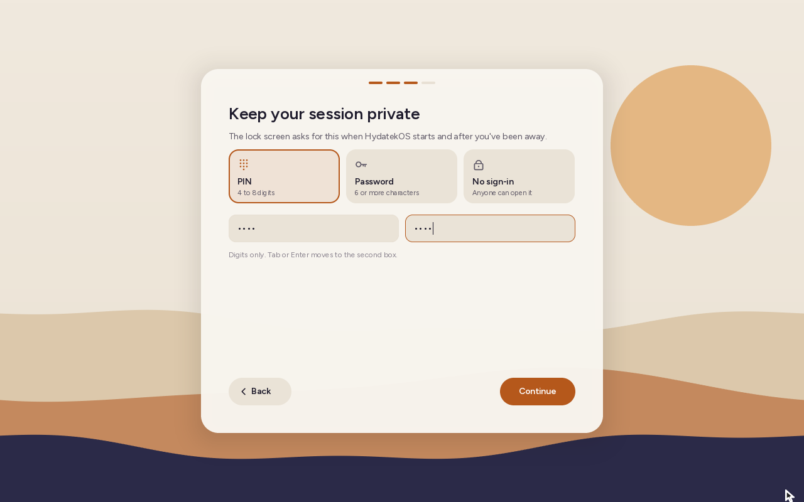
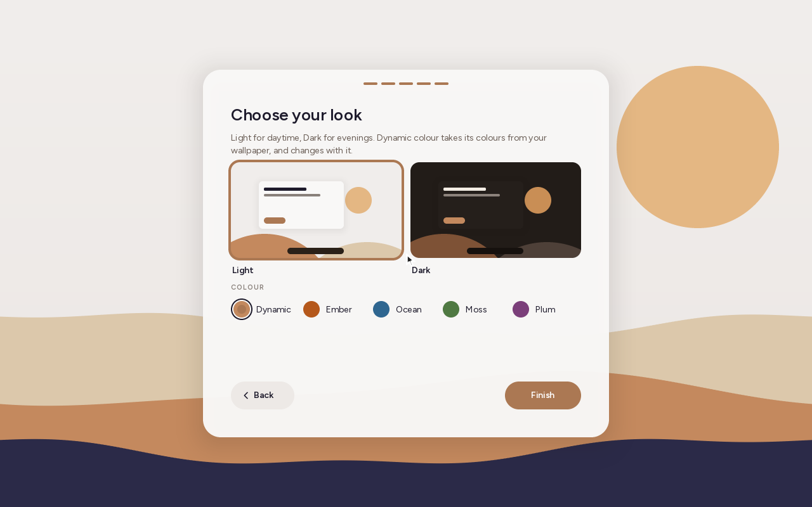
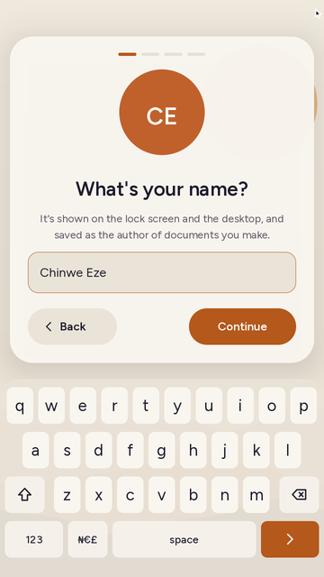
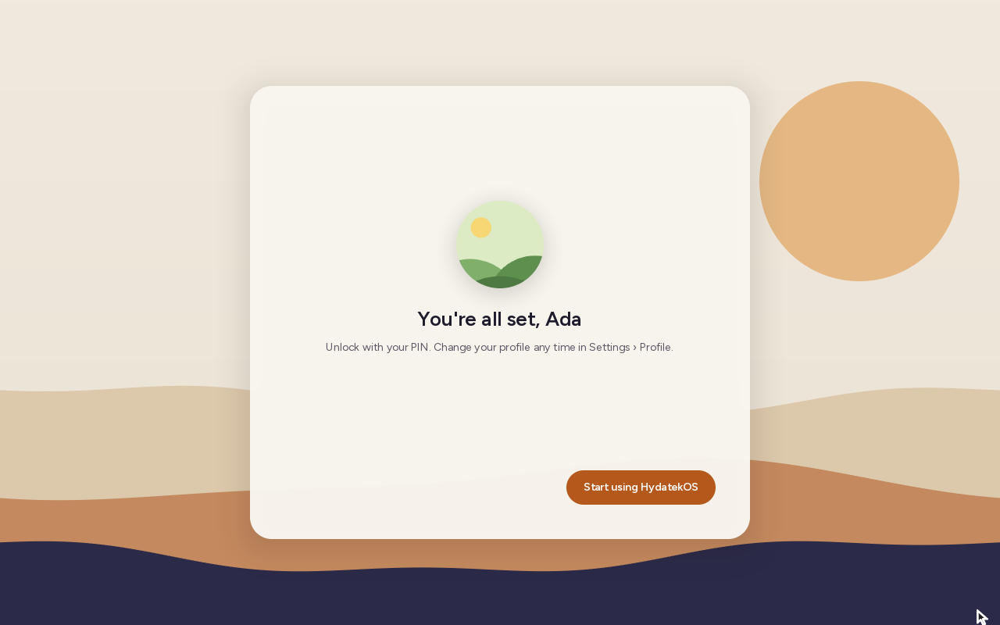
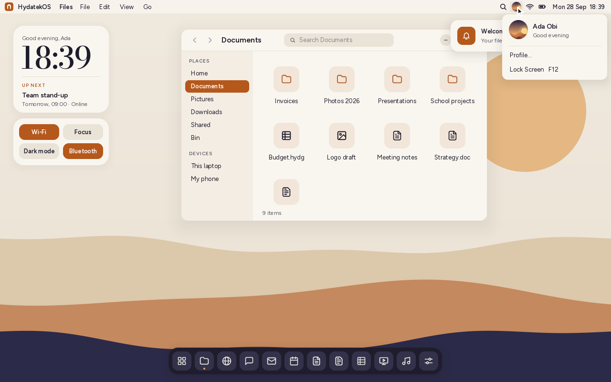

# Your profile and the setup assistant


The first time HydatekOS starts, a setup assistant makes the computer yours: your
name, a picture, how you sign in and how it looks. It takes about a minute, and
everything stays on the computer. Nothing is sent anywhere.

## The setup assistant

| | Step | What it asks |
|---|---|---|
| 1 | **Your name** | The name shown on the lock screen and the desktop, and saved as the author of documents you make. The picture above the box shows your initials as you type. |
| 2 | **A picture** | Your initials on one of eight colours, one of six drawn pictures (sunrise, night, waves, hills, peaks, bloom), or a photo from Pictures, Downloads, Shared or Documents. Photos are cut to the square in their middle. |
| 3 | **Sign-in** | A **PIN** (4 to 8 digits), a **password** (6 or more characters) or no sign-in. You type it twice. |
| 4 | **Meet Claude** | HydatekOS's assistant is Claude, made by Anthropic. Paste your Anthropic API key, or skip and add it later in Settings › Assistant ([details](ASSISTANT.md)). |
| 5 | **Your look** | Light or dark, and the accent colour. The assistant changes as you choose. |

| Your name | A picture |
|---|---|
|  |  |

| Sign-in | Your look |
|---|---|
|  |  |

**Enter** goes on, **Esc** goes back, and **Tab** moves between the two sign-in
boxes. On a phone or other portrait touch screen, the on-screen keyboard opens
under each box: letters first for your name, digits first for a PIN.



When you finish, the assistant says what you chose and opens the desktop:



**A computer that already has a PIN or password** (one set up before profiles
existed) shows the lock screen first and runs the assistant only after it's
unlocked. The assistant then leaves out the sign-in step, so nobody at the lock
screen can use it to change the PIN.

## Where your profile shows

- **The lock screen:** your picture and name above the PIN pad or password box.
- **The menu bar:** your picture next to the search icon. Click it for your name,
  **Profile…** (Settings › Profile) and **Lock Screen**.
- **The desktop and phone home screen:** "Good morning, Ada" (afternoon from 12:00,
  evening from 17:00).
- **Documents:** Hyda Scripts, Hyda Grids and Hyda Slides record your name as
  the author when you first save or export a document. Word, Excel and PowerPoint
  files carry it as their author (`dc:creator` in `docProps/core.xml`), and PDFs from
  Hyda Slides have it as `/Author`. Files you open keep the author they came with.

| Profile menu | Lock screen |
|---|---|
|  |  |

## Changing it: Settings › Profile


- **Edit name** changes your name everywhere at once.
- **Change picture** opens the same choice of initials, drawn pictures and photos
  as the assistant.
- **Sign-in options** goes to Settings › Lock screen for the PIN, password and phone
  fingerprint.
- **Set up again** runs the assistant again with what you have now filled in. **Not
  now** leaves without changes, and the sign-in step is left out while a PIN or
  password is set.

## How it's stored

```
/system/profile.txt      name, picture choice and the day it was set up
/system/profile.png      your photo, 256 × 256 (only when you chose one)
```

```
name=Ada Obi
avatar=initials 3        initials on colour 3 (0-7), or
                         avatar=motif 2 (0-5) / avatar=picture
since=2026-09-28
```

A damaged or partly written file never stops the computer starting. Lines
HydatekOS doesn't know are skipped, a bad picture choice falls back to initials,
and a missing photo falls back to your initials. The PIN and password stay in
`/system/lock.txt`, as salted and stretched hashes (see
[ARCHITECTURE.md](ARCHITECTURE.md)).

## Limits

- Each account has its own profile ([ACCOUNTS.md](ACCOUNTS.md)). The files
  above are the first account's; other accounts keep theirs in
  `/system/users/<id>/`.
- Photos can't be moved or zoomed within the circle: the middle square is used.
  There is no camera driver yet, so there is no "take a photo".
- In a live session (read-only disk) the profile lasts until you restart, and the
  assistant says so.

## How it's built

| Part | Where |
|---|---|
| The profile: file format, names, initials, greetings, photo cropping | `kernel/src/profile.rs` |
| Pictures: initials, the drawn pictures, photos; the picture grid | `kernel/src/avatar.rs` |
| The setup assistant | `kernel/src/shell/setup.rs` |
| The on-screen keyboard (shared with the lock screen) | `kernel/src/shell/osk.rs` |
| Settings › Profile | `kernel/src/apps/settings.rs` |
| Authors in documents | `doc.rs` (`core_xml`, `core_creator`), `gridio.rs`, `deckio.rs`, `pdf.rs` |

`tools/test.sh` runs the host tests in `tests-host/src/profile_tests.rs`:
- the profile file's round trip, and damaged files falling back;
- tidying names, initials (accents and hyphenated names too), greetings by hour,
  and colours picked from names;
- cropping photos to their middle square (averaging, transparency, portrait
  pictures, enlarging);
- authors through `.hyds`/`.docx`, `.hydg`/`.xlsx` and `.hydp`/`.pptx`;
- authors read from files that python-docx, openpyxl, python-pptx and
  LibreOffice wrote.

Exported `.docx` and `.xlsx` files were also read with python-docx, openpyxl and
LibreOffice, which all show the author.
